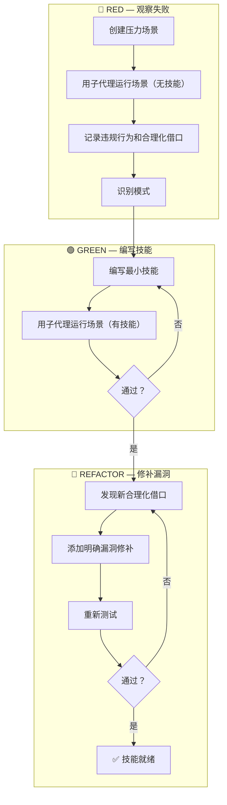

# Skill Factory v2.2 — 技能工坊 (Router Edition)

<p align="center">
  <strong>AI Agent 技能创建工坊 | 4-Entry Router 架构 | TDD 驱动 | CI/CD 集成</strong>
</p>

<p align="center">
  <a href="#-核心特性">核心特性</a> •
  <a href="#-快速开始">快速开始</a> •
  <a href="#-项目架构">项目架构</a> •
  <a href="#-使用指南">使用指南</a> •
  <a href="#-设计原则">设计原则</a> •
  <a href="#-版本历史">版本历史</a>
</p>

<p align="center">
  
  
  
  
</p>

---

## 📖 这是什么？

**Skill Factory** 是一个轻量级技能创建工坊，帮助 AI Agent 规范化地**创建、加工、发布和管理 Skills**。

### ✨ 核心价值

| 特性 | 说明 |
|------|------|
| **🔄 4-Entry Router 架构** | 轻量路由枢纽 + 4 个独立子技能（creator/processor/publisher/assembler） |
| **🔬 TDD 驱动创建** | 先观察 Agent 失败，再编写技能，用压力测试场景验证效果 |
| **⚖️ 三层架构铁律** | 所有技能层级必须 ≤3 层，不可妥协的设计约束 |
| **🔬 CSO 发现优化** | description 只写触发条件，不写工作流，防止 Agent 走捷径 |
| **🗂️ 四维分类法** | 轻/重 × 薄/厚，精准判定技能体型和结构 |
| **✅ 质量标准体系** | 100 分制审计评分（7 维度）+ HTML 报告生成 |
| **🧪 Test Harness** | 100 个压力测试场景（每个技能 20 个），should-trigger/should-not-trigger |
| **🚀 CI/CD 集成** | GitHub Actions 自动发布流水线 + 发布前质量门禁（≥85%） |

### 🎯 解决的痛点

| 手动创建的问题 | Skill Factory 的解决方式 |
|---------------|------------------------|
| 格式不一致（有的有前言区有的没有） | 提供标准前言区模板 + skill-standards 强制检查 |
| 遗漏关键章节（没触发条件/没示例/没注意事项） | 五大必备章节 + 100 分评分体系 |
| 发布混乱（版本号乱跳、无变更记录） | 语义化版本判定 + git commit 规范 + CHANGELOG 同步 |
| **技能不如预期（Agent 总是绕过规则）** | **TDD 驱动创建：先观察 Agent 失败，再编写技能，用子代理压力测试验证效果** |
| **description 误导 Agent（写了工作流总结反而跳过正文）** | **CSO 优化：description 只写触发条件，不写工作流，防止 Agent 走捷径** |

---

## 🚀 核心特性

### 1️⃣ TDD 驱动技能创建

```
NO SKILL WITHOUT A FAILING TEST FIRST
```

采用 RED → GREEN → REFACTOR 循环：



### 2️⃣ 三层架构铁律

```
Layer 0: skill-name/SKILL.md                  ← 入口
Layer 1: skills/phase-guide/SKILL.md          ← 阶段指南（创建/发布/整合）
Layer 2: skills/phase-guide/worker/SKILL.md   ← 执行者（仅大项目需要）

🛑 最大深度 3 层（references/ / scripts/ 不算层级）
```

| 层级 | 命名规范 | 职责 | 数量 |
|------|---------|------|------|
| Layer 0 | `{skill-name}` | 全局入口 | 1 |
| Layer 1 | `{phase}-{名称}` | 阶段指南 | 1-4 |
| Layer 2 | `{worker-name}` | 单一操作（可选） | 0-10 |

### 3️⃣ CSO 技能发现优化

**核心陷阱：description 写工作流**

❌ **错误示例**：
```
description: "执行计划时派发子代理，每个任务完成后进行代码审查"
→ Agent 只做一次审查（因为 description 说了"代码审查"）
→ 跳过流程图中的两阶段审查流程
```

✅ **正确示例**：
```
description: "Use when executing implementation plans with independent tasks"
→ Agent 加载完整 SKILL.md
→ 按照流程图执行两阶段审查
```

### 4️⃣ 四维分类法

先判断技能的"体型"，决定用什么结构：

| 维度 | 定义 | 标准 |
|------|------|------|
| **轻** | 功能单一 | 1 个核心能力 |
| **重** | 功能复杂 | 多个独立模块 |
| **薄** | 内容精简 | <300 行 |
| **厚** | 内容详细 | >300 行，需要 references/ |

| 类型 | 结构 | 示例 |
|------|------|------|
| **Type 1 (轻+薄)** | 单个 SKILL.md | 简单工具技能 |
| **Type 2 (重+薄)** | SKILL.md + skills/ | 多功能工具集 |
| **Type 3 (轻+厚)** | SKILL.md + references/ | 详细的操作指南 |
| **Type 4 (重+厚)** | SKILL.md + skills/ + references/ | 大型框架 |

---

## 🎓 快速开始

### 新建一个技能（TDD 驱动流程）

```
1. 判定类型: 轻/重? 薄/厚?
2. 🔴 RED 阶段: 创建压力场景 → 用子代理测试无技能时的行为 → 记录违规
3. 选择模板: Type 1-4
4. 🟢 GREEN 阶段: 写前言区 + 填充内容 → 用子代理验证效果
5. 🔵 REFACTOR 阶段: 修补Agent合理化漏洞 → 重新验证
6. 规范检查: 对照标准清单验证
7. 发布: 版本更新 + git commit
```

### 场景快速路由

| 需求 | 场景 | 详见 |
|------|------|------|
| "帮我创建技能" | 创建新技能 | [creator](skills/skill-factory-creator/SKILL.md) |
| "优化/精简/改进技能" | 加工已有技能 | [processor](skills/skill-factory-processor/SKILL.md) |
| "检查/审计/评分" | 审计技能质量 | [processor](skills/skill-factory-processor/SKILL.md) |
| "合并/拆分技能" | 多技能操作 | [assembler](skills/skill-factory-assembler/SKILL.md) |
| "发布新版本" | 版本发布 | [publisher](skills/skill-factory-publisher/SKILL.md) |
| "退役旧技能" | 技能退役 | [publisher](skills/skill-factory-publisher/SKILL.md) |
| "怎么写出好内容" | 写作规则 | [references/writing-rules.md](references/writing-rules.md) |
| "运行全量审计" | 项目级检查 | `./skills/skill-factory-processor/scripts/audit.ps1 -Project` |

### 示例：创建一个"代码审查"技能

```
用户: "帮我创建一个代码审查技能，检查代码风格和安全漏洞"

skill-factory 工作流程:
1. 判定类型 → 轻（单功能）+ 薄（<300行）→ Type 1
2. 快速路径 → 跳过加工阶段
3. 生成 SKILL.md:

---
name: code-reviewer
version: v0.1.0
author: user
description: Use when reviewing code for style compliance and security vulnerabilities in JavaScript and Python projects
tags: [code-review, style-check, security, javascript, python]
dependency:
  parent: none
---
# 代码审查器

## 任务目标
自动审查代码，检查风格规范和安全漏洞。

## 触发条件
用户说"帮我审查这段代码"或"检查安全问题"时使用。

## 操作步骤
1. 解析代码语言和框架
2. 运行风格检查（ESLint/Pylint）
3. 运行安全扫描（常见漏洞模式）
4. 生成结构化审查报告

## 注意事项
- 仅支持 JavaScript 和 Python
- 安全扫描不是银弹，复杂漏洞需人工确认
```

---

## 🏗️ 项目架构

```
skill-factory/
├── SKILL.md                              ← 入口文件（路由器 ~150行）
├── metadata.json                         ← 项目元数据
├── README.md                             ← 项目说明
├── CHANGELOG.md                          ← 变更日志
├── references/                           ← 全局参考文档（不占层级）
│   ├── design-principles.md              ← 铁律 + 四维分类 + 三级加载系统
│   ├── best-practices.md                 ← 最佳实践速查
│   ├── writing-rules.md                  ← 写作高级规则 (R1-R14)
│   └── routing-engine.md                 ← 路由引擎详细设计
├── skills/                               ← Layer 1: 4 个独立子技能
│   ├── skill-factory-creator/            ← 📦 创建器 (TDD流程+类型判定)
│   │   ├── SKILL.md                      ← 协调器 (~575行)
│   │   └── references/                   ← test-scenario-guide.md
│   ├── skill-factory-processor/          ← ⚙️ 加工器+审计引擎
│   │   ├── SKILL.md                      ← 协调器 (~574行)
│   │   ├── references/                   ← harness-agents-guide.md, harness-integration-guide.md
│   │   └── scripts/
│   │       └── audit.ps1                 ← 100分制审计脚本 (v1.3)
│   ├── skill-factory-publisher/          ← 📤 发布器 (手动触发)
│   │   ├── SKILL.md                      ← 协调器 (~468行)
│   │   └── references/                   ← semver/git-commit/changelog/deprecation
│   └── skill-factory-assembler/           ← 🔗 整合器 (合并+拆分)
│       ├── SKILL.md                      ← 协调器 (~387行)
│       └── references/                   ← 合并/拆分策略
└── tests/scenarios/                      ← Test Harness (100个场景)
    ├── skill-factory-root/scenarios.yaml
    ├── skill-factory-creator/scenarios.yaml
    ├── skill-factory-processor/scenarios.yaml
    ├── skill-factory-publisher/scenarios.yaml
    └── skill-factory-assembler/scenarios.yaml
```

### 通用技能目录约定

```
{skill-name}/
├── SKILL.md                 ← Layer 0: 入口（必需）
├── scripts/                 ← 可执行脚本（可选，不占层级）
├── references/              ← 参考文档（可选，不占层级）
├── assets/                  ← 模板、图片等资源（可选，不占层级）
└── skills/                  ← Layer 1: 子技能（可选）
```

---

## 📐 标准前言区模板

每个 SKILL.md 都必须包含标准前言区：

```yaml
---
name: {skill-name}           # kebab-case，≤50字符
version: v0.1.0              # 语义化版本
author: {author-name}
description: {100-150字符的描述，一句话说清楚}
tags: [{5-15个标签}]
dependency:
  parent: {父技能 或 none}
  children: [{子技能列表}]
---
```

### Description 编写规则（CSO）

| 规则 | 说明 | 好例子 | 坏例子 |
|------|------|--------|--------|
| **以 "Use when..." 开头** | 聚焦触发条件 | "Use when creating new skills..." | "技能创建指南和设计模式库" |
| **只写触发条件** | 不总结工作流 | "Use when tests have race conditions" | "用子代理执行任务并审查代码" |
| **具体症状** | 列出用户实际会遇到的问题 | "技能不如预期、Agent 绕过规则时" | "需要技能创建时使用" |
| **关键词覆盖** | 包含 Agent 可能搜索的词 | "skill / 技能 / SKILL.md / agent" | 单个术语 |

---

## ✅ 规范清单（速查）

> 📖 完整清单: [references/skill-standards.md](references/skill-standards.md)

| # | 检查项 | 通过标准 |
|---|--------|---------|
| 1 | 前言区完整 | name/version/description/tags 全部存在 |
| 2 | **CSO description 规则** | **以 "Use when" 开头，只写触发条件，不写工作流** |
| 3 | description 长度 | 100-150 字符 |
| 4 | 命名规范 | kebab-case，小写+连字符 |
| 5 | 必备章节 | 任务目标/操作步骤/示例/注意事项 |
| 6 | 层级合规 | 目录深度 ≤3 层 |
| 7 | **TDD 验证** | **已通过压力测试（有测试记录或明确说明豁免原因）** |
| 8 | 链接有效 | 内部引用无死链 |

---

## 🔧 关键设计模式

> 📖 详见: [references/design-principles.md](references/design-principles.md)

| 模式 | 适用场景 | 核心思路 |
|------|---------|---------|
| **流水线** | 有固定顺序的流程 | 每步有门禁，失败可回调 |
| **策略选择** | 根据条件选择路径 | 按技能行数自动决策 |
| **快速路径** | Type 1 简单技能 | 跳过加工，直接发布 |
| **拆分** | 技能过于复杂 | 拆为多个 ≤3 层的独立技能 |
| **整合** | 多个技能合并 | 选择序列/并行/嵌套模式 |
| **渐进加载** | Skills 三阶段机制 | Discovery→Activation→Execution |
| **Token 效率** | 控制上下文占用 | 最小高信号 token 集 |
| **Happy Path First** | 内容排序 | 90%场景方案放最前面，边缘后置；Quickstart 覆盖完整端到端 |
| **反模式命名** | 指令可靠性 | 每个"不要"配"这样做"+失败原因；显式拒绝 Agent 先验倾向 |
| **验证循环** | 质量保障 | Plan→Validate→Execute；验证项必须是二进制通过/不通过 |
| **错误处理矩阵** | 稳定性 | 5 类异常（输入/工具/数据/权限/超时）各有处理+反馈+重试策略 |
| **TDD 驱动创建** | 技能质量保障 | RED→GREEN→REFACTOR；无测试无技能 |
| **CSO 优化** | 技能发现率 | description 只写触发条件，不写工作流；关键词覆盖 |
| **子代理压力测试** | 技能鲁棒性 | 模拟高压力场景 + 记录 Agent 合理化借口 + 逐条修补 |
| **复杂度分级** | 技能难度标注 | basic(<5步) / intermediate(5-10步) / advanced(>10步) |

---

## 📦 发布规范

```
修改完成 → 版本判定 → 元数据更新 → git commit/tag
```

| 变更类型 | 版本 | Commit 前缀 |
|---------|------|------------|
| 修复 | patch +1 | `fix` |
| 新增 | minor +1 | `feat` |
| 重构 | minor +1 | `refactor` |
| 破坏性 | major +1 | `feat!` |

> 📖 详见: [publisher](skills/skill-factory-publisher/SKILL.md)

---

## ⚠️ 注意事项

- **TDD 铁律不可违反**：NO SKILL WITHOUT A FAILING TEST FIRST — 没有经过 RED 阶段的技能不允许发布
- **三层铁律不可妥协**：任何技能目录深度 ≤3 层，超过时必须拆分或征求用户同意
- **CSO 优先**：description 只写触发条件，不写工作流——防止 Agent 走捷径跳过正文
- **先判定再动手**：不确定技能是 Type 1-4 中哪种时，先用四维分类法判定，选错类型会导致不必要的返工
- **Type 1 走快速路径**：简单技能不要过度设计，但即使简单也须经过 RED 阶段验证
- **子代理压力测试不可跳过**：每个技能发布前必须用子代理模拟压力场景验证效果
- **规范清单是底线**：每个技能发布前至少过一遍速查清单的 8 项检查（新增 CSO 和 TDD 检查）
- **版本号同步**：修改根文件时要检查子技能版本号是否也需要更新，避免版本分裂

---

## 📚 相关资源

### 核心文档

| 文档 | 说明 | 路径 |
|------|------|------|
| **SKILL.md** | 主入口文件 | [SKILL.md](SKILL.md) |
| **元数据** | 项目元信息 | [metadata.json](metadata.json) |
| **设计原则** | 铁律+分类+模式 | [references/design-principles.md](references/design-principles.md) |
| **技能标准** | 规范检查清单 | [references/skill-standards.md](references/skill-standards.md) |
| **写作规则** | 高级写作技巧 | [references/writing-rules.md](references/writing-rules.md) |

### 阶段指南

| 指南 | 职责 | 路径 |
|------|------|------|
| **Creator** | 创建器（TDD 流程 + 类型判定） | [skills/skill-factory-creator/SKILL.md](skills/skill-factory-creator/SKILL.md) |
| **Processor** | 加工器 + 审计引擎（4 种策略 + audit.ps1） | [skills/skill-factory-processor/SKILL.md](skills/skill-factory-processor/SKILL.md) |
| **Publisher** | 发布器 + 退役（手动触发） | [skills/skill-factory-publisher/SKILL.md](skills/skill-factory-publisher/SKILL.md) |
| **Assembler** | 整合器（合并 + 拆分） | [skills/skill-factory-assembler/SKILL.md](skills/skill-factory-assembler/SKILL.md) |

### 审计工具

| 工具 | 说明 | 用法 |
|------|------|------|
| **audit.ps1** | 100 分制质量审计脚本 (v1.3) | `./skills/skill-factory-processor/scripts/audit.ps1 -Project -Verbose` |
| **HTML 报告** | 可视化审计报告生成 | 添加 `-Html` 参数 |

---

## 🤝 贡献指南

欢迎贡献！请遵循以下步骤：

1. Fork 本仓库
2. 创建特性分支 (`git checkout -b feature/amazing-feature`)
3. 提交更改 (`git commit -m 'feat: add amazing feature'`)
4. 推送到分支 (`git push origin feature/amazing-feature`)
5. 开启 Pull Request

### Commit 规范

- `feat`: 新功能
- `fix`: 修复问题
- `refactor`: 重构代码
- `docs`: 文档更新
- `style`: 代码格式调整
- `test`: 测试相关
- `chore`: 构建/工具相关

---

## 📄 许可证

本项目采用 MIT 许可证 - 查看 [LICENSE](LICENSE) 文件了解详情

---

<p align="center">
  Made with ❤️ by <strong>skill-factory</strong>
</p>

<p align="center">
  <sub>版本: v2.2.0 | 最后更新: 2026-05-30 | 项目平均: <strong>95% (A-grade)</strong></sub>
</p>
