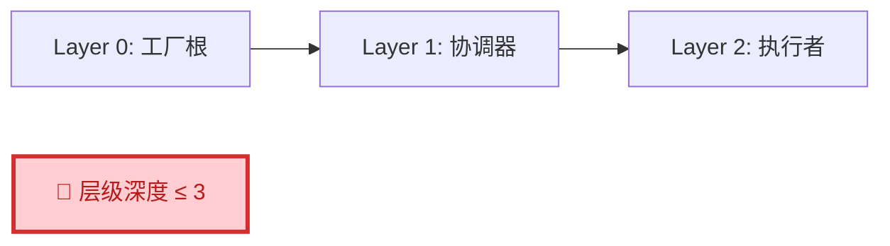
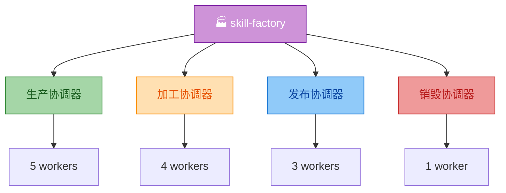

# Skill Factory v3.1 - 技能工厂

## 任务目标

本 Skill 是技能的全生命周期管理工厂，类比现实中的生产工厂：
- **原材料** → 技术文档/URL/需求描述
- **生产线** → 四阶段流水线（生产→加工→发布→销毁）
- **产品** → 结构化的 SKILL.md 技能包

**触发条件**: 当需要创建、修改、优化、整合、拆分、发布或退役技能时使用。

---

## ⚖️ 三层架构铁律（摘要版）

> **核心理念**：所有技能创建的层级关系必须遵循 **最多三层** 的铁律。
>
> 📖 **详细内容**: [references/three-layer-iron-rule.md](references/three-layer-iron-rule.md)

### 铁律定义



### 三层结构模板

| 层级 | 命名规范 | 职责 | 数量 |
|------|---------|------|------|
| **Layer 0** | `{skill-name}` | 全局入口 | 1 |
| **Layer 1** | `phase-{name}` | 阶段调度 | 2-6 |
| **Layer 2** | `{worker-name}` | 单一操作 | 5-20+ |

### 关键规则

```
✅ 最大深度: 3 层（references/ 和 scripts/ 不算层级）
⚠️ 4 层: 需拆分或征求用户同意
🚨 ≥5层: 必须重新设计
```

---

## 工厂全景架构

> 📖 **详细说明**: [references/factory-architecture.md](references/factory-architecture.md)



### 三层职责

| 层级 | 名称 | 数量 | 核心职责 |
|------|------|------|---------|
| **Layer 0** | 工厂根 | 1 | 全局入口、跨阶段编排、四维分类 |
| **Layer 1** | 阶段协调器 | 4 | 阶段内调度、质量门禁、接口协议 |
| **Layer 2** | 执行者 | 13 | 单一职责操作，明确输入输出 |

---

## 四维分类体系

> 📖 **详细图表**: [references/factory-architecture.md](references/factory-architecture.md)

| 维度 | 定义 | 判断标准 | 输出结构 |
|------|------|---------|---------|
| **轻** | 功能单一 | 1 个核心能力 | 单个 SKILL.md |
| **重** | 功能复杂 | 多个模块 | `skills/{子}/SKILL.md` |
| **薄** | 内容精简 | <300 行 | 无需额外文件 |
| **厚** | 内容丰富 | >300 行 | `references/` + 可选 `scripts/` |

---

## 四阶段核心流程

### 阶段一：生产（5 步流水线）

```
用户输入 → researcher → analyzer → planner → generator → packager → 技能包
```

| 子技能 | 职责 | 核心 |
|--------|------|------|
| [researcher](skills/skill-factory-phase-production/skill-factory-researcher/SKILL.md) | 信息研究 | 六步研究流程 |
| [analyzer](skills/skill-factory-phase-production/skill-factory-analyzer/SKILL.md) | 技术分析 | 完整度 >= 80% |
| [planner](skills/skill-factory-phase-production/skill-factory-planner/SKILL.md) | 类型判定 | 四维分类决策树 |
| [generator](skills/skill-factory-phase-production/skill-factory-generator/SKILL.md) | 文件生成 | A/B/C/D 四种模板 |
| [packager](skills/skill-factory-phase-production/skill-factory-packager/SKILL.md) | 结构验证 | 四层验证模式 |

### 阶段二：加工（4 种加工器）

```
已有技能 → {enricher/simplifier/beautifier/standardizer} → 升级后技能
```

| 子技能 | 职责 | 策略角色 |
|--------|------|---------|
| [enricher](skills/skill-factory-phase-processing/skill-factory-enricher/SKILL.md) | 内容丰富 | 丰富优先 |
| [simplifier](skills/skill-factory-phase-processing/skill-factory-simplifier/SKILL.md) | 内容简化 | 精简优先 |
| [beautifier](skills/skill-factory-phase-processing/skill-factory-beautifier/SKILL.md) | 格式美化 | 图表 + 排版 |
| [standardizer](skills/skill-factory-phase-processing/skill-factory-standardizer/SKILL.md) | 规范化 | 最终步骤 |

### 阶段三：发布（3 步顺序）

```
version → metadata → release (git commit/tag/push)
```

| 子技能 | 职责 | 顺序 |
|--------|------|------|
| [publisher-version](skills/skill-factory-phase-publishing/skill-factory-publisher-version/SKILL.md) | 版本管理 | 第1步 |
| [publisher-metadata](skills/skill-factory-phase-publishing/skill-factory-publisher-metadata/SKILL.md) | 元数据管理 | 第2步 |
| [publisher-release](skills/skill-factory-phase-publishing/skill-factory-publisher-release/SKILL.md) | 发布执行 | 第3步 |

### 阶段四：销毁

| 子技能 | 职责 |
|--------|------|
| [destroyer](skills/skill-factory-phase-destruction/skill-factory-destroyer/SKILL.md) | 退役标记 + 迁移指引 + 归档清理 |

---

## 🚨 超三层处理 SOP（概述）

> 📖 **完整流程**: [references/over-three-layer-sop.md](references/over-three-layer-sop.md)

### 处理流程

```
检测到超三层 → 暂停 → 分析根因 → 尝试拆分 → 成功/征求用户同意 → 完成
```

### 拆分方案（首选）

```
✅ 推荐: 拆分为多个 ≤3层的独立技能族
⚠️ 备选: 征求用户同意 + 特殊标记
```

---

## 发布路径选择

> 📖 **详细决策树**: [references/factory-architecture.md](references/factory-architecture.md)

| 类型 | 路径 | 流程 | 效率 |
|------|------|------|------|
| **Type 1 (轻+薄)** | 🚀 快速 | 生产→发布（跳过加工） | **+85%** |
| Type 2/3 | 📋 标准 | 生产→选择性加工→发布 | 正常 |
| Type 4 (重+厚) | 🔄 完整 | 生产→全量加工→发布 | 正常 |

---

## 场景快速路由

```
用户请求 → {从零创建 → 阶段一 / 修改已有 → 阶段二+三 / 退役 → 阶段四}
```

| 需求 | 入口 |
|------|------|
| "帮我创建技能" | 阶段一：生产全流程 |
| "优化这个技能" | 阶段二：加工（4种加工器） |
| "发布新版本" | 阶段三：发布 |
| "技能太复杂，拆开" | 阶段二：拆分模式 |

---

## 子技能完整索引

### 阶段协调器（Layer 1）

| 协调器 | 子技能数 | 文档 |
|--------|---------|------|
| [phase-production](skills/skill-factory-phase-production/SKILL.md) | 5 | [查看](skills/skill-factory-phase-production/SKILL.md) |
| [phase-processing](skills/skill-factory-phase-processing/SKILL.md) | 4 | [查看](skills/skill-factory-phase-processing/SKILL.md) |
| [phase-publishing](skills/skill-factory-phase-publishing/SKILL.md) | 3 | [查看](skills/skill-factory-phase-publishing/SKILL.md) |
| [phase-destruction](skills/skill-factory-phase-destruction/SKILL.md) | 1 | [查看](skills/skill-factory-phase-destruction/SKILL.md) |

### 执行者（Layer 2）

**🏭 生产 (5)**: [researcher](skills/skill-factory-phase-production/skill-factory-researcher/SKILL.md) · [analyzer](skills/skill-factory-phase-production/skill-factory-analyzer/SKILL.md) · [planner](skills/skill-factory-phase-production/skill-factory-planner/SKILL.md) · [generator](skills/skill-factory-phase-production/skill-factory-generator/SKILL.md) · [packager](skills/skill-factory-phase-production/skill-factory-packager/SKILL.md)

**⚙️ 加工 (4)**: [enricher](skills/skill-factory-phase-processing/skill-factory-enricher/SKILL.md) · [simplifier](skills/skill-factory-phase-processing/skill-factory-simplifier/SKILL.md) · [beautifier](skills/skill-factory-phase-processing/skill-factory-beautifier/SKILL.md) · [standardizer](skills/skill-factory-phase-processing/skill-factory-standardizer/SKILL.md)

**📦 发布 (3)**: [publisher-version](skills/skill-factory-phase-publishing/skill-factory-publisher-version/SKILL.md) · [publisher-metadata](skills/skill-factory-phase-publishing/skill-factory-publisher-metadata/SKILL.md) · [publisher-release](skills/skill-factory-phase-publishing/skill-factory-publisher-release/SKILL.md)

**🗑️ 销毁 (1)**: [destroyer](skills/skill-factory-phase-destruction/skill-factory-destroyer/SKILL.md)

---

## 版本历史

| 版本 | 日期 | 主要变更 |
|------|------|---------|
| **v0.3.1** | 2026-05-01 | 📦 **Type 3 架构拆分**：主文件精简至 ~300 行，详细内容移至 references/ |
| v0.3.0 | 2026-05-01 | ⚖️ 三层架构铁律内化：新增核心理念章节 + SOP |
| v0.2.0 | 2026-05-01 | 🏗️ 三层架构重构：引入阶段协调器 |
| v0.1.0 | 2026-04-XX | 🎉 初始版本 |

> 💡 **详细变更记录**: [CHANGELOG.md](CHANGELOG.md)
