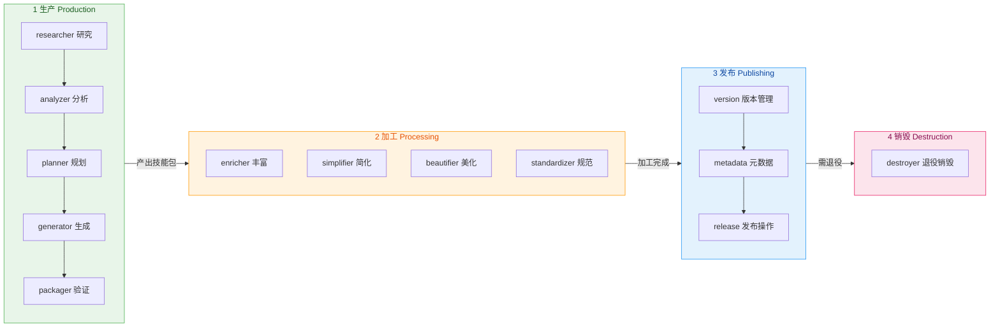
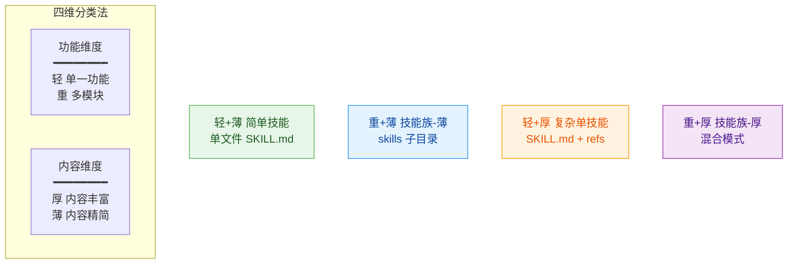
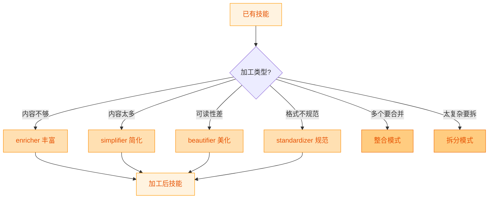
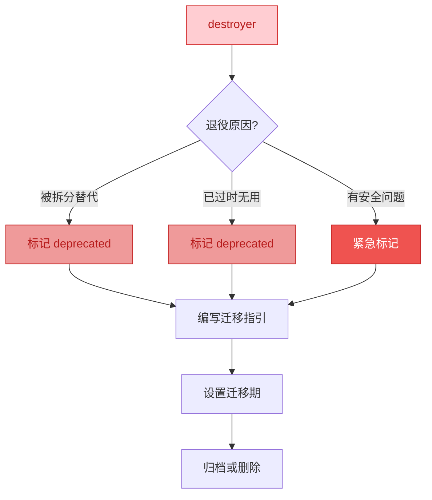
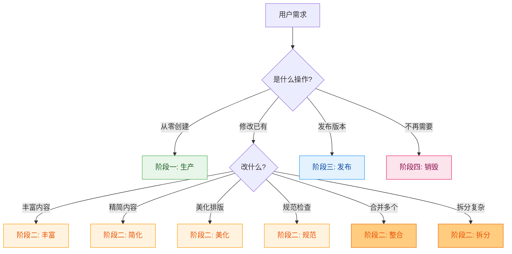

# Skill Factory v2 - 技能工厂

## 任务目标

本 Skill 是技能的全生命周期管理工厂，类比现实中的生产工厂：
- **原材料** → 技术文档/URL/需求描述
- **生产线** → 四阶段流水线（生产→加工→发布→销毁）
- **产品** → 结构化的 SKILL.md 技能包

**触发条件**: 当需要创建、修改、优化、整合、拆分、发布或退役技能时使用。

---

## 工厂全景架构



### 四阶段定位

| 阶段 | 类比现实工厂 | 输入 | 输出 | 核心问题 |
|------|------------|------|------|---------|
| **① 生产** | 原料→成品 | 文档/URL/需求 | SKILL.md 技能包 | 怎么造？ |
| **② 加工** | 成品→精加工 | 已有技能 | 升级后的技能 | 怎么改？ |
| **③ 发布** | 质检→出厂 | 加工后技能 | 版本发布记录 | 怎么发？ |
| **④ 销毁** | 退役→回收 | 过时技能 | deprecated 标记 | 怎么废？ |

---

## 四维分类体系（贯穿所有阶段）



| 维度 | 定义 | 判断标准 | 输出结构 |
|------|------|---------|---------|
| **轻** | 功能单一 | 1 个核心能力 | 单个 SKILL.md |
| **重** | 功能复杂 | 多个模块，可独立使用 | `skills/{子}/SKILL.md` |
| **薄** | 内容精简 | <300 行能描述清楚 | 无需额外文件 |
| **厚** | 内容丰富 | 需要详细说明/示例/代码 | `references/` + 可选 `scripts/` |

---

## 阶段一：生产（Production）

从零创建新技能的完整流水线。


### 子技能索引

| 子技能 | 职责 | 核心 |
|--------|------|------|
| [researcher](skills/skill-factory-researcher/SKILL.md) | 接收输入、交互确认、补充信息 | 六步研究流程 + 回调机制 |
| [analyzer](skills/skill-factory-analyzer/SKILL.md) | 提取技术信息、评估体量 | 完整度 >= 80% 判定 |
| [planner](skills/skill-factory-planner/SKILL.md) | 判定轻重薄厚四维分类 | 两步决策树 |
| [generator](skills/skill-factory-generator/SKILL.md) | 按四种类型生成文件 | A/B/C/D 四种模板 |
| [packager](skills/skill-factory-packager/SKILL.md) | 验证对应结构的完整性 | 四种验证模式 + 质量评分 |

### 典型场景映射

| 用户需求 | 生产流程入口 |
|---------|-------------|
| "帮我根据这个教程生成技能" | researcher → 全流程 |
| "把这个网站做成技能" | researcher → 全流程 |
| "我有一个需求想做成技能" | researcher → 全流程 |

---

## 阶段二：加工（Processing）

对已有技能进行加工处理，类比工厂的精加工车间。



### 2.1 丰富器（Enricher）

**职责**: 补充技能内容，使其更完整

| 操作 | 说明 | 效果 |
|------|------|------|
| 补充示例 | 添加更多使用示例 | 可能 薄→厚 |
| 添加 references | 详细实现拆到 references/ | 薄→厚 |
| 扩展能力 | 在现有基础上添加新功能 | 可能 轻→重 |
| 补充 Mermaid | 为流程添加可视化图表 | 厚度增加 |

### 2.2 简化器（Simplifier）

**职责**: 精简冗余内容，使技能更精炼

| 操作 | 说明 | 效果 |
|------|------|------|
| 合并重复 | 去除重复描述 | 行数减少 |
| 精炼语言 | 压缩冗余表述 | 行数减少 |
| 提取摘要 | 主文件保留概览 | 厚→薄（可能）|
| 原子拆分 | 复杂技能拆为简单子技能 | 重→多轻 |

### 2.3 美化器（Beautifier）

**职责**: 提升技能的可读性和视觉表现

| 操作 | 说明 | 示例 |
|------|------|------|
| 添加 Mermaid 图表 | 流程图、架构图、决策树 | flowchart / sequenceDiagram |
| 优化排版 | 统一标题层级、表格对齐 | Markdown 格式优化 |
| 配色方案 | 统一颜色语义 | 绿=成功/红=错误/蓝=信息 |
| 增强导航 | 添加目录、快速链接 | 锚点链接 |

### 2.4 规范化器（Standardizer）

**职责**: 使技能符合标准规范

| 操作 | 说明 | 标准 |
|------|------|------|
| 前言区校准 | name/version/description/tags | 100-150字符 description |
| 命名规范 | 目录名、文件名 kebab-case | 小写+连字符 |
| 必备章节 | 任务目标/操作步骤/示例/注意事项 | 缺一补一 |
| 链接检查 | references 内部链接有效性 | 无死链 |

### 2.5 特殊加工模式

#### 整合（Assembly）

将多个技能合并为一个：

```
技能A + 技能B + 技能C → 整合技能族 (重+薄 或 重+厚)
```

- 对应原 scenario-integrate
- 模式选择: 顺序/并行/嵌套
- 输出类型判定: 全是简单子→重+薄 / 有复杂子→重+厚

#### 拆分（Disassembly）

将复杂技能拆分为多个：

```
复杂技能 (重+厚) → 技能A (轻+薄) + 技能B (轻+厚) + 技能C (轻+薄)
```

- 对应原 scenario-decompose
- 拆分维度: 功能/场景/复杂度
- 迁移策略: 并行维护 → deprecated → 退役

### 典型场景映射

| 用户需求 | 加工入口 |
|---------|---------|
| "这个技能内容太少，丰富一下" | enricher |
| "这个技能太长了，精简一下" | simplifier |
| "加些图表让它好看点" | beautifier |
| "检查下这个符不符合规范" | standardizer |
| "把这几个技能合并" | 整合模式 |
| "这个技能太复杂了，拆开" | 拆分模式 |

---

## 阶段三：发布（Publishing）

版本管理和正式发布。


### 3.1 版本管理（Version Manager）

| 变更类型 | 版本递增 | 触发条件 |
|---------|---------|---------|
| **Fix** | patch +1 | 错别字、描述修正 |
| **Feature** | minor +1 | 新增能力、新示例 |
| **Type Upgrade** | minor +1 | 轻→重、薄→厚 |
| **Breaking** | major +1 | 接口修改、删除能力 |

### 3.2 元数据管理（Metadata Manager）

| 元数据字段 | 更新时机 |
|-----------|---------|
| description | 每次变更后重新评估 100-150 字符 |
| tags | 能力变化时增删标签 |
| dependency.parent | 重构父子关系时 |
| dependency.children | 新增/移除子技能时 |
| version | 每次发布时递增 |

### 3.3 发布执行（Release Publisher）

```bash
git add .
git commit -m "<type>(<skill>): <变更说明>"
git tag -a v<版本> -m "Release v<版本>: <说明>"
```

| Commit 类型前缀 | 适用场景 |
|----------------|---------|
| `fix` | 错误修复 |
| `feat` | 新增功能 |
| `refactor` | 类型升级/重构 |
| `feat!` | 破坏性变更 |

### 典型场景映射

| 用户需求 | 发布入口 |
|---------|---------|
| "修改完了，提交一个版本" | version → metadata → release |
| "这个变更是什么类型的？" | version 判定 |
| "更新一下元数据" | metadata |

---

## 阶段四：销毁（Destruction）

技能退役和清理。



### 销毁流程

| 步骤 | 操作 | 说明 |
|------|------|------|
| 1. 判定原因 | 为什么退役？ | 被替代/过时/安全 |
| 2. 标记 deprecated | 修改 SKILL.md | description 加 [已废弃] |
| 3. 迁移指引 | 告诉用户用什么替代 | 链接到新技能 |
| 4. 设置迁移期 | 建议 30 天 | 给用户缓冲时间 |
| 5. 归档/删除 | 移动到 archive/ 或删除 | 清理仓库 |

### Deprecated 模板

```yaml
---
name: <原技能>
version: v0.1.0
description: "[已废弃] 请使用以下替代技能:"
tags: [deprecated]
---

## 退役通知

本技能已于 {日期} 标记为废弃。

### 替代方案
- [<新技能A>](../<new-skill-a>/SKILL.md): <用途>
- [<新技能B>](../<new-skill-b>/SKILL.md): <用途>

### 迁移指南
<简要说明如何从旧技能迁移到新技能>
```

### 典型场景映射

| 用户需求 | 销毁入口 |
|---------|---------|
| "这个技能不用了，退役吧" | destroyer |
| "已经拆分了，旧的怎么处理" | destroyer (被替代模式) |

---

## 场景快速路由



---

## 全部子技能索引

### 阶段一：生产（5 个）

| 子技能 | 文件路径 | 职责 |
|--------|---------|------|
| researcher | `skills/skill-factory-researcher/SKILL.md` | 信息研究 |
| analyzer | `skills/skill-factory-analyzer/SKILL.md` | 技术分析 |
| planner | `skills/skill-factory-planner/SKILL.md` | 类型判定 |
| generator | `skills/skill-factory-generator/SKILL.md` | 文件生成 |
| packager | `skills/skill-factory-packager/SKILL.md` | 结构验证 |

### 阶段二：加工（4 个）

| 子技能 | 文件路径 | 职责 |
|--------|---------|------|
| enricher | `skills/skill-factory-enricher/SKILL.md` | 内容丰富 |
| simplifier | `skills/skill-factory-simplifier/SKILL.md` | 内容简化 |
| beautifier | `skills/skill-factory-beautifier/SKILL.md` | 格式美化 |
| standardizer | `skills/skill-factory-standardizer/SKILL.md` | 规范化 |

### 阶段三：发布（3 个）

| 子技能 | 文件路径 | 职责 |
|--------|---------|------|
| publisher-version | `skills/skill-factory-publisher-version/SKILL.md` | 版本管理 |
| publisher-metadata | `skills/skill-factory-publisher-metadata/SKILL.md` | 元数据管理 |
| publisher-release | `skills/skill-factory-publisher-release/SKILL.md` | 发布执行 |

### 阶段四：销毁（1 个）

| 子技能 | 文件路径 | 职责 |
|--------|---------|------|
| destroyer | `skills/skill-factory-destroyer/SKILL.md` | 退役销毁 |

---

## 与 skill-lifecycle 的关系

skill-lifecycle 的全部能力已整合进 skill-factory：

| 原 skill-lifecycle 内容 | 映射到 skill-factory |
|-----------------------|---------------------|
| scenario-create | 阶段一：生产（全流程） |
| scenario-modify | 阶段二：加工 + 阶段三：发布 |
| scenario-optimize | 阶段二：加工（四种加工器） |
| scenario-integrate | 阶段二：加工（整合模式） |
| scenario-decompose | 阶段二：加工（拆分模式） |
| workflow-generation | 阶段一：生产的输出类型之一 |
| skill-standards | 阶段二：加工（规范化器） |

**结论**: skill-factory 是独立项目，作为技能的全生命周期管理工厂。
