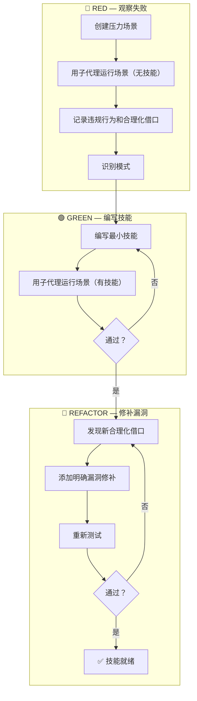

# Skill Factory v6.0 — 技能工坊 (TDD Edition)

## 这是什么？

Skill Factory 是一个**轻量级技能创建工坊**，帮助 AI Agent 规范化地创建、加工、发布和管理 Skills。

**v6.0 核心升级：融合 Superpowers 方法论，引入 TDD 驱动创建和 CSO 发现优化。**

### 解决的痛点

| 手动创建的问题 | Skill Factory 的解决方式 |
|---------------|------------------------|
| 格式不一致（有的有前言区有的没有） | 提供标准前言区模板 + skill-standards 强制检查 |
| 遗漏关键章节（没触发条件/没示例/没注意事项） | 五大必备章节 + 100 分评分体系 |
| 发布混乱（版本号乱跳、无变更记录） | 语义化版本判定 + git commit 规范 + CHANGELOG 同步 |
| **技能不如预期（Agent 总是绕过规则）** | **TDD 驱动创建：先观察 Agent 失败，再编写技能，用子代理压力测试验证效果** |
| **description 误导 Agent（写了工作流总结反而跳过正文）** | **CSO 优化：description 只写触发条件，不写工作流，防止 Agent 走捷径** |

### 适用场景

- 创建新的 AI Agent 技能（从零开始或从已有脚本迁移）
- 优化已有的 SKILL.md（行数过多/结构混乱/质量不足）
- 多技能整合或复杂技能拆分
- 建立团队统一的技能规范和评审标准

### 不适用场景

- 单行命令工具或极简 alias（直接写 `.bashrc` 即可）
- 纯配置文件（JSON/YAML/TOML 无需 SKILL.md 包装）
- 已有完善规范的成熟项目（引入可能增加不必要的开销）

---

## ⚖️ 三层架构铁律

> **核心理念**: 所有技能层级必须 ≤3 层。这是不可妥协的设计约束。
>
> 📖 详见: [references/design-principles.md](references/design-principles.md)

```
Layer 0: skill-name/SKILL.md                  ← 入口
Layer 1: skills/phase-guide/SKILL.md          ← 阶段指南（创建/发布/整合）
Layer 2: skills/phase-guide/worker/SKILL.md   ← 执行者（仅大项目需要）

🛑 最大深度 3 层（references/ / scripts/ 不算层级）
```

| 层级 | 命名规范 | 职责 | 数量 |
|------|---------|------|------|
| Layer 0 | `{skill-name}` | 全局入口 | 1 |
| Layer 1 | `{phase}-{名称}` | 阶段指南 | 1-4 |
| Layer 2 | `{worker-name}` | 单一操作（可选） | 0-10 |

> 💡 **轻量项目**（如本工坊）只需 2 层：SKILL.md → skills/*.md。Layer 2 仅在功能复杂、需要独立调度时使用。

---

## 🗂️ 四维分类法

先判断技能的"体型"，决定用什么结构：

| 维度 | 定义 | 标准 |
|------|------|------|
| **轻** | 功能单一 | 1 个核心能力 |
| **重** | 功能复杂 | 多个独立模块 |
| **薄** | 内容精简 | <300 行 |
| **厚** | 内容详细 | >300 行，需要 references/ |

| 类型 | 结构 | 示例 |
|------|------|------|
| **Type 1 (轻+薄)** | 单个 SKILL.md | 简单工具技能 |
| **Type 2 (重+薄)** | SKILL.md + skills/ | 多功能工具集 |
| **Type 3 (轻+厚)** | SKILL.md + references/ | 详细的操作指南 |
| **Type 4 (重+厚)** | SKILL.md + skills/ + references/ | 大型框架 |

> 📖 详见: [references/design-principles.md](references/design-principles.md)

---

## 🔄 TDD 驱动技能创建（来自 Superpowers 方法论）

> **核心理念**: 技能开发 = 对流程文档应用 TDD。如果没有先观察 Agent 在没有技能时的失败行为，就无法确认技能是否教会了正确的事情。

### 铁律

```
NO SKILL WITHOUT A FAILING TEST FIRST
```

这条铁律适用于**新技能创建**和**已有技能编辑**。在测试前编写了技能内容？删除重来。

### TDD 映射表

| TDD 概念 | 技能创建 |
|---------|---------|
| **测试用例** | 用子代理创建压力场景 |
| **生产代码** | 技能文档 (SKILL.md) |
| **测试失败 (RED)** | Agent 在没有技能时违反规则—记录它给出的合理化借口 |
| **测试通过 (GREEN)** | Agent 在技能存在时遵守规则 |
| **重构** | 修补漏洞的同时保持合规性 |
| **先写测试** | 在编写技能之前先运行基准场景 |
| **观察失败** | 逐字记录 Agent 的借口："太简单不需要测试"、"先写代码再补测试" |
| **最小代码** | 只针对观察到的违规行为编写技能 |
| **观察通过** | 验证 Agent 现在遵守了规则 |

### 创建流程



### 技能类型与测试策略

| 技能类型 | 示例 | 测试方法 |
|---------|------|---------|
| **规范强制型** | TDD、代码审查、先设计后编码 | 学术提问 + 压力场景 + 多重压力组合 |
| **技术方法型** | 条件等待、根因追踪、防御编程 | 应用场景测试 + 边界情况 + 信息缺失测试 |
| **思维模式型** | 简化复杂性、信息隐藏 | 识别场景测试 + 反例测试 |
| **参考文档型** | API 文档、命令参考 | 检索场景 + 应用场景 + 空白测试 |

> 📖 详见: [references/writing-rules.md](references/writing-rules.md) — TDD 驱动技能创建章节

---

## 🔬 Claude Search Optimization（CSO）— 技能发现优化

技能只有在 Agent 能发现它时才有效。CSO 是一套优化技能可发现性的技术体系。

### 核心陷阱：description 写工作流

**问题**：当 description 总结了技能的工作流时，Agent 可能直接执行 description 中的描述，而跳过阅读完整的 SKILL.md 正文。

**示例**：
```
❌ 错误: description: "执行计划时派发子代理，每个任务完成后进行代码审查"
→ Agent 只做一次审查（因为 description 说了"代码审查"）
→ 跳过流程图中的两阶段审查流程

✅ 正确: description: "Use when executing implementation plans with independent tasks"
→ Agent 加载完整 SKILL.md
→ 按照流程图执行两阶段审查
```

### Description 编写规则

| 规则 | 说明 | 好例子 | 坏例子 |
|------|------|--------|--------|
| **以 "Use when..." 开头** | 聚焦触发条件 | "Use when creating new skills..." | "技能创建指南和设计模式库" |
| **只写触发条件** | 不总结工作流 | "Use when tests have race conditions" | "用子代理执行任务并审查代码" |
| **具体症状** | 列出用户实际会遇到的问题 | "技能不如预期、Agent 绕过规则时" | "需要技能创建时使用" |
| **关键词覆盖** | 包含 Agent 可能搜索的词 | "skill / 技能 / SKILL.md / agent" | 单个术语 |

> 📖 详见: [references/skill-standards.md](references/skill-standards.md) — Description 编写规则章节

---

## 🚀 快速开始

### 新建一个技能（TDD 驱动流程）

```
1. 判定类型: 轻/重? 薄/厚?
2. 🔴 RED 阶段: 创建压力场景 → 用子代理测试无技能时的行为 → 记录违规
3. 选择模板: Type 1-4
4. 🟢 GREEN 阶段: 写前言区 + 填充内容 → 用子代理验证效果
5. 🔵 REFACTOR 阶段: 修补Agent合理化漏洞 → 重新验证
6. 规范检查: 对照标准清单验证
7. 发布: 版本更新 + git commit
```

| 需求 | 场景 | 详见 |
|------|------|------|
| "帮我创建技能" | 创建+加工指南 | [creator](skills/skill-factory-creator/SKILL.md) |
| "优化已有技能" | 加工模式 | [creator](skills/skill-factory-creator/SKILL.md) |
| "合并/拆分技能" | 合并+拆分指南 | [assembler](skills/skill-factory-assembler/SKILL.md) |
| "发布新版本" | 发布流程 | [publisher](skills/skill-factory-publisher/SKILL.md) |
| "退役旧技能" | 销毁流程 | [publisher](skills/skill-factory-publisher/SKILL.md) |
| "检查是否规范" | 标准清单 | [references/skill-standards.md](references/skill-standards.md) |
| "怎么写出好内容" | 写作规则 | [references/writing-rules.md](references/writing-rules.md) |

### 示例：创建一个"代码审查"技能

```
用户: "帮我创建一个代码审查技能，检查代码风格和安全漏洞"

skill-factory 工作流程:
1. 判定类型 → 轻（单功能）+ 薄（<300行）→ Type 1
2. 快速路径 → 跳过加工阶段
3. 生成 SKILL.md:

---
name: code-reviewer
version: v0.1.0
author: user
description: 代码审查技能 — 自动检查代码风格规范和安全漏洞，支持 JavaScript 和 Python 项目，输出结构化审查报告和改进建议
tags: [code-review, style-check, security, javascript, python]
dependency:
  parent: none
---
# 代码审查器

## 任务目标
自动审查代码，检查风格规范和安全漏洞。

## 触发条件
用户说"帮我审查这段代码"或"检查安全问题"时使用。

## 操作步骤
1. 解析代码语言和框架
2. 运行风格检查（ESLint/Pylint）
3. 运行安全扫描（常见漏洞模式）
4. 生成结构化审查报告

## 注意事项
- 仅支持 JavaScript 和 Python
- 安全扫描不是银弹，复杂漏洞需人工确认
```

### 示例：优化一个过大的技能

```
用户: "这个部署技能 600 行了，帮我优化"

skill-factory 工作流程:
1. 判定 → 重 + 厚 → Type 4，行数 >500
2. 加工策略 → 精简优先（精简冗余→丰富内容→美化格式→规范检查）
3. 还可以考虑拆分 → assembler 按场景拆为 deploy-dev / deploy-prod / deploy-rollback
```

---

## 📐 标准前言区模板

```yaml
---
name: {skill-name}           # kebab-case，≤50字符
version: v0.1.0              # 语义化版本
author: {author-name}
description: {100-150字符的描述，一句话说清楚}
tags: [{5-15个标签}]
dependency:
  parent: {父技能 或 none}
  children: [{子技能列表}]
---
```

---

## ✅ 规范清单（速查）

> 📖 完整清单: [references/skill-standards.md](references/skill-standards.md)

| # | 检查项 | 通过标准 |
|---|--------|---------|
| 1 | 前言区完整 | name/version/description/tags 全部存在 |
| 2 | **CSO description 规则** | **以 "Use when" 开头，只写触发条件，不写工作流** |
| 3 | description 长度 | 100-150 字符 |
| 4 | 命名规范 | kebab-case，小写+连字符 |
| 5 | 必备章节 | 任务目标/操作步骤/示例/注意事项 |
| 6 | 层级合规 | 目录深度 ≤3 层 |
| 7 | **TDD 验证** | **已通过压力测试（有测试记录或明确说明豁免原因）** |
| 8 | 链接有效 | 内部引用无死链 |

---

## 🏗️ 关键设计模式

> 📖 详见: [references/design-principles.md](references/design-principles.md)

| 模式 | 适用场景 | 核心思路 |
|------|---------|---------|
| **流水线** | 有固定顺序的流程 | 每步有门禁，失败可回调 |
| **策略选择** | 根据条件选择路径 | 按技能行数自动决策 |
| **快速路径** | Type 1 简单技能 | 跳过加工，直接发布 |
| **拆分** | 技能过于复杂 | 拆为多个 ≤3 层的独立技能 |
| **整合** | 多个技能合并 | 选择序列/并行/嵌套模式 |
| **渐进加载** | Skills 三阶段机制 | Discovery→Activation→Execution |
| **Token 效率** | 控制上下文占用 | 最小高信号 token 集 |
| **Happy Path First** | 内容排序 | 90%场景方案放最前面，边缘后置；Quickstart 覆盖完整端到端 |
| **反模式命名** | 指令可靠性 | 每个"不要"配"这样做"+失败原因；显式拒绝 Agent 先验倾向 |
| **验证循环** | 质量保障 | Plan→Validate→Execute；验证项必须是二进制通过/不通过 |
| **错误处理矩阵** | 稳定性 | 5 类异常（输入/工具/数据/权限/超时）各有处理+反馈+重试策略 |
| **TDD 驱动创建** | 技能质量保障 | RED→GREEN→REFACTOR；无测试无技能 |
| **CSO 优化** | 技能发现率 | description 只写触发条件，不写工作流；关键词覆盖 |
| **子代理压力测试** | 技能鲁棒性 | 模拟高压力场景 + 记录 Agent 合理化借口 + 逐条修补 |
| **复杂度分级** | 技能难度标注 | basic(<5步) / intermediate(5-10步) / advanced(>10步) |

---

## 📦 发布规范

```
修改完成 → 版本判定 → 元数据更新 → git commit/tag
```

| 变更类型 | 版本 | Commit 前缀 |
|---------|------|------------|
| 修复 | patch +1 | `fix` |
| 新增 | minor +1 | `feat` |
| 重构 | minor +1 | `refactor` |
| 破坏性 | major +1 | `feat!` |

> 📖 详见: [publisher](skills/skill-factory-publisher/SKILL.md)

---

## 🗑️ 退役流程

```
标记 deprecated → 编写迁移指引 → 30天缓冲 → 归档/删除
```

退役模板：

```yaml
---
name: {原技能}
version: v0.1.0
description: "[已废弃] 请使用: {替代技能}"
tags: [deprecated]
---
```

---

## 📂 项目结构

```
skill-factory/
├── SKILL.md                              ← 本文件: 入口
├── metadata.json                         ← 元数据
├── references/                           ← 参考文档（不占层级）
│   ├── design-principles.md              ← 铁律 + 四维分类 + 设计模式
│   ├── skill-standards.md                ← 规范检查完整清单
│   └── writing-rules.md                  ← 写作高级规则 (Gotchas/反模式/验证循环)
└── skills/                               ← Layer 1: 阶段指南
    ├── skill-factory-creator/SKILL.md    ← 创建器（生产+加工）
    ├── skill-factory-publisher/SKILL.md  ← 发布器（发布+销毁）
    └── skill-factory-assembler/SKILL.md  ← 整合器（合并+拆分）
```

**通用技能目录约定**：

```
{skill-name}/
├── SKILL.md                 ← Layer 0: 入口（必需）
├── scripts/                 ← 可执行脚本（可选，不占层级）
├── references/              ← 参考文档（可选，不占层级）
├── assets/                  ← 模板、图片等资源（可选，不占层级）
└── skills/                  ← Layer 1: 子技能（可选）
```

---

## ⚠️ 注意事项

- **TDD 铁律不可违反**：NO SKILL WITHOUT A FAILING TEST FIRST — 没有经过 RED 阶段的技能不允许发布
- **三层铁律不可妥协**：任何技能目录深度 ≤3 层，超过时必须拆分或征求用户同意
- **CSO 优先**：description 只写触发条件，不写工作流——防止 Agent 走捷径跳过正文
- **先判定再动手**：不确定技能是 Type 1-4 中哪种时，先用四维分类法判定，选错类型会导致不必要的返工
- **Type 1 走快速路径**：简单技能不要过度设计，但即使简单也须经过 RED 阶段验证
- **子代理压力测试不可跳过**：每个技能发布前必须用子代理模拟压力场景验证效果
- **规范清单是底线**：每个技能发布前至少过一遍速查清单的 8 项检查（新增 CSO 和 TDD 检查）
- **版本号同步**：修改根文件时要检查子技能版本号是否也需要更新，避免版本分裂

---

## 版本历史

| 版本 | 日期 | 主要变更 |
|------|------|---------|
| **v0.6.0** | 2026-05-24 | 🔄 **Superpowers融合**：新增TDD驱动创建、CSO优化、子代理压力测试、复杂度分级；description改用Use when格式 |
| **v0.5.0** | 2026-05-16 | ✍️ **写作规则模块**：新增 writing-rules.md (7项高级规则)，设计模式 7→11 |
| **v0.4.1** | 2026-05-16 | 📚 **质量审计**：修复 13 个问题 (P0-P2)，旧术语清零 |
| **v0.4.0** | 2026-05-16 | 🔧 **工坊重构**：18文件→6文件，6,000行→~800行，工厂→工坊 |
| v0.3.1 | 2026-05-01 | 📦 Type 3 拆分：主文件精简至 225 行 |
| v0.3.0 | 2026-05-01 | ⚖️ 三层架构铁律内化 |
| v0.2.0 | 2026-05-01 | 🏗️ 三层架构重构 |
| v0.1.0 | 2026-04-XX | 🎉 初始版本 |

> 💡 详细记录: [CHANGELOG.md](CHANGELOG.md)