# Skill Factory v3 - 技能工厂

## 任务目标

本 Skill 是技能的全生命周期管理工厂，类比现实中的生产工厂：
- **原材料** → 技术文档/URL/需求描述
- **生产线** → 四阶段流水线（生产→加工→发布→销毁）
- **产品** → 结构化的 SKILL.md 技能包

**触发条件**: 当需要创建、修改、优化、整合、拆分、发布或退役技能时使用。

---

## ⚖️ 三层架构铁律（Core Principle v0.3.0）

> **核心理念**：所有技能创建的层级关系推荐为 **最多三层**。这是 skill-factory 的设计哲学基石。

### 铁律定义

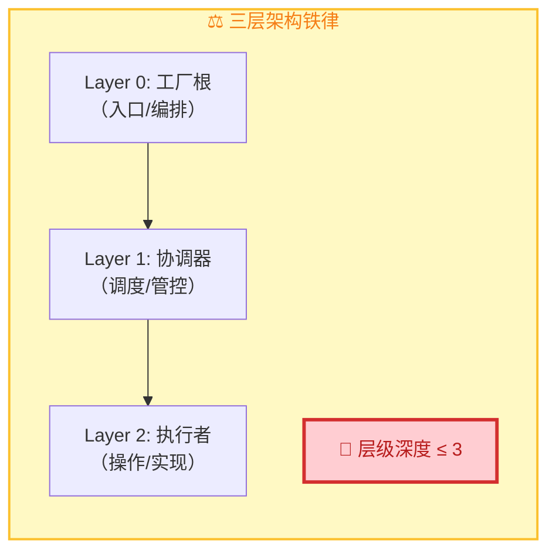

### 三层结构标准模板

| 层级 | 命名规范 | 职责特征 | 典型数量 |
|------|---------|---------|---------|
| **Layer 0** | `{skill-name}` | 全局入口、跨层编排 | 1 个 |
| **Layer 1** | `phase-{name}` 或 `{domain}-coordinator` | 阶段调度、质量门禁 | 2-6 个 |
| **Layer 2** | `{specific-worker}` | 单一职责操作 | 5-20+ 个 |

### 为什么是三层？

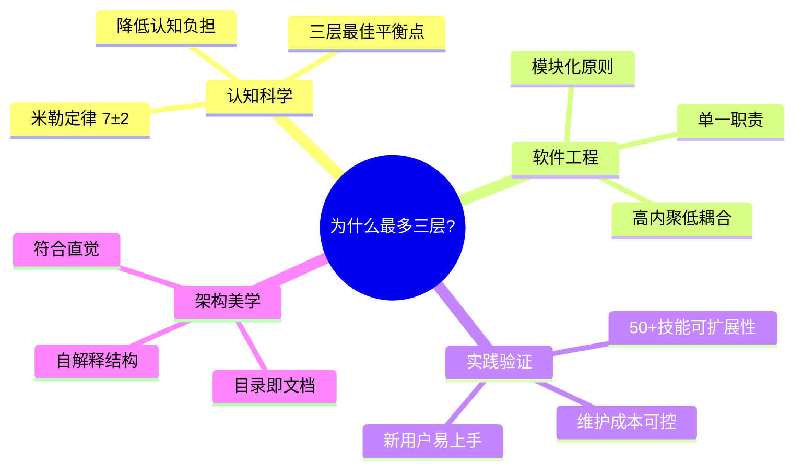

### 层级深度计算方法

```
计算规则：
- 从技能根目录（SKILL.md）开始计数
- 每深入一级子目录 +1
- references/ 和 scripts/ 不算层级（辅助资源）

示例：
✅ skill-factory/SKILL.md                              = Layer 0 (1层)
✅ skills/phase-production/SKILL.md                     = Layer 1 (2层)
✅ skills/phase-production/researcher/SKILL.md          = Layer 2 (3层) ✓
❌ skills/phase-production/researcher/sub-worker/SKILL.md = Layer 3 (4层) ✗ 违规！
```

### 强制执行机制

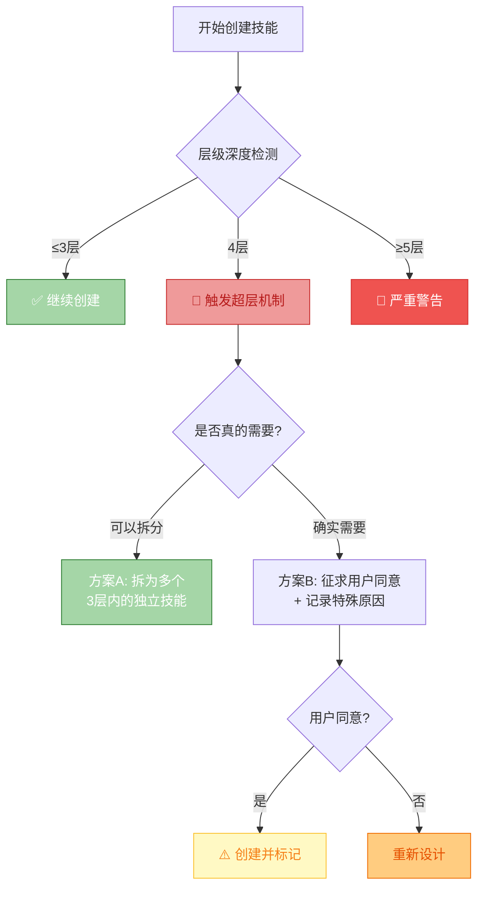

### 违规处理策略

| 层级深度 | 处置方式 | 是否需要确认 |
|---------|---------|------------|
| **1-3层** | ✅ 正常流程 | 否 |
| **4层** | ⚠️ 先尝试拆分，若无法拆分则征求用户同意 | **是** |
| **≥5层** | 🚨 必须重新设计，强制拆分为多个技能 | **必须** |

### 常见的"假性超三层"场景

| 场景 | 实际情况 | 正确做法 |
|------|---------|---------|
| 技能有多个子功能 | 功能复杂但可拆分 | 使用 **重+薄** 技能族模式（仍在3层内） |
| 需要引用外部文档 | 内容丰富 | 放入 `references/` （**不算层级**） |
| 有配置文件/脚本 | 辅助资源 | 同级目录存放（**不算层级**） |
| 动态加载模块 | 运行时行为 | 在 SKILL.md 内描述逻辑（不增加物理层级） |

---

## 工厂全景架构（三层结构 v0.3.0）

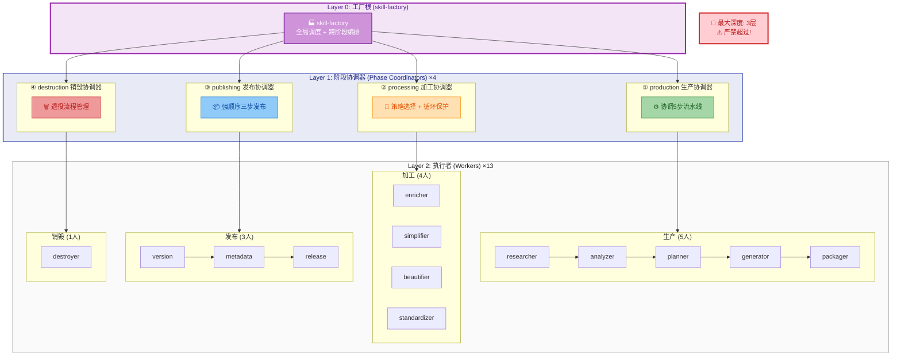

> ⚠️ **层级警示**：本架构严格遵循三层铁律。Layer 2（执行者）为最深层级，**禁止在执行者下再创建子层级**。

### 三层职责定义

| 层级 | 名称 | 数量 | 核心职责 |
|------|------|------|---------|
| **Layer 0** | 工厂根 (Factory Root) | **1** | 全局入口、跨阶段编排、四维分类、场景路由 |
| **Layer 1** | 阶段协调器 (Phase Coordinator) | **4** | 阶段内调度、质量门禁、输入输出契约、错误处理 |
| **Layer 2** | 执行者 (Worker) | **13** | 单一职责操作，接收明确输入，产出明确输出 |

### 架构优势与实践收益

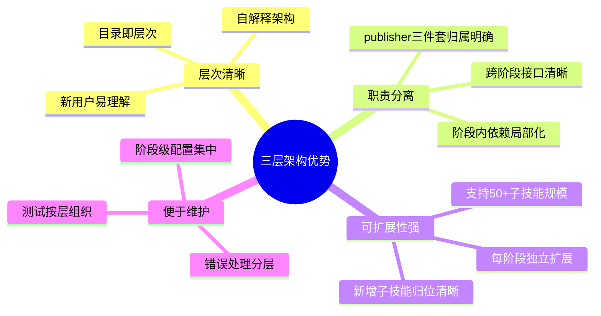

> **💡 与"为什么是三层？"的关系**：前节阐述理论基础（认知科学+软件工程），本节聚焦**工程实践收益**。两者互补：理论指导设计，实践验证价值。

### 四阶段定位

| 阶段 | 类比现实工厂 | 输入 | 输出 | 核心问题 |
|------|------------|------|------|---------|
| **① 生产** | 原料→成品 | 文档/URL/需求 | SKILL.md 技能包 | 怎么造？ |
| **② 加工** | 成品→精加工 | 已有技能 | 升级后的技能 | 怎么改？ |
| **③ 发布** | 质检→出厂 | 加工后技能 | 版本发布记录 | 怎么发？ |
| **④ 销毁** | 退役→回收 | 过时技能 | deprecated 标记 | 怎么废？ |

---

## 四维分类体系（贯穿所有阶段）

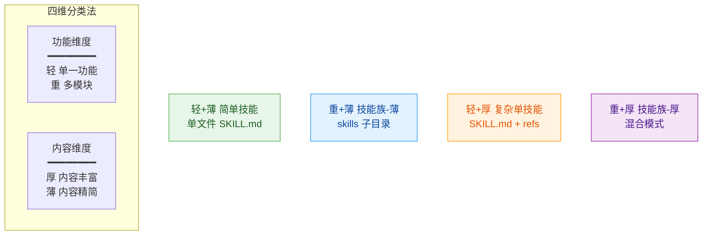

| 维度 | 定义 | 判断标准 | 输出结构 |
|------|------|---------|---------|
| **轻** | 功能单一 | 1 个核心能力 | 单个 SKILL.md |
| **重** | 功能复杂 | 多个模块，可独立使用 | `skills/{子}/SKILL.md` |
| **薄** | 内容精简 | <300 行能描述清楚 | 无需额外文件 |
| **厚** | 内容丰富 | 需要详细说明/示例/代码 | `references/` + 可选 `scripts/` |

---

## 阶段一：生产（Production）

从零创建新技能的完整流水线。

> ⚠️ **三层铁律检查点**：生产阶段是层级控制的第一道防线，planner 和 generator 必须严格执行层级深度检测。


### 子技能索引（三层架构 v0.2.0）

#### Layer 1: 阶段协调器 (4 个)

| 协调器 | 职责 | 子技能数 | 详细文档 |
|--------|------|---------|---------|
| [phase-production](skills/skill-factory-phase-production/SKILL.md) | 生产阶段协调：5步流水线调度 + 快速路径判断 | 5 | 📋 [查看](skills/skill-factory-phase-production/SKILL.md) |
| [phase-processing](skills/skill-factory-phase-processing/SKILL.md) | 加工阶段协调：策略选择(3种) + 循环保护 | 4 | 📋 [查看](skills/skill-factory-phase-processing/SKILL.md) |
| [phase-publishing](skills/skill-factory-phase-publishing/SKILL.md) | 发布阶段协调：强顺序 version→metadata→release | 3 | 📋 [查看](skills/skill-factory-phase-publishing/SKILL.md) |
| [phase-destruction](skills/skill-factory-phase-destruction/SKILL.md) | 销毁阶段协调：退役流程管理 | 1 | 📋 [查看](skills/skill-factory-phase-destruction/SKILL.md) |

#### Layer 2: 执行者 (13 个，按阶段分组)

**🏭 ① 生产阶段 (5 人)** - 协调器: [phase-production](skills/skill-factory-phase-production/SKILL.md)

| 子技能 | 职责 | 核心 |
|--------|------|------|
| [researcher](skills/skill-factory-phase-production/skill-factory-researcher/SKILL.md) | 接收输入、交互确认、补充信息 | 六步研究流程 + 回调机制 (≤3次+冷却) |
| [analyzer](skills/skill-factory-phase-production/skill-factory-analyzer/SKILL.md) | 提取技术信息、评估体量 | 完整度 >= 80% 判定 |
| [planner](skills/skill-factory-phase-production/skill-factory-planner/SKILL.md) | 判定轻重薄厚四维分类 + **层级深度预检** | 两步决策树 → Type 1-4 + **层级合规性评估** |
| [generator](skills/skill-factory-phase-production/skill-factory-generator/SKILL.md) | 按四种类型生成文件 + **层级结构生成** | A/B/C/D 四种模板 + **确保输出≤3层** |
| [packager](skills/skill-factory-phase-production/skill-factory-packager/SKILL.md) | 验证对应结构的完整性 + **最终层级确认** | 四种验证模式 + **快速验证** (Type1) + **层级深度校验** |

**⚙️ ② 加工阶段 (4 人)** - 协调器: [phase-processing](skills/skill-factory-phase-processing/SKILL.md)

| 子技能 | 职责 | 策略角色 |
|--------|------|---------|
| [enricher](skills/skill-factory-phase-processing/skill-factory-enricher/SKILL.md) | 补充示例、references、能力、图表 | **丰富优先** 首选 / 均衡第2步 |
| [simplifier](skills/skill-factory-phase-processing/skill-factory-simplifier/SKILL.md) | 合并去重、语言精炼、摘要提取 | **精简优先** 首选 / 均衡第1步 |
| [beautifier](skills/skill-factory-phase-processing/skill-factory-beautifier/SKILL.md) | 添加 Mermaid 图表、优化排版 | **丰富优先** 第2步 / 均衡第3步 |
| [standardizer](skills/skill-factory-phase-processing/skill-factory-standardizer/SKILL.md) | 前言区校准、命名规范、必备章节 | 所有策略的**最终步骤** |

**📦 ③ 发布阶段 (3 人)** - 协调器: [phase-publishing](skills/skill-factory-phase-publishing/SKILL.md)

| 子技能 | 职责 | 执行顺序 |
|--------|------|---------|
| [publisher-version](skills/skill-factory-phase-publishing/skill-factory-publisher-version/SKILL.md) | 语义化版本 + 类型变更判定 | **第1步** (含快速模式) |
| [publisher-metadata](skills/skill-factory-phase-publishing/skill-factory-publisher-metadata/SKILL.md) | 维护 description/tags/dependency | **第2步** (含快速模式) |
| [publisher-release](skills/skill-factory-phase-publishing/skill-factory-publisher-release/SKILL.md) | git commit/tag/push 操作 | **第3步** (含批量发布) |

**🗑️ ④ 销毁阶段 (1 人)** - 协调器: [phase-destruction](skills/skill-factory-phase-destruction/SKILL.md)

| 子技能 | 职责 |
|--------|------|
| [destroyer](skills/skill-factory-phase-destruction/skill-factory-destroyer/SKILL.md) | 退役标记、迁移指引编写、归档清理 |

### 典型场景映射

| 用户需求 | 生产流程入口 |
|---------|-------------|
| "帮我根据这个教程生成技能" | researcher → 全流程 |
| "把这个网站做成技能" | researcher → 全流程 |
| "我有一个需求想做成技能" | researcher → 全流程 |

---

## 阶段二：加工（Processing）

对已有技能进行加工处理，类比工厂的精加工车间。

> ⚠️ **三层铁律优化点**：加工阶段是维护层级合规的关键环节。当技能过于复杂时，应优先考虑**拆分为多个符合三层规范的独立技能**，而非增加层级深度。

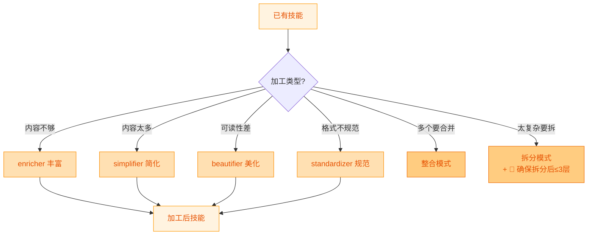

### 2.1 丰富器（Enricher）

**职责**: 补充技能内容，使其更完整

| 操作 | 说明 | 效果 |
|------|------|------|
| 补充示例 | 添加更多使用示例 | 可能 薄→厚 |
| 添加 references | 详细实现拆到 references/ | 薄→厚 |
| 扩展能力 | 在现有基础上添加新功能 | 可能 轻→重 |
| 补充 Mermaid | 为流程添加可视化图表 | 厚度增加 |

### 2.2 简化器（Simplifier）

**职责**: 精简冗余内容，使技能更精炼

| 操作 | 说明 | 效果 |
|------|------|------|
| 合并重复 | 去除重复描述 | 行数减少 |
| 精炼语言 | 压缩冗余表述 | 行数减少 |
| 提取摘要 | 主文件保留概览 | 厚→薄（可能）|
| 原子拆分 | 复杂技能拆为简单子技能 | 重→多轻（**确保每个子技能≤3层**） |

### 2.3 美化器（Beautifier）

**职责**: 提升技能的可读性和视觉表现

| 操作 | 说明 | 示例 |
|------|------|------|
| 添加 Mermaid 图表 | 流程图、架构图、决策树 | flowchart / sequenceDiagram |
| 优化排版 | 统一标题层级、表格对齐 | Markdown 格式优化 |
| 配色方案 | 统一颜色语义 | 绿=成功/红=错误/蓝=信息 |
| 增强导航 | 添加目录、快速链接 | 锚点链接 |

### 2.4 规范化器（Standardizer）

**职责**: 使技能符合标准规范

| 操作 | 说明 | 标准 |
|------|------|------|
| 前言区校准 | name/version/description/tags | 100-150字符 description |
| 命名规范 | 目录名、文件名 kebab-case | 小写+连字符 |
| 必备章节 | 任务目标/操作步骤/示例/注意事项 | 缺一补一 |
| 链接检查 | references 内部链接有效性 | 无死链 |

### 2.5 特殊加工模式

#### 整合（Assembly）

将多个技能合并为一个：

```
技能A + 技能B + 技能C → 整合技能族 (重+薄 或 重+厚)
```

- 对应原 scenario-integrate
- 模式选择: 顺序/并行/嵌套
- 输出类型判定: 全是简单子→重+薄 / 有复杂子→重+厚

#### 拆分（Disassembly）

将复杂技能拆分为多个：

```
复杂技能 (重+厚) → 技能A (轻+薄) + 技能B (轻+厚) + 技能C (轻+薄)
                  ↑
            每个输出必须 ≤3层
```

- 对应原 scenario-decompose
- 拆分维度: 功能/场景/复杂度
- **三层铁律约束**: 拆分后的每个子技能必须独立符合三层架构规范
- 迁移策略: 并行维护 → deprecated → 退役

### 典型场景映射

| 用户需求 | 加工入口 |
|---------|---------|
| "这个技能内容太少，丰富一下" | enricher |
| "这个技能太长了，精简一下" | simplifier |
| "加些图表让它好看点" | beautifier |
| "检查下这个符不符合规范" | standardizer |
| "把这几个技能合并" | 整合模式 |
| "这个技能太复杂了，拆开" | 拆分模式 |

---

## 阶段三：发布（Publishing）

版本管理和正式发布。

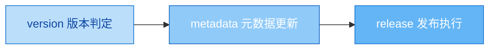

### 3.1 版本管理（Version Manager）

| 变更类型 | 版本递增 | 触发条件 |
|---------|---------|---------|
| **Fix** | patch +1 | 错别字、描述修正 |
| **Feature** | minor +1 | 新增能力、新示例 |
| **Type Upgrade** | minor +1 | 轻→重、薄→厚 |
| **Breaking** | major +1 | 接口修改、删除能力 |

### 3.2 元数据管理（Metadata Manager）

| 元数据字段 | 更新时机 |
|-----------|---------|
| description | 每次变更后重新评估 100-150 字符 |
| tags | 能力变化时增删标签 |
| dependency.parent | 重构父子关系时 |
| dependency.children | 新增/移除子技能时 |
| version | 每次发布时递增 |

### 3.3 发布执行（Release Publisher）

```bash
git add .
git commit -m "<type>(<skill>): <变更说明>"
git tag -a v<版本> -m "Release v<版本>: <说明>"
```

| Commit 类型前缀 | 适用场景 |
|----------------|---------|
| `fix` | 错误修复 |
| `feat` | 新增功能 |
| `refactor` | 类型升级/重构 |
| `feat!` | 破坏性变更 |

### 典型场景映射

| 用户需求 | 发布入口 |
|---------|---------|
| "修改完了，提交一个版本" | version → metadata → release |
| "这个变更是什么类型的？" | version 判定 |
| "更新一下元数据" | metadata |

---

## 阶段四：销毁（Destruction）

技能退役和清理。

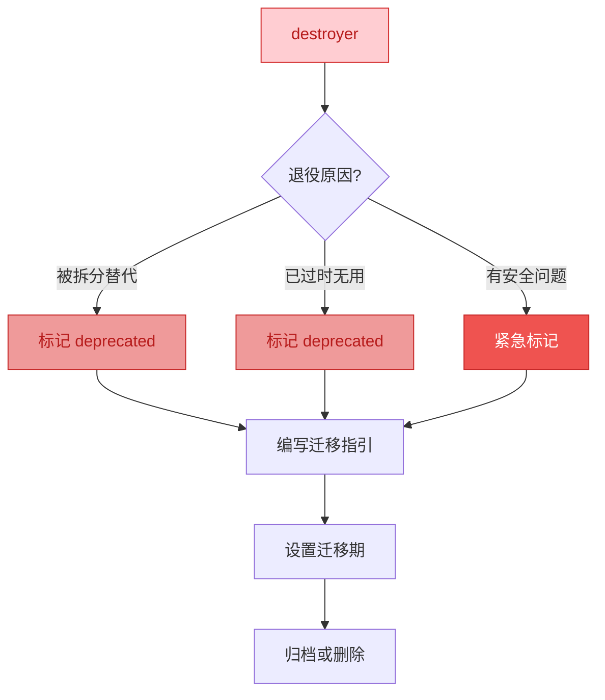

### 销毁流程

| 步骤 | 操作 | 说明 |
|------|------|------|
| 1. 判定原因 | 为什么退役？ | 被替代/过时/安全 |
| 2. 标记 deprecated | 修改 SKILL.md | description 加 [已废弃] |
| 3. 迁移指引 | 告诉用户用什么替代 | 链接到新技能 |
| 4. 设置迁移期 | 建议 30 天 | 给用户缓冲时间 |
| 5. 归档/删除 | 移动到 archive/ 或删除 | 清理仓库 |

### Deprecated 模板

```yaml
---
name: <原技能>
version: v0.1.0
description: "[已废弃] 请使用以下替代技能:"
tags: [deprecated]
---

## 退役通知

本技能已于 {日期} 标记为废弃。

### 替代方案
- [<新技能A>](../<new-skill-a>/SKILL.md): <用途>
- [<新技能B>](../<new-skill-b>/SKILL.md): <用途>

### 迁移指南
<简要说明如何从旧技能迁移到新技能>
```

### 典型场景映射

| 用户需求 | 销毁入口 |
|---------|---------|
| "这个技能不用了，退役吧" | destroyer |
| "已经拆分了，旧的怎么处理" | destroyer (被替代模式) |

---

## 场景快速路由

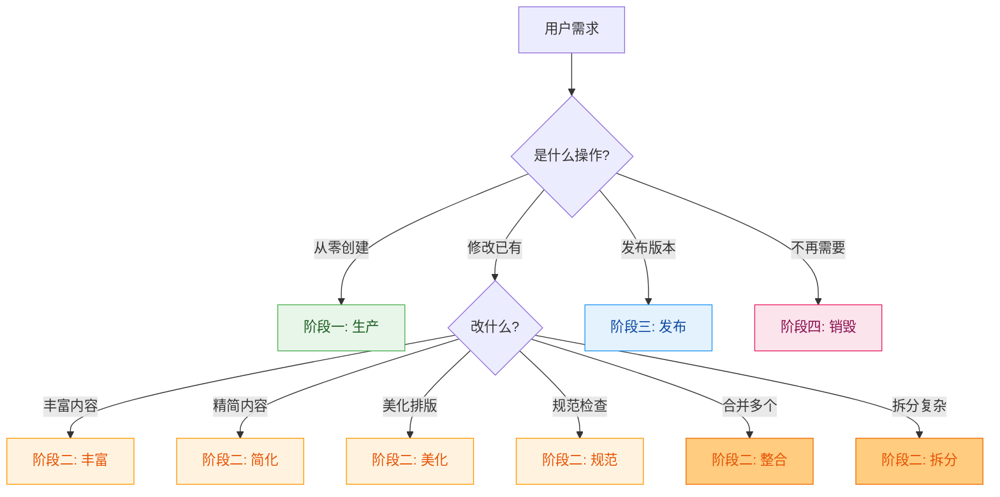

---

## 🚨 超三层处理流程（SOP v0.3.0）

> **当检测到需要创建超过三层的技能时，必须严格执行本流程**。

### 触发条件

```yaml
触发场景:
  - planner 预检发现需求需要 ≥4层才能完整表达
  - generator 生成过程中发现输出结构会超过3层
  - packager 验证时检测到层级深度 > 3
  - 用户主动提出需要深层级结构的需求

自动检测机制:
  - 每个生产阶段节点内置层级计数器
  - 目录深度实时监控（从根 SKILL.md 开始）
  - references/ 和 scripts/ 排除在计数外
```

### 标准处理流程

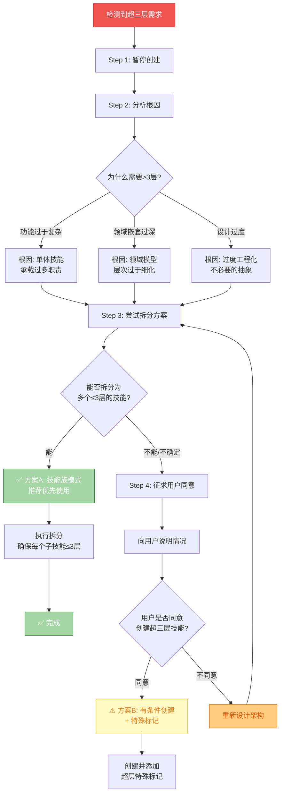

### 详细步骤说明

#### Step 1-2: 暂停与分析

| 步骤 | 操作 | 输出 |
|------|------|------|
| **暂停** | 立即停止当前创建流程，不生成任何文件 | 系统暂停状态 |
| **分析** | 识别导致超层的根本原因 | 根因报告（功能复杂/领域嵌套/过度设计） |

#### Step 3: 拆分方案设计（首选）

**方案 A：技能族模式（推荐）**

```
❌ 超三层结构 (禁止):
skill-name/
└── skills/
    └── phase-1/
        └── worker/
            └── sub-worker/     ← 第4层！违规！
                └── SKILL.md

✅ 拆分为技能族 (推荐):
skill-name/                          ← Layer 0: 工厂根
├── SKILL.md
└── skills/
    ├── skill-a/                    ← Layer 2: 独立技能A (轻+薄)
    │   └── SKILL.md               ← 总共3层 ✓
    ├── skill-b/                    ← Layer 2: 独立技能B (轻+厚)
    │   ├── SKILL.md
    │   └── references/            ← 不算层级
    └── skill-c/                    ← Layer 2: 独立技能C (轻+薄)
        └── SKILL.md               ← 总共3层 ✓
```

**拆分决策树：**

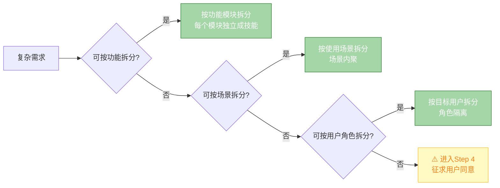

#### Step 4: 用户确认流程（备选）

当且仅当**无法拆分**或**拆分成本过高**时，才进入此步骤：

**必须向用户说明的内容：**

```markdown
## ⚠️ 超三层架构申请

### 当前情况
- 计划层级深度：{N} 层
- 三层铁律限制：≤3 层
- 超出层数：{N-3} 层

### 尝试过的拆分方案
1. {方案1描述} → 结果：{为何不可行}
2. {方案2描述} → 结果：{为何不可行}

### 申请理由
{详细说明为什么必须使用超三层结构}

### 承诺与标记
- ✅ 同意在 SKILL.md 中添加 `depth: {N}` 标记
- ✅ 同意添加 `warning: 超三层架构` 警示
- ✅ 承担未来维护成本增加的风险

### 请求确认
请确认是否同意创建此超三层技能？[是/否]
```

**如果用户同意：**

```yaml
# 必须在 SKILL.md 前言区添加的特殊标记
---
name: {skill-name}
version: v0.1.0
depth: 4  # ⚠️ 超出三层铁律限制
layer-warning: "本技能采用 {N} 层架构，已获得用户特别授权"
authorization:
  date: "{YYYY-MM-DD}"
  reason: "{授权原因}"
  user-confirmed: true
---
```

**如果用户不同意：**

→ 返回 Step 3，重新设计更激进的拆分方案，或简化需求范围。

### 处理结果记录

无论最终采用哪种方案，都必须在技能的 metadata 中记录：

| 字段 | 说明 |
|------|------|
| `layer_check_date` | 层级检查日期 |
| `layer_depth` | 最终采用的层级数 |
| `layer_decision` | 决策结果（normal/split/authorized） |
| `layer_note` | 处理过程备注 |

---

## 发布路径选择 (Release Path Selection) - v0.3.0 新增

### 路径矩阵

| 技能类型 | 推荐路径 | 流程步骤 | 预计耗时 | 效率提升 |
|---------|---------|---------|---------|---------|
| **Type 1 (轻+薄)** | 🚀 **快速路径** | 生产→发布 | **30-40min** | **+85%** |
| Type 2 (重+薄) | 📋 标准路径 | 生产→选择性加工→发布 | 2h | - |
| Type 3 (轻+厚) | 📋 标准路径 | 生产→加工→发布 | 3h | - |
| Type 4 (重+厚) | 🔄 完整路径 | 生产→全量加工→发布+监控 | 5h+ | - |

### 快速路径详细流程 (Type 1 专用)

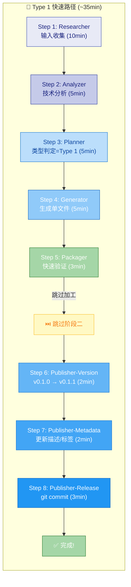

### 路径选择决策树

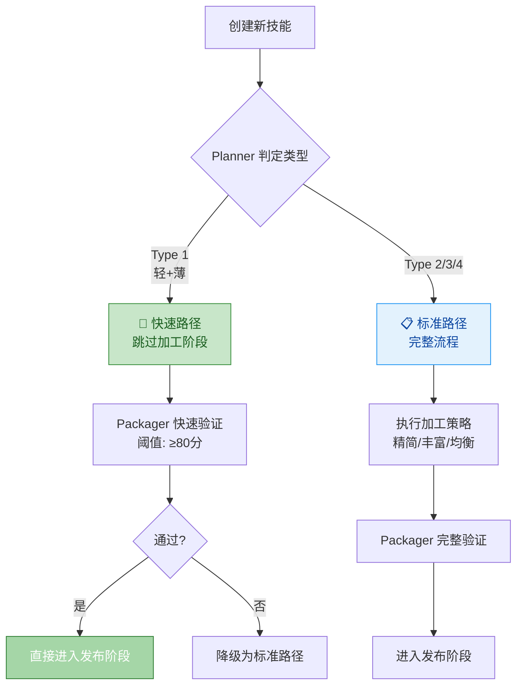

### Type 1 判定标准（快速路径准入）

```yaml
type_1_criteria:
  功能维度: "轻"  # 单一核心能力
  内容维度: "薄"  # <300行可描述清楚
  输出结构: "单个 SKILL.md 文件"
  复杂度评估:
    示例数量: "<= 3 个"
    决策分支: "<= 2 个"
    外部依赖: "无或极少"

fast_path_requirements:
  - ✅ 前言区完整（name/version/description/tags）
  - ✅ 单文件 SKILL.md（无 skills/ 或 references/）
  - ✅ 正文 < 300 行
  - ✅ Packager 快速验证 ≥ 80 分
  - ⏭️ 跳过 Enricher/Simplifier/Beautifier/Standardizer
```

---

## 全部子技能索引

### 阶段一：生产（5 个）

| 子技能 | 文件路径 | 职责 |
|--------|---------|------|
| researcher | `skills/skill-factory-researcher/SKILL.md` | 信息研究 |
| analyzer | `skills/skill-factory-analyzer/SKILL.md` | 技术分析 |
| planner | `skills/skill-factory-planner/SKILL.md` | 类型判定 |
| generator | `skills/skill-factory-generator/SKILL.md` | 文件生成 |
| packager | `skills/skill-factory-packager/SKILL.md` | 结构验证 |

### 阶段二：加工（4 个）

| 子技能 | 文件路径 | 职责 |
|--------|---------|------|
| enricher | `skills/skill-factory-enricher/SKILL.md` | 内容丰富 |
| simplifier | `skills/skill-factory-simplifier/SKILL.md` | 内容简化 |
| beautifier | `skills/skill-factory-beautifier/SKILL.md` | 格式美化 |
| standardizer | `skills/skill-factory-standardizer/SKILL.md` | 规范化 |

### 阶段三：发布（3 个）

| 子技能 | 文件路径 | 职责 |
|--------|---------|------|
| publisher-version | `skills/skill-factory-publisher-version/SKILL.md` | 版本管理 |
| publisher-metadata | `skills/skill-factory-publisher-metadata/SKILL.md` | 元数据管理 |
| publisher-release | `skills/skill-factory-publisher-release/SKILL.md` | 发布执行 |

### 阶段四：销毁（1 个）

| 子技能 | 文件路径 | 职责 |
|--------|---------|------|
| destroyer | `skills/skill-factory-destroyer/SKILL.md` | 退役销毁 |

---

## 与 skill-lifecycle 的关系

skill-lifecycle 的全部能力已整合进 skill-factory：

| 原 skill-lifecycle 内容 | 映射到 skill-factory |
|-----------------------|---------------------|
| scenario-create | 阶段一：生产（全流程） |
| scenario-modify | 阶段二：加工 + 阶段三：发布 |
| scenario-optimize | 阶段二：加工（四种加工器） |
| scenario-integrate | 阶段二：加工（整合模式） |
| scenario-decompose | 阶段二：加工（拆分模式） |
| workflow-generation | 阶段一：生产的输出类型之一 |
| skill-standards | 阶段二：加工（规范化器） |

**结论**: skill-factory 是独立项目，作为技能的全生命周期管理工厂。

---

## 版本历史

| 版本 | 日期 | 主要变更 |
|------|------|---------|
| **v0.3.0** | 2026-05-01 | ⚖️ **三层架构铁律内化**：新增核心理念章节 + 超三层处理 SOP |
| v0.2.0 | 2026-05-01 | 🏗️ **三层架构重构**：引入 Layer 1 阶段协调器 + 快速路径 |
| v0.1.0 | 2026-04-XX | 🎉 **初始版本**：建立四维分类体系 + 四阶段流水线 |

> 💡 **详细变更记录**: 请查看 [CHANGELOG.md](CHANGELOG.md)
