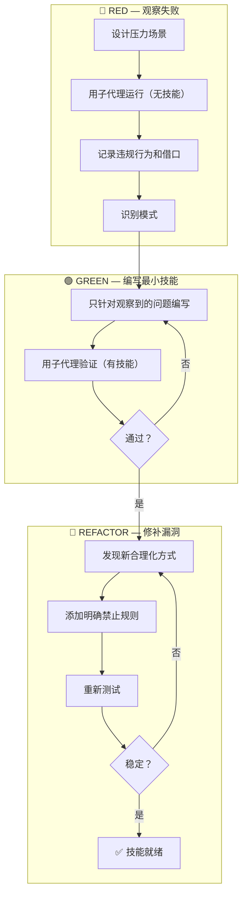
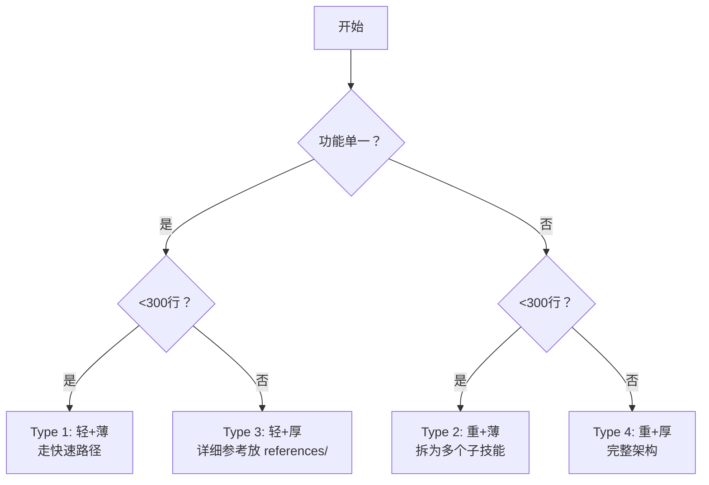

# 🎯 Skill 最佳实践规范速查手册

> **版本**: v1.0.0
> **来源**: skill-factory 规范体系整合
> **适用**: 所有 AI Agent 技能开发者
> **更新日期**: 2026-05-27

---

## 📌 快速导航

| 需求 | 跳转到 |
|------|--------|
| **5分钟快速入门** | [⚡ Quick Start](#-quick-start--5分钟创建符合规范的技能) |
| **核心铁律** | [🔴 三大不可违反的铁律](#-三大不可违反的铁律) |
| **标准模板** | [📐 完整 SKILL.md 模板](#-完整-skillmd-模板) |
| **质量检查** | [✅ 8项必检清单](#-8项必检清单) |
| **常见错误** | [❌ 反模式与正确做法](#-反模式与正确做法) |
| **TDD 流程** | [🔄 TDD 驱动创建](#-tdd-驱动创建流程) |

---

## ⚡ Quick Start - 5分钟创建符合规范的技能

### 最小可行技能（Type 1: 轻+薄）

```yaml
---
name: my-awesome-skill
version: v0.1.0
author: your-name
description: Use when {触发条件} — {100-150字符描述核心价值}
tags: [{标签1}, {标签2}, {标签3}]
dependency:
  parent: none
---

# 我的技能名称

## 任务目标
一句话说清楚这个技能做什么。

## 触发条件
用户说"{具体话语}"或遇到"{具体问题}"时使用。

## 操作步骤
1. 第一步：{具体操作}
2. 第二步：{具体操作}
3. 第三步：{具体操作}

## 示例
### 场景1：{场景名}
**输入**: "{用户请求}"
**输出**: "{预期结果}"

## 注意事项
- ⚠️ {具体的限制或陷阱}
- ✅ {推荐做法}
- ❌ {禁止做法}

## 错误处理
| 异常类型 | 处理方式 | 反馈信息 |
|---------|---------|---------|
| 输入错误 | 终止+提示 | "需要X，收到Y" |
| 工具失败 | 重试3次 | "第N/3次重试中..." |
```

> 💡 **提示**: Type 1 技能走快速路径，30分钟可完成！

---

## 🔴 三大不可违反的铁律

### 铁律 #1: TDD 驱动创建

```
NO SKILL WITHOUT A FAILING TEST FIRST
```

| 阶段 | 目标 | 关键动作 |
|------|------|---------|
| **🔴 RED** | 证明"没技能时会失败" | 用子代理测试→记录违规行为和借口 |
| **🟢 GREEN** | 编写最小技能 | 只针对观察到的问题编写规则 |
| **🔵 REFACTOR** | 修补漏洞 | 发现新借口→添加明确禁止规则→重测 |

**豁免条件**：仅限参考文档型技能（需在元数据中注明）

---

### 铁律 #2: CSO Description 规则

> **核心原则**: description 只写触发条件，不写工作流总结

#### ✅ 正确示例

```yaml
description: "Use when creating, editing, optimizing, or validating AI Agent skills — supports skill structure design"
```

#### ❌ 错误示例

```yaml
description: "执行计划时派发子代理，每个任务完成后进行代码审查"
# 问题：Agent 只做一次审查就跳过了完整流程！
```

#### 8条编写规则

| # | 规则 | 好例子 | 坏例子 |
|---|------|--------|--------|
| 1 | **以 "Use when..." 开头** | "Use when creating new skills..." | "技能创建指南和设计模式库" |
| 2 | **只写触发条件** | "Use when tests have race conditions" | "用子代理执行任务并审查代码" |
| 3 | **具体症状** | "技能不如预期、Agent 绕过规则时" | "需要技能创建时使用" |
| 4 | **关键词覆盖** | "skill / 技能 / SKILL.md / agent / TDD" | 单个术语 |
| 5 | **第三人称** | "Use when encountering any bug..." | "I can help you debug..." |
| 6 | **长度控制** | <500 字符（最好 <200） | 详细的功能描述段落 |
| 7 | **写用户会问什么** | "用户请求代码审查时触发" | "本技能处理代码审查工作" |
| 8 | **避免歧义** | 每个技能有辨识度 | 通用模糊描述 |

---

### 铁律 #3: 三层架构限制

```
最大深度: 3 层（references/ / scripts/ 不算层级）
```

#### ✅ 合规示例

```
✅ Layer 0: skill/SKILL.md                          (入口)
✅ Layer 1: skills/creator/SKILL.md                  (阶段指南)
✅ Layer 2: skills/creator/validator/SKILL.md        (执行者) ← 最大深度！
```

#### ❌ 违规示例

```
❌ skills/creator/validator/sub-worker/SKILL.md      (第4层！必须拆分)
```

#### 超三层处理 SOP

```
检测(≥4层) → 暂停+告警 → 分析路径 → 生成方案 → 用户确认 → 标记
```

---

## 📐 完整 SKILL.md 模板

### 标准前言区

```yaml
---
name: {skill-name}                    # kebab-case，≤50字符
version: v0.1.0                       # 语义化版本 (semver)
author: {author-name}                 # 作者名
description: Use when {触发条件} — {100-150字符}
tags: [{5-15个标签}]                 # kebab-case 小写
dependency:
  parent: {父技能 或 none}
  children: [{子技能列表}]            # 可选
complexity: basic                     # basic/intermediate/advanced
tdd_status: validated                 # validated/exempted
---
```

### 必备章节（5个）

| # | 章节 | 要求 | 示例 |
|---|------|------|------|
| 1 | **任务目标** | 一句话 | "自动审查代码风格和安全漏洞" |
| 2 | **触发条件** | 具体场景列表 | "用户说'帮我审查这段代码'时使用" |
| 3 | **操作步骤** | 清晰可执行 | 1. 解析语言 2. 运行检查 3. 生成报告 |
| 4 | **示例** | ≥1个完整案例 | 包含输入→输出→验证 |
| 5 | **注意事项** | 三类内容之一 | Gotchas/错误处理矩阵/反模式列表 |

### 可选章节（按需添加）

| 章节 | 适用场景 |
|------|---------|
| **Quickstart** | 复杂技能需要端到端演示 |
| **错误处理** | 有多种异常类型需分类处理 |
| **红旗警告** | 规范强制型技能防止合理化 |
| **复杂度标注** | 影响资源分配和验证深度 |

---

## ✅ 8项必检清单

发布前逐项检查：

| # | 检查项 | 通过标准 | 权重 |
|---|--------|---------|------|
| 1 | **前言区完整** | name/version/description/tags 全存在 | 15% |
| 2 | **CSO description** | 以 "Use when" 开头，只写触发条件 | 20% |
| 3 | **description 长度** | 100-150 字符 | 10% |
| 4 | **命名规范** | kebab-case，全小写+连字符 | 10% |
| 5 | **必备章节** | 任务目标/操作步骤/示例/注意事项齐全 | 20% |
| 6 | **层级合规** | 目录深度 ≤3 层 | 10% |
| 7 | **TDD 验证** | 已通过压力测试或有豁免说明 | 10% |
| 8 | **链接有效** | 内部引用无死链 | 5% |

### 评分等级

| 总分 | 等级 | 操作 |
|------|------|------|
| **≥90分** | ⭐⭐⭐ 优秀 | 可以发布 |
| **≥70分** | ⭐⭐ 合格 | 建议优化后发布 |
| **≥60分** | ⭐ 可发布 | 必须修复关键问题 |
| **<60分** | ❌ 不合格 | 禁止发布，返回修改 |

---

## 🔄 TDD 驱动创建流程

### 完整三阶段循环



### 压力场景设计技巧

| 压力类型 | 设计要点 | 适用技能 |
|---------|---------|---------|
| **时间压力** | "每分钟损失 $X" | 调试、紧急修复 |
| **权威压力** | "经理要求..." | 代码审查、流程强制 |
| **疲劳/厌倦** | "这是第 N 个类似的..." | 重复性任务 |
| **过度自信** | "这很明显不需要..." | 复杂技术决策 |

### 合理化借口对照表模板

```markdown
## Agent 合理性对照表

| 借口 | 现实 | 禁止规则 |
|------|------|---------|
| "太简单不需要测试" | 简单代码也会出问题 | 即使简单也必须经过 RED 阶段 |
| "我先写代码再补测试" | 测试后写的 = 不知道该测什么 | 删掉代码，从测试开始 |
| "这很明显不需要文档" | 对你明显 ≠ 对其他 Agent 明显 | 必须有书面技能 |
| "时间紧跳过流程" | 跳过流程 = 质量无保障 | 无例外，时间紧也要走 TDD |
| "我是按精神不是按字面" | 违反字面 = 违反精神 | **违反字面就是违反精神** |
```

---

## 📊 四维分类法（决定技能结构）

### 判定维度

| 维度 | 定义 | 判定标准 |
|------|------|---------|
| **轻/重** | 功能数量 | 轻=单一能力 / 重=多独立模块 |
| **薄/厚** | 内容量 | 薄=<300行 / 厚=>300行需references/ |

### 四种类型及结构

| 类型 | 特征 | 目录结构 | 创建耗时 |
|------|------|---------|---------|
| **Type 1** (轻+薄) | 单一功能，<300行 | 单个 SKILL.md | 30min 🚀 |
| **Type 2** (重+薄) | 多功能，<300行 | SKILL.md + skills/ | 2h |
| **Type 3** (轻+厚) | 单功能，>300行 | SKILL.md + references/ | 3h |
| **Type 4** (重+厚) | 多功能，>300行 | 全部目录 | 5h+ 🔄 |

### 快速判定流程



---

## ❌ 反模式与正确做法

### Top 10 常见错误

| # | ❌ 反模式 | 为什么失败 | ✅ 正确做法 |
|---|----------|-----------|-------------|
| 1 | description 写工作流 | Agent 跳过正文直接执行 | 只写触发条件（Use when...） |
| 2 | 跳过 TDD 直接写 | 不知道该解决什么问题 | 先观察失败，再编写技能 |
| 3 | 泛泛的"适当处理错误" | Agent 不知道什么叫"适当" | 按5类异常分别定义处理方式 |
| 4 | 给选项菜单不给默认值 | Agent 不擅长选择 | 给推荐默认值，仅必要时列替代 |
| 5 | 目录层级超过3层 | 认知负担指数上升 | 拆分为多个≤3层的独立技能 |
| 6 | 缺少压力测试验证 | 无法确认技能有效性 | 用子代理模拟高压力场景 |
| 7 | 注意事项太泛泛 | 每次理解不同 | 升级为Gotchas/错误处理/反模式 |
| 8 | 操作步骤缺少验证 | 无法判断是否成功 | 每步追加二进制验证项 |
| 9 | 只写"不要 X" | Agent 无所适从 | "不要 X，因为 Y；改为 Z" |
| 10 | 版本号随意跳跃 | 无法追踪变更 | 严格遵循 semver 规范 |

### 具体示例对比

#### 示例1: Error Handling

```markdown
❌ 差的写法:
   "注意处理可能的错误情况"

✅ 好的写法:
   "当遇到以下异常时按此矩阵处理：
    - FileNotFoundError → 提示用户确认路径，不自动创建
    - PermissionError → 列出当前用户权限，建议 sudo
    - UnicodeDecodeError → 尝试 latin-1 回退，记录警告"
```

#### 示例2: Description

```yaml
❌ 差的 description:
   description: "执行计划时派发子代理，每个任务完成后进行代码审查"

✅ 好的 description:
   description: "Use when executing implementation plans with independent tasks in the current session"
```

#### 示例3: Anti-patterns

```markdown
❌ 差的写法:
   "禁止直接修改源码"

✅ 好的写法:
   "禁止直接修改 .py 文件，因为 AST 变换更安全且可回滚。
    改为：使用 ast.transform() 或 monkey-patch 替代方案"
```

---

## 🎯 高级写作规则（R1-R10）

### R1: Gotchas 坑点清单

环境级别的具体陷阱，Agent 必须在执行前知晓：

| 陷阱 | 后果 | 正确做法 |
|------|------|---------|
| 查询遗漏 WHERE 条件 | 全表删除 | 必须显式 `WHERE id = ?` |
| API 版本参数格式错 | 400错误或静默忽略 | 检查 Accept-Version 头 |
| 字段名 id 歧义 | 关联查询返回错误数据 | 统一 user_id / record_id |
| 日期忽略时区 | 跨时区偏差±12h | 统一存UTC，显示时转换 |
| 文件未指定编码 | Windows GBK乱码 | 始终 encoding='utf-8' |

---

### R2: 反模式命名 + 失败模式

每个"不要"配一个"这样做"+失败原因：

| ❌ 错误 | 先验倾向 | ✅ 正确 |
|--------|---------|--------|
| "处理错误" | catch-all 吞异常 | 分类处理每类异常 |
| "选择合适的格式" | 随机选或选最长 | **默认JSON**，用户要求才切换 |
| "确保文件存在后操作" | 可能被其他进程锁定 | try open + os.path.exists 双确认 |

---

### R3: Happy Path First

90%场景放最前面，边缘情况后置：

| 好的排序 | 坏的排序 |
|----------|---------|
| 1. 创建文件并写入 | 1. 输入验证 |
| 2. 验证文件已创建 | 2. 权限检查 |
| 3. （边缘）权限不足 | 3. 创建文件 |
| 4. （边缘）磁盘空间不足 | 4. 写入内容... |

---

### R4: 错误处理矩阵（5类异常）

| 异常类别 | 触发条件 | 处理方式 | 是否重试 | 重试上限 |
|---------|---------|---------|---------|---------|
| **输入错误** | 参数为空/类型不符 | 终止+提示正确格式 | 否 | - |
| **工具调用失败** | HTTP500 / CLI exit≠0 | 指数退避重试 | 是 | 3次 |
| **数据异常** | JSON解析失败/字段缺失 | 记录原始数据+跳过 | 否 | - |
| **权限不足** | 403 / EACCES | 终止+列出所需权限 | 否 | - |
| **超时** | >30s无响应 | 放弃当前，标记待处理 | 是(异步) | 1次 |

---

### R5: Plan→Validate→Execute 验证循环

操作完成后必须有二进制验证清单：

| 模糊（差） | 可二进制判断（好） |
|-----------|------------------|
| "代码整洁" | `eslint --max-warnings 0` 返回 exit code 0 |
| "检查无误" | `git diff --stat` 显示 0 行变更 |
| "测试通过" | `pytest tests/ -v` 显示 X passed, 0 failed |
| "部署成功" | curl health 返回 `{"status":"ok"}` |

---

### R6: 复杂度分级

| 级别 | 步骤数 | 特征 | 标注方式 |
|------|--------|------|---------|
| **basic** | <5 | 无边缘情况 | `complexity: basic` |
| **intermediate** | 5-10 | 需要部分判断 | `complexity: intermediate` |
| **advanced** | >10 | 多决策点+领域知识 | `complexity: advanced` |

---

### R7: 默认值优于选项菜单

| 给选项菜单（差） | 给默认值（好） |
|----------------|---------------|
| "输出格式可选：JSON/YAML/TOML/XML" | "**默认 JSON**。若需其他，加 --format=yaml" |
| "可选择以下 LLM：GPT-4/Claude/Gemini" | "**默认 GPT-4**。长上下文改用 Claude" |
| "部署目标：Docker/K8s/Serverless" | "**默认 Docker Compose**。生产>10并发迁移 K8s" |

**例外**：用户明确要求选择 / 选择显著影响后续步骤 / 各选项无公认最优解

---

### R8-R10: 已在上面三大铁律中涵盖

- **R8**: TDD 驱动创建 → 见[铁律 #1](#铁律-1-tdd-驱动创建)
- **R9**: CSO Description → 见[铁律 #2](#铁律-2-cso-description-规则)
- **R10**: 反合理化设计 → 见[TDD流程](#-tdd-驱动创建流程)

---

## 📦 发布规范

### 版本管理（Semver）

| 变更类型 | 版本变化 | Commit 前缀 | 示例 |
|---------|---------|------------|------|
| Bug修复、文字修正 | patch +1 | `fix` | v0.1.0 → v0.1.1 |
| 新功能、新增章节 | minor +1 | `feat` | v0.1.0 → v0.2.0 |
| 重构、结构调整 | minor +1 | `refactor` | v0.1.0 → v0.2.0 |
| **破坏性变更** | **major +1** | **`feat!`** | v0.1.0 → v1.0.0 |

### Git Commit 规范

```bash
fix(scope): 修复 XXX 问题
feat(scope): 新增 XXX 功能
refactor(scope): 重构 XXX 结构
feat!(scope): 破坏性变更 XXX
```

### 发布前最终检查

```
□ 8项必检清单全部通过（≥90分）
□ TDD 验证完成（有测试记录或豁免说明）
□ 版本号已更新（遵循semver）
□ CHANGELOG 已同步
□ 所有链接有效（无死链）
□ 子技能版本号一致性检查
```

---

## 🗑️ 退役流程

当技能不再维护时：

```yaml
---
name: {原技能名}
version: v{最后版本}
description: "[已废弃] 请使用: {替代技能}"
tags: [deprecated]
deprecated_date: YYYY-MM-DD
migration_guide: "参见 {替代技能} 的迁移指引"
---
```

**退役时间线**：
1. 标记 `deprecated` + 编写迁移指引
2. 30天缓冲期（让使用者迁移）
3. 归档或删除

---

## 📚 相关资源

### 项目内部文档

| 文档 | 内容 | 适用场景 |
|------|------|---------|
| [SKILL.md](./SKILL.md) | 工坊主入口 | 了解整体架构 |
| [references/skill-standards.md](./references/skill-standards.md) | 完整规范清单（100分评分体系） | 详细质量审计 |
| [references/design-principles.md](./references/design-principles.md) | 设计原则和模式库 | 架构决策参考 |
| [references/writing-rules.md](./references/writing-rules.md) | 10条高级写作规则 | 进阶内容优化 |
| [skills/skill-factory-creator/SKILL.md](./skills/skill-factory-creator/SKILL.md) | 创建器指南 | 新建/加工技能 |
| [skills/skill-factory-publisher/SKILL.md](./skills/skill-factory-publisher/SKILL.md) | 发布器指南 | 版本管理和发布 |
| [skills/skill-factory-assembler/SKILL.md](./skills/skill-factory-assembler/SKILL.md) | 整合器指南 | 合并/拆分技能 |

### 外部参考资料

| 来源 | 内容 | 链接 |
|------|------|------|
| Superpowers 方法论 | TDD + CSO 核心理念 | agentskills.io |
| hiddentao.com | 28条技能编写规则 | hiddentao.com |
| agent-almanac | 创建指南最佳实践 | agent-almanac.org |
| Anthropic | Token 效率原则 | anthropic.com |

---

## 🎓 学习路径建议

### 新手路径（0经验）

```
1. 阅读 Quick Start（本手册第2节）→ 30分钟
2. 跟着 Type 1 模板创建第一个技能 → 1小时
3. 对照 8项必检清单自检 → 15分钟
4. 学习 TDD 基础概念 → 1小时
总耗时: ~3小时
```

### 进阶路径（有基础）

```
1. 深入学习三大铁律 → 2小时
2. 掌握四维分类法和设计模式 → 2小时
3. 实践 TDD 完整流程（RED→GREEN→REFACTOR）→ 4小时
4. 学习高级写作规则 R1-R10 → 3小时
总耗时: ~11小时
```

### 专家路径（想精通）

```
1. 通读所有 references/ 文档 → 8小时
2. 创建 Type 4 复杂技能并完整验证 → 16小时
3. 贡献规范改进或新设计模式 → 持续
总耗时: 24小时+
```

---

## 💡 常见问题 FAQ

### Q1: Type 1 技能也需要 TDD 吗？

**A**: 是的！即使简单的技能也必须经过 RED 阶段验证。但可以简化：
- RED: 用 1-2 个压力场景测试
- GREEN: 验证基本合规即可
- REFACTOR: 仅当发现明显漏洞时才进入

### Q2: description 必须严格 100-150 字符吗？

**A**: 这是硬性约束，但允许 ±10% 的弹性。关键是：
- 不能太短（<80字符）：缺少关键触发词
- 不能太长（>200字符）：浪费 Discovery 阶段 token

### Q3: 超过3层真的绝对不行吗？

**A**: 原则上是的，但有例外流程：
1. 尝试拆分为多个独立技能
2. 如果确实无法拆分，向用户说明原因
3. 用户同意后在元数据中标记 `depth_override: true`
4. 添加详细的 layer-warning 说明

### Q4: 如何判断技能应该是什么类型？

**A**: 使用四维分类法快速判定：
1. 功能是单一还是多模块？（轻 vs 重）
2. 内容预计会超过300行吗？（薄 vs 厚）
3. 对照四种类型的特征表选择

### Q5: TDD 太费时间了，可以跳过吗？

**A**: 对于**参考文档型技能**可以豁免（需注明原因）。但对于**规范强制型**和**技术方法型**技能，TDD 是质量保障的基础，跳过等于发布未经验证的代码。

---

## 📊 版本历史

| 版本 | 日期 | 主要变更 |
|------|------|---------|
| **v1.0.0** | 2026-05-27 | 🎉 初始版本：整合 skill-factory 全部规范体系，创建快速入门指南 |

---

## ⚠️ 重要提醒

1. **TDD 铁律不可违反**：没有经过 RED 阶段的技能不允许发布
2. **三层铁律不可妥协**：任何技能目录深度 ≤3 层
3. **CSO 优先**：description 只写触发条件，不写工作流
4. **先判定再动手**：不确定技能类型时先用四维分类法判定
5. **Type 1 走快速路径**：简单技能不要过度设计，但仍须 TDD 验证
6. **规范清单是底线**：发布前至少过一遍 8 项必检清单
7. **版本号同步**：修改根文件时检查子技能版本号是否需要更新

---

> 📖 **反馈与贡献**: 如果发现规范有遗漏或不清晰的地方，欢迎提 Issue 或 PR 改进！
>
> 🎯 **核心理念**: 好的规范让 Agent 更可靠，让协作更高效，让维护更轻松。
