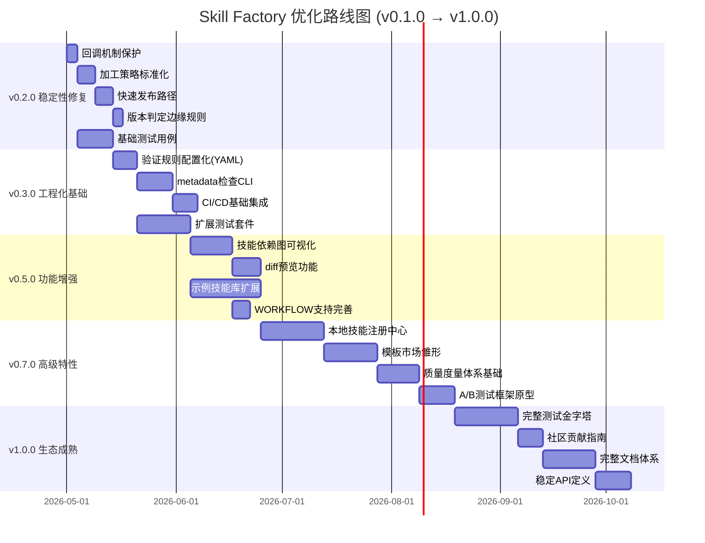

# Skill Factory 优化实施路线图

> **基于**: [深度架构分析报告](../repo-analysis/README.md)  
> **规划周期**: 2026 Q2 (5月-7月)  
> **版本范围**: v0.1.0 → v1.0.0  
> **总工期**: 约 14 周  

---

## 📋 路线图总览



---

## 🎯 版本规划矩阵

| 版本 | 定位 | 核心目标 | 优先级 | 工期 | 依赖 |
|------|------|---------|--------|------|------|
| **v0.2.0** | 🔧 稳定性修复 | 解决P0问题，消除风险 | **P0 必须立即** | 2-3周 | v0.1.0 |
| **v0.3.0** | ⚙️ 工程化基础 | 自动化工具链，CI/CD | **P1 尽快启动** | 3-4周 | v0.2.0 |
| **v0.5.0** | 🚀 功能增强 | 可视化、预览、示例库 | **P2 第一批** | 4-5周 | v0.3.0 |
| **v0.7.0** | 💎 高级特性 | Registry、模板、度量 | **P2 第二批** | 5-6周 | v0.5.0 |
| **v1.0.0** | 🏆 生态成熟 | 测试完备、社区就绪 | **里程碑** | 6-8周 | v0.7.0 |

---

## 📊 各版本核心指标

### v0.2.0 - "安全稳定"

| 指标 | 目标值 | 验证方式 |
|------|--------|---------|
| 回调机制安全性 | ✅ 无死循环风险 | 单元测试覆盖 |
| 流程灵活性 | ✅ 支持快速路径 | 集成测试验证 |
| 文档一致性 | ✅ 边缘规则明确 | Code Review |
| 基础测试覆盖率 | ≥ 60% (核心流程) | 测试报告 |

### v0.3.0 - "工程就绪"

| 指标 | 目标值 | 验证方式 |
|------|--------|---------|
| 配置化程度 | ✅ 验证规则可定制 | YAML schema验证 |
| 自动化率 | ≥ 70% (重复操作) | CI/CD 统计 |
| CLI 工具可用性 | ✅ check-metadata 可执行 | 手动测试 |
| 测试覆盖率 | ≥ 75% | 测试报告 |

### v0.5.0 - "功能丰富"

| 指标 | 目标值 | 验证方式 |
|------|--------|---------|
| 可视化能力 | ✅ 依赖图自动生成 | UI 截图对比 |
| 用户体验 | ✅ diff 预览可用 | 用户反馈 |
| 示例库规模 | ≥ 15 个技能 | 文档统计 |
| 测试覆盖率 | ≥ 80% | 测试报告 |

### v0.7.0 - "平台雏形"

| 指标 | 目标值 | 验证方式 |
|------|--------|---------|
| 发现机制 | ✅ 本地搜索可用 | 功能测试 |
| 扩展性 | ✅ 模板可贡献 | 贡献流程测试 |
| 数据驱动 | ✅ 质量分数可量化 | 度量仪表盘展示 |
| 测试覆盖率 | ≥ 85% | 测试报告 |

### v1.0.0 - "生产就绪"

| 指标 | 目标值 | 验证方式 |
|------|--------|---------|
| 测试完备性 | ✅ 三层测试全覆盖 | 测试金字塔报告 |
| 社区友好度 | ✅ CONTRIBUTING 完整 | 新人 onboarding 测试 |
| 文档完整度 | ✅ API文档+教程+FAQ | 文档审查 |
| API稳定性 | ✅ 向后兼容承诺 | 变更日志审核 |
| 测试覆盖率 | ≥ 90% | 测试报告 |

---

## 🔗 版本依赖关系

```
v0.1.0 (当前)
  │
  ├──→ v0.2.0 [稳定性修复] ──┐
  │                          │
  ├──→ v0.3.0 [工程化基础] ←──┘
  │         │
  │         ├──→ v0.5.0 [功能增强]
  │         │         │
  │         │         ├──→ v0.7.0 [高级特性]
  │         │         │         │
  │         │         │         └──→ v1.0.0 [生态成熟] 🏆
  │         │
  │         └──→ (可选) v0.4.0 [Bugfix版本]
  │                   │
  │                   └──→ (可选) v0.6.0 [Bugfix版本]
  │
  └──→ (可选) Hotfix分支: v0.1.1, v0.2.1 等
```

**发布策略**:
- **主版本**（x.y.0）: 按上述路线图按序发布
- **补丁版本**（x.y.z）：紧急修复使用，从主版本分支 hotfix
- **LTS 支持**: v1.0.0 将作为首个 LTS 版本，提供长期维护

---

## 📁 计划文件索引

每个版本的详细计划都包含：

| 文件 | 内容 | 详细程度 |
|------|------|---------|
| [ROADMAP.md](./ROAD.md) | 本文件：总览和导航 | ⭐⭐ 概览 |
| [v0.2.0.md](./v0.2.0.md) | 稳定性修复详细任务 | ⭐⭐⭐⭐⭐ 最详细 |
| [v0.3.0.md](./v0.3.0.md) | 工程化基础详细任务 | ⭐⭐⭐⭐⭐ 最详细 |
| [v0.5.0.md](./v0.5.0.md) | 功能增强详细任务 | ⭐⭐⭐⭐⭐ 最详细 |
| [v0.7.0.md](./v0.7.0.md) | 高级特性详细任务 | ⭐⭐⭐⭐⭐ 最详细 |
| [v1.0.0.md](./v1.0.0.md) | 生态成熟详细任务 | ⭐⭐⭐⭐⭐ 最详细 |

---

## 🎯 决策点与里程碑

### 关键决策点（需要人工确认）

| 时间点 | 决策内容 | 影响 |
|--------|---------|------|
| v0.2.0 发布前 | 是否接受"回调≤3次"的限制？ | 影响后续设计方向 |
| v0.3.0 发布前 | CLI工具技术栈选择（Node/Python/Go？） | 影响生态兼容性 |
| v0.5.0 发布前 | 示例技能库的领域选择？ | 影响用户第一印象 |
| v0.7.0 发布前 | Registry 是本地还是云端优先？ | 影响架构复杂度 |
| v1.0.0 发布前 | API stability guarantee 范围？ | 影响向后兼容承诺 |

### 里程碑事件

| 日期 | 里程碑 | 标志性成果 |
|------|--------|-----------|
| 2026-05-15 | **M1: 安全基线** | v0.2.0 发布，无已知 P0 问题 |
| 2026-06-10 | **M2: 工程化** | v0.3.0 发布，CI/CD 运行稳定 |
| 2026-07-05 | **M3: 功能完善** | v0.5.0 发布，依赖图可视化上线 |
| 2026-08-01 | **M4: 平台化** | v0.7.0 发布，Registry 可用 |
| 2026-09-01 | **🏆 GA (Generally Available)** | v1.0.0 发布，生产就绪 |

---

## 📌 使用说明

### 如何使用本路线图？

1. **项目管理者**: 查看 [ROADMAP.md](./ROADMAP.md) 了解全局，定期 review 进度
2. **开发者**: 查看对应版本的 `.md` 文件，领取具体任务
3. **质量保障**: 关注各版本的"核心指标"，制定验收标准
4. **社区贡献者**: 从 [v1.0.0.md](./v1.0.0.md) 的"社区任务"开始参与

### 如何跟踪进度？

建议使用以下方式：
- **GitHub Projects**: 创建看板，按版本分列
- **Issue Tracking**: 每个任务一个 Issue，标记版本标签
- **CI/CD Dashboard**: 监控自动化指标
- **每周 Sync**: 对照路线图 review 进度

---

## 🔄 路线图维护

### 更新频率
- **每版本发布后**: 更新已完成项的状态
- **每月**: Review 整体进度，调整后续版本计划
- **重大变更时**: 更新本文件并通知相关方

### 变更流程
1. 在 `docs/repo-analysis` 提交新的分析或反馈
2. 评估对路线图的影响
3. 更新相应版本的 `.md` 文件
4. 更新 `ROADMAP.md` 的总览
5. 发送变更通知

---

## 📞 相关资源

- **深度分析报告**: [docs/repo-analysis/](../repo-analysis/README.md)
- **当前代码仓库**: `e:\Workplace\Agent\skill-factory`
- **问题追踪**: (待创建 GitHub Issues)

---

> **最后更新**: 2026-05-01  
> **维护者**: Skill Factory Core Team  
> **下次 Review**: 2026-05-08 (v0.2.0 发布前)

**© 2026 Skill Factory**
