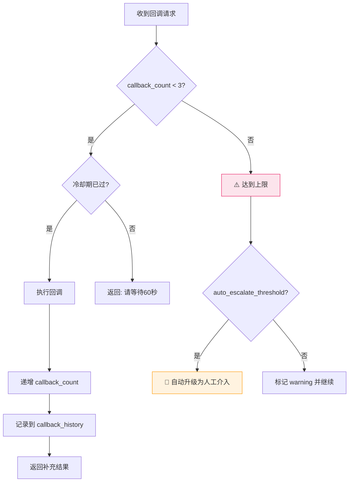

# v0.2.0 - 稳定性修复版本

> **版本定位**: 🔧 安全稳定基线  
> **发布目标**: 2026-05-15 (M1 里程碑)  
> **工期**: 2-3 周 (约 15 个工作日)  
> **优先级**: P0 必须立即解决  
> **依赖**: v0.1.0  

**← 返回 [路线图](./ROADMAP.md) | 下一个版本 → [v0.3.0](./v0.3.0.md)**

---

## 📌 版本目标

### 核心目标
消除当前系统已知的**高风险问题**，建立安全稳定的使用基础。

### 成功标准（Done Criteria）

- ✅ 回调机制有明确的次数限制，不会出现死循环
- ✅ 加工阶段有标准化的操作策略，用户不再困惑
- ✅ 简单技能（Type 1）可以跳过加工直接发布，效率提升50%+
- ✅ 版本判定的边缘情况有明确规则，避免歧义
- ✅ 核心流程有基础测试覆盖（≥60%）

---

## 📋 任务清单（按优先级排序）

### 任务 1: 回调机制保护措施 ⭐⭐⭐⭐⭐ P0-立即

**问题**: Researcher 的回调机制无最大次数限制，可能导致无限循环  
**来源**: [分析报告 10.1.1](../repo-analysis/05-evaluation-and-optimization.md#101-流程优化建议p0-p2)  
**工作量**: 0.5 天 | **负责人**: 待分配 | **状态**: ⬜ 待开始  

#### 具体实施步骤

##### Step 1: 定义回调配置结构 (2h)

在 `skills/skill-factory-researcher/SKILL.md` 中增加配置段：

```yaml
---
## Callback Configuration (新增)
callback_config:
  max_callbacks: 3              # 最大回调次数（硬限制）
  cooldown_seconds: 60          # 回调间隔冷却时间
  auto_escalate_threshold: 2    # 超过N次自动升级为人工介入
  callback_history_log: true    # 是否记录回调历史
  
## Callback Behavior Rules
- 每次回调前检查 callback_count < max_callbacks
- 超过限制时：停止回调 → 标记 warning → 建议人工review
- 记录每次回调的：时间戳、触发者、请求内容、补充结果
- 冷却期内重复请求返回"请等待冷却"
```

**验证方式**: Code Review + 单元测试（模拟多次回调场景）

---

##### Step 2: 更新回调流程描述 (1h)

修改 researcher/SKILL.md 的回调流程图，增加保护逻辑：



**交付物**: 更新后的 SKILL.md 文件

---

##### Step 3: 编写测试用例 (1h)

创建 `tests/researcher/test_callback_protection.yaml`:

```yaml
name: Researcher Callback Protection Tests
tests:
  - name: 正常回调不超过3次
    input:
      max_callbacks: 3
      callbacks_triggered: 2
      request: "缺少边界条件说明"
    expected:
      should_allow: true
      new_count: 3
      
  - name: 第4次回调被拒绝
    input:
      max_callbacks: 3
      callbacks_triggered: 3
      request: "再次缺少信息"
    expected:
      should_allow: false
      error_type: MaxCallbacksReachedError
      
  - name: 冷却期内重复请求被拒绝
    input:
      cooldown_seconds: 60
      last_callback_time: "2026-05-01T10:00:00"
      current_time: "2026-05-01T10:30:00"
    expected:
      should_allow: false
      wait_seconds: 30
```

**验收标准**: 所有测试用例通过

---

### 任务 2: 加工阶段策略标准化 ⭐⭐⭐⭐ P0-本周

**问题**: Enricher/Simplifier/Beautifier/Standardizer 使用顺序未定义，用户困惑  
**来源**: [分析报告 10.1.2](../repo-analysis/05-evaluation-and-optimization.md#101-流程优化建议p0-p2)  
**工作量**: 1 天 | **负责人**: 待分配 | **状态**: ⬜ 待开始  

#### 具体实施步骤

##### Step 1: 定义三种标准策略 (3h)

在主 SKILL.md 或新建 `docs/processing-strategies.md` 中定义：

```markdown
## 加工策略模式 (Processing Strategy Patterns)

### 策略一：精简优先模式 (Simplify-First)
**适用场景**: 初稿过于冗长（>500行），需要先瘦身
**操作顺序**: Simplifier(轻量) → Enricher(选择性) → Standardizer
**预期效果**: 行数减少 20-40%，保留核心内容
**示例**: 
  输入: 800行的复杂技能初稿
  → Simplifier: 合并重复+精炼语言 = 550行
  → Enricher: 仅添加2个关键示例 = 600行
  → Standardizer: 校准格式 = 通过(85分)

### 策略二：丰富优先模式 (Enrich-First)
**适用场景**: 初稿内容不足（<200行），需要完善
**操作顺序**: Enricher(完整) → Beautifier(可视化) → Standardizer
**预期效果**: 内容丰富度提升，可读性增强
**示例**:
  输入: 150行的简单技能
  → Enricher: 补充5个示例+references拆分 = 350行
  → Beautifier: 添加3个Mermaid图表 = 400行
  → Standardizer: 规范化校验 = 通过(88分)

### 策略三：均衡模式 (Balanced) ⭐ 推荐
**适用场景**: 大多数情况下的默认选择
**操作顺序**: 
  1. Simplifier(轻量去重) - 0.5h
  2. Enricher(按需补充) - 1-2h  
  3. Beautifier(关键图表) - 0.5h
  4. Standardizer(最终校验) - 0.5h
**预期效果**: 平衡质量和效率
**决策树**:
  if 行数 > 500:
    使用"精简优先"
  elif 行数 < 200:
    使用"丰富优先"  
  else:
    使用"均衡模式"
```

**交付物**: 完整的策略文档 + 决策树 Mermaid 图

---

##### Step 2: 在各加工器文档中引用策略 (2h)

更新以下文件，增加"推荐使用策略"章节：
- `skills/skill-factory-enricher/SKILL.md`
- `skills/skill-factory-simplifier/SKILL.md`
- `skills/skill-factory-beautifier/SKILL.md`
- `skills/skill-factory-standardizer/SKILL.md`

每个文件中添加：

```yaml
## 推荐使用策略
本加工器在以下策略中使用：
- ✅ 精简优先: 第2步（可选）
- ✅ 丰富优先: 第1步（核心）
- ✅ 均衡模式: 第2步（核心）
- ❌ 快速路径: 不使用（跳过加工）

与其他加工器的协作关系：
- 前置依赖: 无 / Simplifier
- 后续触发: Beautifier / Standardizer
```

---

##### Step 3: 防止循环加工机制 (3h)

增加加工次数限制和循环检测：

```yaml
## 加工循环保护
max_processing_rounds: 3        # 同一技能最多加工3轮
processing_history_log: true     # 记录每轮加工操作
circular_pattern_detection: true # 检测 enrich→simplify→enrich 循环

## 循环检测规则
如果检测到以下模式，自动终止并警告：
- 连续2轮出现 enrich→simplify 操作对
- 总行数变化 < 5%（认为无实质改进）
- 同一位置的内容被反复修改

警告信息示例：
  ⚠️ 检测到可能的加工循环（第3轮）
     - 第1轮: enrich(+50行) → simplify(-30行) = 净+20行
     - 第2轮: enrich(+45行) → simplify(-28行) = 净+17行
     - 建议: 当前质量已足够，考虑直接进入发布阶段
```

**验收标准**: Code Review + 模拟循环场景测试

---

### 任务 3: 快速发布路径实现 ⭐⭐⭐⭐ P0-下周

**问题**: Type 1（轻+薄）简单技能被迫走完整四阶段流程，浪费时间  
**来源**: [分析报告 9.4 改动一](../repo-analysis/05-evaluation-and-optimization.md#94-如果让我重新设计)  
**工作量**: 1 天 | **负责人**: 待分配 | **状态**: ⬜ 待开始  

#### 具体实施步骤

##### Step 1: 设计基于类型的路径选择逻辑 (2h)

在主 SKILL.md 中增加路径选择章节：

```markdown
## 发布路径选择 (Release Path Selection)

### 路径矩阵
| 技能类型 | 推荐路径 | 流程步骤 | 预计耗时 |
|---------|---------|---------|---------|
| Type 1 (轻+薄) | 🚀 **快速路径** | 生产→发布 | 30min |
| Type 2 (重+薄) | 📋 标准路径 | 生产→选择性加工→发布 | 2h |
| Type 3 (轻+厚) | 📋 标准路径 | 生产→加工→发布 | 3h |
| Type 4 (重+厚) | 🔄 完整路径 | 生产→全量加工→发布+监控 | 5h |

### 快速路径详细流程 (Type 1 专用)
Step 1: Researcher (输入收集) - 10min
  ↓
Step 2: Analyzer (技术分析) - 5min
  ↓
Step 3: Planner (类型判定=Type 1) - 5min
  ↓
Step 4: Generator (生成单文件SKILL.md) - 5min
  ↓
Step 5: Packager (快速验证) - 3min
  ↓ [跳过加工阶段] ↓
Step 6: Publisher-Version (v0.1.0 → v0.1.1) - 2min
  ↓
Step 7: Publisher-Metadata (更新description/tags) - 2min
  ↓
Step 8: Publisher-Release (git commit) - 3min
  ↓
✅ 完成！总耗时: ~35分钟（vs 完整路径 5小时+）
```

**交付物**: 路径选择流程图 + 时间估算表

---

##### Step 2: 更新各子技能以支持快速路径 (3h)

修改以下文件，增加快速路径的特殊处理逻辑：

**Researcher/SKILL.md**:
```yaml
## 快速路径优化 (Type 1)
当检测到可能是Type 1时：
- 简化缺失检测清单（仅检查必填项）
- 跳过可选信息的交互确认
- 目标: 将research阶段从20min压缩到10min
```

**Packager/SKILL.md**:
```yaml
## 快速验证模式 (Type 1专用)
type_1_quick_check:
  checks:
    - frontmatter_exists: 必填
    - single_file_valid: 必填
    - description_length_ok: 100-150字符
    - at_least_2_examples: 必填
  threshold: 80  # 保持一致
  estimated_time: 3min  # vs 标准模式的15min
```

**Publisher-*/SKILL.md (3个)**:
```yaml
## 快速发布支持
- 支持批量处理多个Type 1技能
- commit message 自动生成
- 可选跳过tag（仅commit不tag）
```

---

##### Step 3: 编写快速路径集成测试 (3h)

创建 `tests/fast-path/test_type1_release.yaml`:

```yaml
name: Fast Path Integration Test
scenario: 创建一个简单的 git-commit 技能（Type 1）
steps:
  1. 输入: URL="https://git-scm.com/doc/git-commit"
  2. Researcher: 收集基本信息（应≤10min）
  3. Analyzer: 分析出单一功能、预计<300行
  4. Planner: 判定为 Type 1 (轻+薄)
  5. Generator: 生成单个 SKILL.md
  6. Packager: 快速验证通过（≥80分）
  7. [跳过加工阶段]
  8. Publisher: 版本 v0.1.0 → v0.1.1
  9. Release: git commit 成功

expected:
  total_time: < 40min
  output_files: ["git-commit/SKILL.md"]
  quality_score: >= 80
  no_processing_stage: true
```

**验收标准**: 快速路径端到端测试通过

---

### 任务 4: 版本判定边缘规则明确化 ⭐⭐⭐ P1-尽快

**问题**: Type Upgrade 的某些边缘情况未明确（如 Type 1→Type 2 是否算 breaking）  
**来源**: [分析报告 10.1.3](../repo-analysis/05-evaluation-and-optimization.md#101-流程优化建议p0-p2)  
**工作量**: 0.5 天 | **负责人**: 待分配 | **状态**: ⬜ 待开始  

#### 具体实施步骤

##### Step 1: 编写完整判定规则表 (2h)

创建 `docs/versioning-rules.md`:

```markdown
## Semantic Versioning 判定规则完整版

### 变更类型分类

#### Fix (patch +1)
触发条件:
  ✅ 错别字、语法错误修正
  ✅ 描述文字优化（不影响能力理解）
  ✅ 示例文案调整（不改逻辑）
  ✅ 格式美化（Markdown、Mermaid等）
  
示例:
  - 修正 "compelx" → "complex"
  - 调整 example 3 的输出格式
  - 优化 Mermaid 图表配色

---

#### Feature (minor +1)
触发条件:
  ✅ 新增一个独立的能力/用法
  ✅ 新增示例（扩展使用场景）
  ✅ 扩展现有能力的参数范围
  ✅ 新增 references/ 文档
  
示例:
  - 新增 "支持 JSON 格式输出"
  - 新增 "与 GitHub Actions 集成"示例
  - 扩展 input 参数支持新选项

---

#### Type Upgrade (minor +1) ⚠️ 重点
触发条件:
  ✅ 轻→重: 从单文件变为多模块（但接口不变）
  ✅ 薄→厚: 新增 references/ 目录（向后兼容）
  ✅ 重→薄: 子技能合并回主文件（旧路径仍可用）
  
❌ NOT Breaking（即使目录结构变化）:
  - 只要原有 API（trigger/input/output）不变
  - 只要旧的 import 路径能 redirect 到新位置
  
示例:
  Type 1 → Type 2 (拆分子技能):
    version: v0.1.0 → v0.2.0 (minor)
    reason: 新增子技能是扩展，原skill仍可用
    
  Type 1 → Type 3 (添加references/):
    version: v0.1.0 → v0.2.0 (minor)  
    reason: references/ 是增量，不影响主文件使用

---

#### Breaking (major +1)
触发条件:
  ❌ 删除已有能力或参数
  ❌ 修改 trigger 条件（导致匹配失败）
  ❌ 修改 input/output 结构（破坏调用契约）
  ❌ 重命名 skill-name（影响引用）
  ❌ 修改核心行为逻辑（结果不同）
  
示例:
  - 删除 "支持 YAML 输出" 能力
  - trigger 从 "生成commit" 改为 "Git操作"
  - input.params 从数组改为对象

---

### 特殊场景速查表

| 场景 | 类型升级？ | Breaking? | 版本递增 | 示例 |
|------|-----------|-----------|---------|------|
| T1→T2 (拆分子技能) | ✅ 是 | ❌ 否 | minor+1 |
| T1→T3 (加references/) | ✅ 是 | ❌ 否 | minor+1 |
| T3→T4 (部分子技能加厚) | ✅ 是 | ⚠️ 视情况 | major or minor* |
| T2→T1 (合并简化) | ✅ 是 | ❌ 否 (旧路径redirect) | minor+1 |
| 删除某能力 | - | ✅ 是 | major+1 |
| 修改trigger | - | ✅ 是 | major+1 |
| 纯内容优化 | ❌ 否 | ❌ 否 | patch+1 |

*T3→T4 的情况需要人工判断：
  - 如果只是新增子技能的references/ → minor
  - 如果重构了主文件的接口 → major
```

**交付物**: 完整的版本判定规则文档

---

##### Step 2: 更新 Publisher-Version 文档 (1h)

在 `skills/skill-factory-publisher-version/SKILL.md` 中引用新规则：

```yaml
## 版本判定参考
详细的边缘情况判定规则请参见: docs/versioning-rules.md

快速判断流程:
1. 是否删除了能力？ → Breaking (major)
2. 是否修改了接口（trigger/input/output）？ → Breaking (major)
3. 是否改变了类型（轻↔重 or 薄↔厚）？ → Type Upgrade (minor)
4. 是否新增了内容？ → Feature (minor)
5. 其他 → Fix (patch)
```

**验收标准**: Code Review + 团队评审确认规则合理性

---

### 任务 5: 基础测试套件建设 ⭐⭐⭐ P1-尽快

**问题**: 当前无任何自动化测试，难以保证可靠性  
**来源**: [分析报告 9.2 问题三](../repo-analysis/05-evaluation-and-optimization.md#92-潜在问题与风险)  
**工作量**: 2 天 | **负责人**: 待分配 | **状态**: ⬜ 待开始  

#### 具体实施步骤

##### Step 1: 搭建测试框架 (4h)

选择测试框架（建议 Jest for Node.js 或 pytest for Python）:

```bash
# 项目结构
skill-factory/
├── tests/
│   ├── __init__.py
│   ├── conftest.py              # 共享 fixtures
│   ├── unit/                   # 单元测试
│   │   ├── test_researcher.py
│   │   ├── test_analyzer.py
│   │   ├── test_planner.py
│   │   ├── test_generator.py
│   │   └── test_packager.py
│   ├── integration/            # 集成测试
│   │   ├── test_production_flow.py
│   │   └── test_fast_path.py
│   └── fixtures/               # 测试数据
│       ├── sample_skills/
│       └── expected_outputs/
├── pytest.ini                 # 配置文件
└── requirements-test.txt      # 测试依赖
```

**交付物**: 测试框架搭建完成，可运行空测试

---

##### Step 2: 编写核心单元测试 (8h)

为每个生产阶段子技能编写关键测试：

**test_researcher.py** (重点):
```python
class TestResearcherCallbackProtection:
    def test_callback_within_limit(self): ...
    def test_callback_exceeds_limit(self): ...
    def test_callback_cooldown_enforced(self): ...
    def test_callback_history_logged(self): ...

class TestResearcherCompletenessCheck:
    def test_detect_missing_basic_info(self): ...
    def test_detect_missing_content_info(self): ...
    def test_full_completeness_passes(self): ...
```

**test_planner.py** (重点):
```python
class TestPlannerTypeDecision:
    def test_single_function_light(self): ...    # → Type 1
    def test_multi_module_heavy(self): ...     # → Type 2
    def test_single_complex_thick(self): ...   # → Type 3
    def test_multi_complex_thick(self): ...    # → Type 4
    def test_boundary_300_lines(self): ...     # 边界值测试
```

**test_packager.py** (重点):
```python
class TestPackagerValidation:
    def test_type1_validation_pass(self): ...
    def test_type1_missing_frontmatter_fail(self): ...
    def test_type3_references_check(self): ...
    def test_quality_scoring_80_threshold(self): ...
```

**目标**: 至少 25 个单元测试用例，覆盖核心逻辑

**验收标准**: 运行 `pytest` 全部通过，覆盖率 ≥ 60%

---

##### Step 3: 编写集成测试 (4h)

编写端到端流程测试：

**test_production_flow.py**:
```python
class TestProductionFlow:
    def test_complete_type1_skill_creation(self):
        """完整流程：创建一个 Type 1 技能"""
        
    def test_complete_type3_skill_creation(self):
        """完整流程：创建一个 Type 3 技能"""
        
    def test_callback_scenario(self):
        """测试 Analyzer → Researcher 回调场景"""

class TestFastPath:
    def test_type1_skips_processing(self):
        """验证 Type 1 跳过加工阶段"""
        
    def test_fast_path_time_limit(self):
        """验证快速路径在 40min 内完成"""
```

**目标**: 至少 5 个集成测试用例

**验收标准**: 集成测试全部通过，模拟真实使用场景

---

## 📊 进度跟踪

### 任务汇总表

| ID | 任务名称 | 优先级 | 工作量 | 状态 | 负责人 | 完成日期 |
|----|---------|--------|--------|------|--------|---------|
| T2.1 | 回调机制保护 | P0 | 0.5d | ⬜ 待开始 | - | - |
| T2.2 | 加工策略标准化 | P0 | 1d | ⬜ 待开始 | - | - |
| T2.3 | 快速发布路径 | P0 | 1d | ⬜ 待开始 | - | - |
| T2.4 | 版本判定边缘规则 | P1 | 0.5d | ⬜ 待开始 | - | - |
| T2.5 | 基础测试套件 | P1 | 2d | ⬜ 待开始 | - | - |
| **合计** | | | **5d** | | | |

### 里程碑检查点

- **Day 3** (2026-05-06): T2.1, T2.4 应该完成（P0文档类任务）
- **Day 7** (2026-05-10): T2.2, T2.3 应该完成（P0核心功能）
- **Day 12** (2026-05-14): T2.5 应该完成（P1测试）
- **Day 15** (2026-05-17): **Code Freeze**，准备发布 v0.2.0

---

## ✅ 验收标准（Definition of Done）

### 功能验收

- [ ] 回调机制有明确的 3 次限制和冷却时间
- [ ] 三种加工策略文档完整，包含决策树
- [ ] 快速路径可在 40 分钟内完成 Type 1 技能创建
- [ ] 版本判定规则涵盖所有已知边缘情况
- [ ] ≥ 25 个单元测试用例通过
- [ ] ≥ 5 个集成测试用例通过

### 质量验收

- [ ] 测试覆盖率 ≥ 60%
- [ ] 所有 P0 问题已解决或有明确的 workaround
- [ ] 文档更新完整（变更日志、升级指南）
- [ ] Code Review 通过（至少 1 人 approve）

### 发布准备

- [ ] CHANGELOG.md 更新（列出 v0.2.0 的所有变更）
- [ ] 版本号更新为 v0.2.0（所有相关文件）
- [ ] Git tag: v0.2.0
- [ ] 发布说明文档准备好

---

## 🔄 与其他版本的关系

### 上游依赖
- **v0.1.0**: 本版本的基础，所有修改基于 v0.1.0 代码

### 下游影响
- **v0.2.x**: Hotfix 版本（如有紧急修复）
- **v0.3.0**: 将在本版本建立的测试框架上继续扩展
- **v0.2.0 → v0.3.0 的迁移注意事项**:
  - 测试框架可能需要重构（如果 v0.3.0 选择不同技术栈）
  - 回调限制参数可能在 v0.3.0 配置化时外移到 config 文件
  - 快速路径逻辑可能在 v0.3.0 集成到 CLI 工具中

---

## 📝 已知限制与后续规划

### 本版本不做的事情（推迟到后续版本）

| 推迟项 | 原因 | 计划版本 |
|--------|------|---------|
| 验证规则 YAML 配置化 | 需要更复杂的架构设计 | v0.3.0 |
| CLI 工具开发 | 依赖测试框架稳定 | v0.3.0 |
| CI/CD 集成 | 需要先有自动化测试 | v0.3.0 |
| diff 预览功能 | 属于功能增强 | v0.5.0 |

### 技术债务识别

1. **硬编码的阈值**: 回调次数(3)、冷却时间(60s)、加工轮次(3) 目前写在文档中
   - **解决计划**: v0.3.0 外置到配置文件
   - **临时方案**: 本版本保持文档形式，但标注 `// TODO: v0.3.0 配置化`

2. **测试数据管理**: 当前测试 fixtures 可能不够丰富
   - **解决计划**: v0.3.0 扩展示例库
   - **临时方案**: 本版本只覆盖核心场景

---

## 🎯 下一步行动

### 立即执行（今天）

1. ✅ 分配 T2.1 和 T2.4 给文档工程师（纯文档任务，可并行）
2. ✅ 搭建测试框架环境（为 T2.5做准备）

### 本周内完成

3. 🎯 完成 T2.2（加工策略标准化）
4. 🎯 完成 T2.3（快速发布路径）
5. 🎯 启动 T2.5（基础测试）

### 下周目标

6. 🏁 所有任务完成
7. 🧪 测试全部通过
8. 📝 准备发布材料

---

> **版本维护者**: Skill Factory Core Team  
> **创建日期**: 2026-05-01  
> **最后更新**: 2026-05-01  
> **下次 Review**: 2026-05-08 (开发中期)

**← 返回 [路线图](./ROADMAP.md) | 继续阅读 → [v0.3.0 工程化基础](./v0.3.0.md)**
