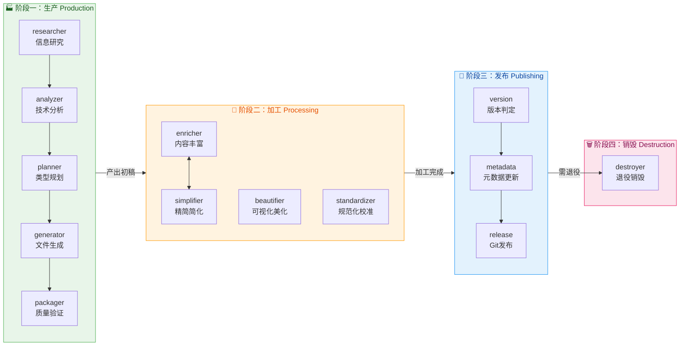

# 第一部分：背景与定位

> **所属报告**: [Skill Factory 深度架构分析](./README.md)  
> **章节范围**: 第1-3章  
> **核心主题**: 行业背景、竞品对比、项目全景  

**← 返回主索引 [README](./README.md) | 继续阅读 → [第二部分：架构哲学](./02-architecture-philosophy.md)**

---

## 1. 问题与背景

### 1.1 AI Agent 技能管理的行业痛点

2025 年被称为"**Agent 元年**"。随着 Claude、GPT-4o 等大模型的成熟，AI Agent 从概念走向落地，企业开始大规模部署 Agent 来自动化业务流程。但一个关键问题浮出水面：

**如何让 Agent 拥有"技能"？**

传统做法是硬编码工具调用（Tool Use），但这种方式存在三大痛点：

| 痛点 | 具体表现 | 影响 |
|------|---------|------|
| **能力孤岛** | 每个 Agent 的 prompt 是独立的，无法复用 | 重复造轮子，维护成本高 |
| **黑盒不可控** | Agent 的行为依赖隐式 prompt，难以审计和调试 | 生产环境风险高 |
| **缺乏标准** | 不同团队用不同格式定义"能力"，无法跨项目共享 | 生态碎片化 |

2026 年初，**Anthropic 推出 SKILL.md 标准**，试图用结构化文档来解决这些问题。但这只是第一步——有了标准，还需要**系统化的生产、管理和维护机制**。

### 1.2 从"工具调用"到"技能封装"的范式演进

我们正在经历一场范式转移：

```
第一阶段（2023-2024）: Tool Use
  └─ Agent 通过 function calling 调用预定义函数
  └─ 问题：函数是静态的，无法表达复杂的工作流

第二阶段（2024-2025）: Prompt Template
  └─ 用模板化的 prompt 描述 Agent 行为
  └─ 问题：模板缺乏标准化，复用困难

第三阶段（2025-2026）: Skill Encapsulation ⭐ 当前
  └─ 将能力封装为独立的"技能包"（SKILL.md + references/）
  └─ 优势：可组合、可版本化、可独立测试

第四阶段（未来）: Skill Ecosystem
  └─ 技能市场、技能依赖图、技能编排引擎
  └─ 需要：全生命周期的管理系统 → 这就是 Skill Factory 的定位
```

### 1.3 为什么需要"技能工厂"？

想象一下：如果每个技能都需要人工从零编写 SKILL.md，那和手写代码没什么区别。真正的工业化需要的是：

1. **标准化流水线**：输入原材料（文档/URL），输出标准化的技能包
2. **质量控制体系**：验证生成的技能是否符合规范
3. **加工能力**：对现有技能进行丰富、简化、美化
4. **发布机制**：版本管理、元数据同步、Git 工作流
5. **退役流程**：优雅地处理过时技能

**Skill Factory 就是这个"工厂"**——它不是简单的代码生成器，而是一个覆盖技能全生命周期的管理系统。

---

## 2. 竞品生态位分析

### 2.1 主流方案对比

当前市场上存在多种 Agent 技能管理方案，它们各有侧重：

#### 🅰️ Anthropic Agent Skills（官方标准）

**定位**: 文档驱动的轻量级技能包规范

```yaml
skill-name/
├── SKILL.md          # 前言区 + 能力描述 + 使用示例
├── references/       # 可选的详细说明文档
└── scripts/          # 可选的辅助脚本
```

**优势**:
- ✅ 官方背书，生态兼容性好
- ✅ 结构简单，学习成本低
- ✅ 强调 Progressive Disclosure（渐进式披露）

**劣势**:
- ❌ 只定义了"长什么样"，没说"怎么生产"
- ❌ 无生命周期管理（无版本策略、无废弃流程）
- ❌ 无加工能力（无法丰富或简化已有技能）

---

#### 🅱️ Open Agent Skills Specification

**定位**: 开放标准的跨平台技能协议

**优势**:
- ✅ 社区驱动，非 vendor-lock-in
- ✅ 定义了更丰富的元数据字段
- ✅ 支持多语言和多平台

**劣势**:
- ❌ 标准仍在演进中，稳定性不足
- ❌ 缺乏实际的大规模采用案例
- ❌ 无配套的生产工具链

---

#### 🆎 GEP (Genome Evolution Protocol)

**定位**: 生产级的基因进化协议（用于复杂 Agent 系统）

**核心概念**:
- **Gene**: 最小能力单元（类似 DNA 片段）
- **Capsule**: 封装了多个 Gene 的功能模块
- **Evolution**: 通过选择、变异、交叉来优化 Agent

**优势**:
- ✅ 可追踪、可量化（有明确的度量指标）
- ✅ 支持自动优化（基于反馈的进化）
- ✅ 适合超大规模 Agent 系统

**劣势**:
- ❌ 复杂度高，学习曲线陡峭
- ❌ 过于理论化，工程实践案例少
- ❌ 与现有 SKILL.md 标准不兼容

---

### 2.2 Skill Factory 的差异化定位

| 维度 | Anthropic Skills | OAS | GEP | **Skill Factory** |
|------|-----------------|-----|-----|-------------------|
| **定位** | 文档规范 | 开放标准 | 进化协议 | **全生命周期工厂** |
| **生产** | ❌ 手工编写 | ❌ 手工编写 | ❌ 自动生成 | ✅ **五步流水线** |
| **加工** | ❌ 无 | ❌ 无 | ✅ 自动进化 | ✅ **四种加工器** |
| **发布** | ❌ 无 | ❌ 基础 | ✅ 版本追踪 | ✅ **三步发布流程** |
| **销毁** | ❌ 无 | ❌ 无 | ❌ 无 | ✅ **优雅退役机制** |
| **分类** | ❌ 无 | ❌ 无 | ✅ Gene/Capsule | ✅ **四维分类法** |
| **复杂度** | ⭐ 低 | ⭐⭐ 中 | ⭐⭐⭐⭐ 极高 | ⭐⭐⭐ 中高 |

**核心差异**: 其他方案要么只定义"标准"，要么只解决"生产"，**Skill Factory 是唯一覆盖完整生命周期**的系统。

### 2.3 四维对比矩阵总结

```
                    标准化程度
                      高 │
                         │    GEP
                         │       ●
                      中 │           ● OAS
                         │               ● Anthropic
                         │                   ● Skill Factory
                      低 │___________________________│
                          低        完整度         高
```

**结论**: Skill Factory 在"完整度"上领先，但在"标准化程度"上还有提升空间（v0.1.0 初期）。它的护城河在于**四维分类法 + 全生命周期覆盖**的组合。

---

## 3. 项目全景与核心创新

### 3.1 项目定位与目标用户

**Skill Factory** 是一个**知识型的技能工厂系统**，目标用户是：

1. **AI 应用开发者**: 需要为 Agent 创建和管理大量技能
2. **平台工程团队**: 需要标准化的技能开发流程
3. **开源社区贡献者**: 希望分享可复用的技能包

**核心价值主张**:

> "像管理软件产品一样管理 AI Agent 的技能——从需求分析到退役归档，全流程标准化。"

### 3.2 工厂隐喻：四阶段生命周期

Skill Factory 用**现实工厂的生产流程**作为隐喻，将技能的生命周期划分为四个阶段：



**为什么是这四个阶段？**

| 阶段 | 类比现实工厂 | 解决的核心问题 |
|------|-------------|---------------|
| **生产** | 原材料→半成品 | "如何从零创建一个符合规范的技能？" |
| **加工** | 半成品→精加工产品 | "如何让现有技能更好用？" |
| **发布** | 产品入库+上市 | "如何让其他人发现并使用这个技能？" |
| **销毁** | 过期产品回收 | "过时技能如何体面退出？" |

### 3.3 核心创新：四维分类法

这是 Skill Factory **最具原创性的设计**——用两个维度将所有技能划分为 4 种类型：

| 维度 | 含义 | 判断标准 |
|------|------|---------|
| **轻重（Light/Heavy）** | 功能维度 | 单一能力 vs 多模块协作 |
| **薄厚（Thin/Thick）** | 内容维度 | <300行能说清 vs 需要详细文档 |

**四种类型的空间映射**：

```
                内容维度（厚）
                   高 │
                      │   重+厚 = 技能族(厚)
                      │      ● 多模块 + 详细文档
                   mid │
                      │              ● 轻+厚 = 复杂单技能
                      │                 单一功能 + 详细文档
                   low │  ● 轻+薄 = 简单技能
                      │     单一功能 + <300行
                      │  ● 重+薄 = 技能族(薄)
                      │     多模块 + 每个都精简
                      └──────────────────────────
                        low              high
                        功能维度（重）
```

**每种类型的目录结构模板**：

| 类型 | 结构 | 适用场景 |
|------|------|---------|
| **轻+薄** | `{name}/SKILL.md` | 简单工具类（如 git-commit） |
| **重+薄** | `{name}-family/SKILL.md` + `skills/{子}/SKILL.md` | 功能族（如 code-review） |
| **轻+厚** | `{name}/SKILL.md` + `references/` | 复杂算法（如 architecture-design） |
| **重+厚** | `{name}-family/SKILL.md` + `skills/(部分有references/)` | 大型系统（如 full-stack-dev） |

**设计智慧**: 这个分类法解决了"一个技能应该多复杂"的结构性难题，为不同场景提供了**4种标准化的答案**。

### 3.4 系统架构总览

Skill Factory 由 **13 个子技能**组成，分布在四个阶段：

| 阶段 | 子技能数 | 核心职责 | 代码行数占比 |
|------|---------|---------|-------------|
| **① 生产** | 5 个 | 从输入到初稿 | 40.2% (1514行) |
| **② 加工** | 4 个 | 优化和完善 | 26.4% (996行) |
| **③ 发布** | 3 个 | 版本化和分发 | 11.0% (413行) |
| **④ 销毁** | 1 个 | 退役和清理 | 5.4% (204行) |
| **核心** | 2 个 | 总控和元数据 | 17.0% (640行) |

**关键观察**：
- 生产阶段最复杂（5个子技能，40%代码量），符合"从零到一最难"的规律
- 加工阶段次之（4个子技能，26%），体现了"持续优化"的重要性
- 销毁阶段最简单（1个子技能，5%），但不可或缺（体现人文关怀）

---

## 📌 本章小结

本章建立了理解 Skill Factory 的基础框架：
- **行业背景**: AI Agent 技能管理正处于从"手工编写"向"工业化生产"转型的关键期
- **竞品定位**: Skill Factory 是唯一覆盖**完整生命周期**的系统，差异化竞争力明显
- **核心创新**: 四维分类法（轻/重 × 薄/厚）解决了技能结构化的根本性问题
- **系统全景**: 13个子技能分布在四阶段，形成完整的工厂式流水线

**下一步**: 进入 [第二部分：架构设计哲学深挖](./02-architecture-philosophy.md)，深入分析"为什么这样设计"。
