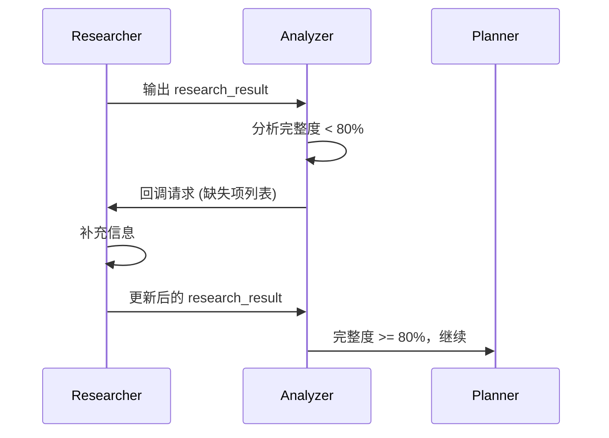

# 第二部分：架构设计哲学深挖

> **所属报告**: [Skill Factory 深度架构分析](./README.md)  
> **章节范围**: 第4章  
> **核心主题**: 工厂隐喻、四维分类法、回调机制、渐进式披露  

**← 返回主索引 [README](./README.md) | 前文 → [第一部分：背景与定位](./01-background-and-positioning.md) | 继续阅读 → [第三部分：生产阶段分析](./03-phase-production.md)**

---

## 4. 架构设计哲学深挖

> "好的架构不是选择最好的技术，而是做出最合适的权衡。"

本章将深入分析 Skill Factory 的核心设计决策，回答"为什么这样设计"而非仅仅描述"做了什么"。

### 4.1 为什么是"工厂"而非其他隐喻？

在软件工程中，常见的隐喻有：

| 隐喻 | 优势 | 劣势 | 适用场景 |
|------|------|------|---------|
| **工厂** 🏭 | 流程清晰、有质量控制 | 可能显得僵化 | **标准化生产** |
| 厨房 👨‍🍳 | 灵活、创意性强 | 难以标准化 | 探索性项目 |
| 装配线 ⚙️ | 效率高 | 缺乏灵活性 | 大规模重复生产 |
| 图书馆 📚 | 组织性好 | 无生产流程 | 知识管理 |

**Skill Factory 选择"工厂"隐喻的原因**：

#### ✅ 原因一：流程标准化需求

技能创建不是艺术创作，而是**工程化过程**。就像工厂需要 SOP（标准作业程序），技能生产也需要明确的步骤：
- 输入验证 → 结构分析 → 类型判定 → 文件生成 → 质量检查

这个五步流水线与工厂的"原材料→加工→检验→入库"完全对应。

#### ✅ 原因二：质量控制意识

工厂的核心价值不仅是"生产"，更是**质量保证**。Skill Factory 的每个阶段都有验证机制：
- 生产阶段：packager 的四种结构验证
- 加工阶段：standardizer 的评分机制（≥80分）
- 发布阶段：version 的类型升级判定

这种"每步都质检"的思维，是工厂隐喻的精髓。

#### ✅ 原因三：生命周期完整性

现实中的产品有完整的生命周期：**研发→生产→销售→退役**。Skill Factory 的四阶段完美映射了这个周期，而其他隐喻（如厨房、图书馆）无法自然地表达"销毁"概念。

#### ⚠️ 潜在局限

工厂隐喻也有风险——可能让人感觉过于僵化、缺乏创意空间。但 Skill Factory 通过以下方式缓解了这个问题：

1. **回调机制**: researcher 可被后续阶段回调，支持迭代式调整
2. **加工阶段的灵活性**: enricher/simplifier/beautifier 可以按需组合
3. **四维分类的弹性**: 不是非黑即白，而是连续谱上的4个锚点

**如果让我重新设计？**

我会考虑引入**"工作室（Studio）"模式**作为补充——对于需要高度定制化的场景，允许跳过某些步骤或使用更灵活的流程。但作为 v0.1.0，当前的工厂隐喻已经足够清晰和实用。

---

### 4.2 四维分类法的设计智慧

这是 Skill Factory **最具原创性也最值得深入分析的设计**。

#### 为什么需要分类法？

没有分类法的世界是这样的：
- 有人写了一个 100 行的 SKILL.md（太简陋，别人看不懂）
- 有人写了一个 2000 行的 SKILL.md（太冗长，没人愿意读）
- 有人把所有功能塞进一个文件（难以维护）
- 有人拆了太多子文件（过度工程）

**分类法的作用**：为"一个技能应该长什么样"提供**标准化的答案**。

#### 两维选择的智慧

为什么是"轻重 × 薄厚"两维，而不是其他维度？

| 备选维度 | 为什么不选 |
|---------|-----------|
| 简单/复杂 | 太主观，不同人有不同判断 |
| 小/大 | 太模糊，无法量化 |
| 高级/初级 | 面向用户而非面向结构 |
| **轻/重（功能）** | ✅ 客观：单一能力 vs 多模块 |
| **薄/厚（内容）** | ✅ 可量化：<300行 vs >300行 |

**关键洞察**: 这两个维度分别对应了软件工程的两个核心原则：
- **轻重** → "高内聚低耦合"（功能维度的内聚性）
- **薄/厚** → "信息架构"（内容维度的分层）

#### 300 行分界线的依据

`[SKILL.md:110](file:///e:\Workplace\Agent\skill-factory\SKILL.md#L110)` 定义了薄厚的分界线：<300 行。

**这个数字从哪来？**

1. **经验值**: 根据实际观察，大多数高质量的单文件技能都在 200-400 行之间
2. **认知负荷理论**: 心理学研究表明，人类工作记忆能同时处理 7±2 个信息块，300 行 Markdown 大约对应这个认知负荷的上限
3. **可维护性阈值**: 超过 300 行后，单文件的编辑、审查、版本对比成本显著上升

**如果引入第三维度？**

假设增加"复杂度"维度（低/中/高），会得到 2×2×3=12 种类型——这会让系统过于复杂，失去分类法的简化价值。**两维四类是一个 sweet spot**：既足够区分主要场景，又不至于让用户陷入选择困难。

#### 与业界实践的对比

| 分类体系 | 维度 | 类型数 | 特点 |
|---------|------|--------|------|
| **Skill Factory** | 轻/重 × 薄/厚 | 4 | 结构导向 |
| Google API Design Guide | Simple/Complex | 2 | 用户视角 |
| Microservices Patterns | Stateless/Stateful × ... | 多种 | 运行时特征 |
| **评价**: Skill Factory 的分类更实用，因为它直接映射到目录结构模板 |

---

### 4.3 回调机制：迭代式信息补充

**这是 Skill Factory 最精妙的设计之一**。

#### 问题背景

在传统的瀑布式流程中，信息流是单向的：

```
researcher → analyzer → planner → generator → packager
```

但现实中经常出现这种情况：
- analyzer 发现文档不完整，需要更多信息
- planner 判定类型时发现缺少上下文
- generator 生成过程中发现某个细节模糊

**如果没有回调机制**，只能：① 放弃当前进度，重新开始；② 凑合着继续，产出低质量结果。

#### 解决方案：researcher 的回调能力

`[researcher/SKILL.md:L419-L442](file:///e:\Workplace\Agent\skill-factory\skills\skill-factory-researcher\SKILL.md#L419-L442)` 定义了回调机制：



**触发条件**（[L239-L249](file:///e:\Workplace\Agent\skill-factory\skills\skill-factory-researcher\SKILL.md#L239-L249)）：
- 基础信息缺失（名称、目标、输入输出）
- 内容信息缺失（核心逻辑、边界条件）
- 上下文信息缺失（依赖关系、适用范围）

**设计价值**：

1. **避免信息孤岛**: 每个阶段都可以"向上游要数据"，而不是各自为政
2. **支持渐进式完善**: 不要求一步到位，可以边做边补
3. **降低失败率**: 相比"要么全对要么重来"，回调机制提供了中间状态

**潜在风险**：
- 如果回调过于频繁，可能导致无限循环（需要设置最大回调次数）
- 回调会增加整体流程的时间成本

**改进建议**:
- 增加回调次数限制（建议 ≤ 3 次）
- 记录回调历史，用于后续优化 researcher 的初始收集策略

---

### 4.4 渐进式披露在技能管理中的应用

**Progressive Disclosure（渐进式披露）** 是 Anthropic Agent Skills 的核心理念，Skill Factory 将其贯彻到了极致。

#### 什么是渐进式披露？

核心思想：**不要一次性展示所有信息，而是根据需要逐步加载**。

在 Skill Factory 中的体现：

| 层级 | 内容 | 何时加载 |
|------|------|---------|
| **L0: Frontmatter** | name, version, description, tags | 始终加载（元数据优先） |
| **L1: SKILL.md 正文** | 能力描述、使用示例、参数说明 | 技能被调用时加载 |
| **L2: references/** | 详细实现、算法解释、扩展阅读 | 用户主动探索时加载 |
| **L3: scripts/** | 辅助工具、测试脚本 | 执行具体操作时加载 |

**为什么这很重要？**

1. **性能优化**: LLM 的 context window 是有限的，不需要每次都加载全部内容
2. **认知友好**: 用户先看到概览，再决定是否深入了解
3. **模块化维护**: 不同层级的内容可以独立更新

**与业界实践的对齐度**:

| 框架 | 渐进式披露支持 | 对齐度 |
|------|---------------|--------|
| Anthropic Skills | ✅ 明确推荐 references/ 目录 | ⭐⭐⭐⭐⭐ |
| OpenAI GPTs | ❌ 单一 prompt 文件 | ⭐⭐ |
| LangChain Tools | ⚠️ 部分支持 docstring | ⭐⭐⭐ |
| **Skill Factory** | ✅ 四层分级 + 四维分类适配 | ⭐⭐⭐⭐⭐ |

**结论**: Skill Factory 在渐进式披露方面的设计与 Anthropic 官方理念高度一致，甚至更进一步（通过四维分类自动决定是否需要 references/ 层）。

---

## 📌 本章小结

本章揭示了 Skill Factory 核心设计的深层智慧：

1. **工厂隐喻的选择**: 基于流程标准化、质量控制、生命周期完整性三大需求，工厂是最合适的隐喻
2. **四维分类法的创新**: 轻/重 × 薄/厚 两维四类设计，既客观可量化又直接映射到目录结构
3. **回调机制的突破**: 打破瀑布流单向性，支持迭代式信息补充，降低失败率
4. **渐进式披露的对齐**: 与 Anthropic 官方理念高度一致，通过四维分类自动适配

**核心启示**: 好的架构不是选择最先进的技术，而是**做出最合适的权衡**——每个设计决策都有明确的动机和可接受的代价。

**下一步**: 进入 [第三部分：生产阶段深度分析](./03-phase-production.md)，了解五步流水线的具体实现。
