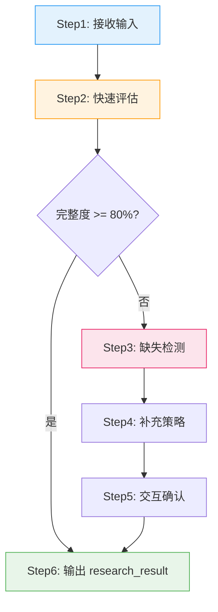
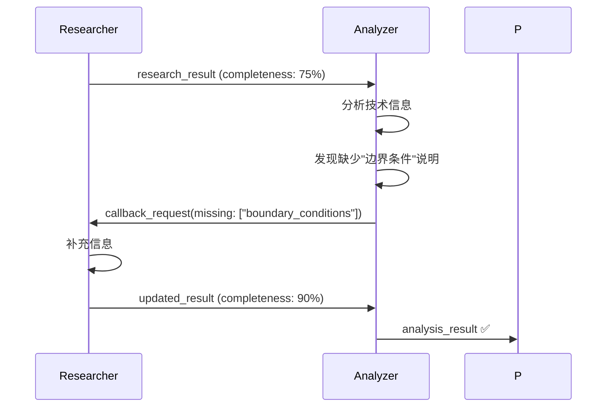

# 第三部分：生产阶段深度分析

> **所属报告**: [Skill Factory 深度架构分析](./README.md)  
> **章节范围**: 第5章  
> **核心主题**: Researcher → Analyzer → Planner → Generator → Packager 五步流水线  

**← 返回主索引 [README](./README.md) | 前文 → [第二部分：架构哲学](./02-architecture-philosophy.md) | 继续阅读 → [第四部分：加工/发布/销毁阶段](./04-phase-processing-publishing.md)**

---

## 5. 生产阶段深度分析

> "从零到一的过程，永远比从一到N更难。"

生产阶段是 Skill Factory **最复杂也最核心**的部分，包含 5 个子技能，占总代码量的 40.2%。这一阶段的目标是：**将模糊的用户输入转化为符合规范的技能包初稿**。

### 5.0 模块概览与叙事衔接

在工厂隐喻中，生产阶段对应"原材料→半成品"的转化过程。用户可能只提供一个 URL、一段需求描述、甚至一个模糊的想法——生产阶段的任务就是把这些"原材料"加工成标准化的"半成品"（即通过 packager 验证的初稿）。

这个阶段的设计挑战在于：**输入的不确定性极高，但输出的规范性要求极严**。五步流水线正是为了解决这个矛盾而设计的。

---

### 5.1 Researcher - 信息研究员 ⭐⭐⭐ 核心模块

**职责**: 接收用户输入，交互确认需求，补充缺失信息  
**代码量**: 393 行（13个子技能中最长之一）  
**位置**: 流水线的第一步，也是唯一有"回调能力"的模块

#### 5.1.1 为什么 Researcher 需要最复杂？

直觉上，第一步应该最简单（只是收集信息），但实际上 **Researcher 是整个系统中最复杂的子技能**。原因：

1. **输入的多样性**: 用户可能提供 URL、文档、代码片段、甚至口头描述
2. **信息的完整性要求**: 后续所有步骤都依赖 Researcher 的输出
3. **回调机制的支持**: 需要设计状态管理以支持被后续阶段回调

#### 5.1.2 六步研究流程（[L55-L180](file:///e:\Workplace\Agent\skill-factory\skills\skill-factory-researcher\SKILL.md#L55-L180)）



**关键设计决策**：

- **80% 完整度阈值**: 为什么不是 100%？因为追求完美会导致无限循环。80% 是一个务实的平衡点——允许后续阶段发现小问题时通过回调补充。
- **缺失检测的三层分类**（[L239-L249](file:///e:\Workplace\Agent\skill-factory\skills\skill-factory-researcher\SKILL.md#L239-L249)）：
  - 基础信息：名称、目标、输入输出（必须补齐）
  - 内容信息：核心逻辑、边界条件（建议补齐）
  - 上下文信息：依赖关系、适用范围（可选）

#### 5.1.3 回调机制的设计智慧（[L419-L442](file:///e:\Workplace\Agent\skill-factory\skills\skill-factory-researcher\SKILL.md#L419-L442)）

这是 Researcher 最具创新性的特性：

```
正常流程: User → Researcher → Analyzer → Planner → ...
回调流程: ... → Analyzer → [发现缺失] → Researcher → [补充] → Analyzer → ...
```

**设计价值分析**：

| 维度 | 无回调 | 有回调 |
|------|--------|--------|
| 信息完整性 | 依赖初始收集质量 | 可迭代完善 |
| 失败率 | 高（一步错步步错） | 低（容错性强） |
| 时间成本 | 低（单次通过） | 中等（可能多次往返） |
| 实现复杂度 | 简单 | 需要状态管理 |

**潜在问题**:
- 未定义最大回调次数（可能导致无限循环）
- 回调历史未持久化（无法用于后续优化）

#### 5.1.4 输出规范（research_result 结构）

Researcher 的输出是一个结构化的 `research_result` 对象，包含：
- `source`: 原始输入来源
- `raw_content`: 原始内容（URL则包含抓取内容）
- `confirmed_info`: 用户确认的信息
- `missing_info`: 已识别的缺失项
- `context`: 额外上下文

这个结构化输出是后续 analyzer 和 planner 的输入基础。

---

### 5.2 Analyzer - 技术内容分析器

**职责**: 从 research_result 中提取技术信息，评估体量和复杂度  
**代码量**: 87 行（最精简的子技能之一）  
**特点**: 纯分析型，无副作用

#### 5.2.1 为什么 Analyzer 如此精简？

只有 87 行，是生产阶段最小的子技能。这是因为它的**职责边界非常清晰**：

> "只做一件事：把非结构化的文本变成结构化的技术信息。"

它不负责：
- ❌ 判定类型（那是 planner 的事）
- ❌ 生成文件（那是 generator 的事）
- ❌ 验证质量（那是 packager 的事）

这种**单一职责原则**的应用，让 Analyzer 成为一个纯粹的"转换器"。

#### 5.2.2 核心流程（[L30-L39](file:///e:\Workplace\Agent\skill-factory\skills\skill-factory-analyzer\SKILL.md#L30-L39)）

```
输入: research_result (来自 Researcher)
  ↓
Step1: 输入验证 (检查必要字段)
  ↓
Step2: 内容读取 (提取 raw_content)
  ↓
Step3: 结构化提取 (识别技术要素)
  ↓
Step4: 体量评估 (预估行数和复杂度)
  ↓
输出: analysis_result {
         technical_info: {...},
         volume_estimate: {lines, complexity},
         completeness: 0-100%
       }
```

**关键技术要素识别**（[L50-L70](file:///e:\Workplace\Agent\skill-factory\skills\skill-factory-analyzer\SKILL.md#L50-L70)）：
- 功能数量（单一 vs 多个）
- 依赖关系（独立 vs 有依赖）
- 文档体量（预估行数）
- 示例需求（是否需要详细示例）
- 引用资料（是否有外部文档可拆分）

#### 5.2.3 与 Researcher 的协作模式

Analyzer 是**第一个可能触发回调**的阶段：



**设计评价**: 这种"下游发现问题→向上游要数据"的模式，打破了传统瀑布流的单向性，是 Skill Factory 区别于简单代码生成器的关键特征。

---

### 5.3 Planner - 类型规划器 ⭐⭐⭐ 决策核心

**职责**: 基于四维分类法判定技能类型，输出结构化拆分计划  
**代码量**: 336 行  
**地位**: 整个系统的"大脑"，决定了技能的最终形态

#### 5.3.1 两步决策树（[L55-L84](file:///e:\Workplace\Agent\skill-factory\skills\skill-factory-planner\SKILL.md#L55-L84)）

Planner 使用**两步决策**来判定类型：

```
Step1: 功能维度判断（轻 vs 重）
  ├── 单一核心能力 → 轻（Light）
  └── 多个可独立使用的模块 → 重（Heavy）

Step2: 内容维度判断（薄 vs 厚）
  ├── <300行能说清楚 → 薄（Thin）
  └── 需要详细说明/示例/代码 → 厚（Thick）

最终类型 = Step1结果 + Step2结果
  例: 单一功能 + 需要详细说明 = 轻+厚 (Type 3)
```

**为什么分两步而不是一次性判断？**

1. **认知减负**: 同时考虑两个维度会增加判断难度
2. **可解释性**: 分步决策更容易追溯原因
3. **灵活性**: 可以单独调整某个维度的标准而不影响另一个

#### 5.3.2 四种类型的详细定义

Planner 为每种类型提供了详细的判断标准和输出模板（[L120-L243](file:///e:\Workplace\Agent\skill-factory\skills\skill-factory-planner\SKILL.md#L120-L243)）：

| 类型 | 名称 | 判断标准 | 目录结构 | 典型场景 |
|------|------|---------|---------|---------|
| **Type 1** | 轻+薄 | 单一功能 + <300行 | `{name}/SKILL.md` | git-commit, format-code |
| **Type 2** | 重+薄 | 多模块 + 每个精简 | `{name}-family/SKILL.md` + `skills/` | code-review-family |
| **Type 3** | 轻+厚 | 单一功能 + 详细文档 | `{name}/SKILL.md` + `references/` | architecture-design |
| **Type 4** | 重+厚 | 多模块 + 部分详细 | `{name}-family/SKILL.md` + `skills/(部分有references/)` | full-stack-dev |

**关键洞察**: Type 3（轻+厚）是最常见的类型——大多数有价值的技能都需要详细说明，但不一定需要拆分成多个模块。

#### 5.3.3 输出：plan_result 结构

Planner 的输出不仅包含类型判定，还包含**具体的拆分计划**：

```yaml
plan_result:
  type: 3  # 轻+厚
  classification:
    light_heavy: light
    thin_thick: thick
  structure_plan:
    main_file: "{name}/SKILL.md"
    references_dir: true
    sub_skills: []
  rationale: "单一架构设计能力，需要大量图表和案例说明"
```

这个 `plan_result` 将直接指导 Generator 的文件生成。

---

### 5.4 Generator - 技能生成器

**职责**: 根据 plan_result 生成对应的 SKILL.md 和目录结构  
**代码量**: 297 行  
**特点**: 模板驱动，四种输出模式

#### 5.4.1 四种输出模式（[L22-L44](file:///e:\Workplace\Agent\skill-factory\skills\skill-factory-generator\SKILL.md#L22-L44)）

Generator 根据 Planner 的类型判定，使用不同的模板：

| 类型 | 生成内容 | 模板特点 |
|------|---------|---------|
| **Type 1 (轻+薄)** | 单个 SKILL.md | 精简版 frontmatter + 浓缩的能力描述 |
| **Type 2 (重+薄)** | 主 SKILL.md + 子技能 SKILL.md | 主文件为索引，子文件各自独立 |
| **Type 3 (轻+厚)** | SKILL.md + references/ 目录 | 主文件含概览，details 拆到 references/ |
| **Type 4 (重+厚)** | 主文件 + 子技能 + 部分 references/ | 最完整的结构 |

**模板设计哲学**:

Generator 不是简单的"填空题"，而是**智能组装**：
- 从 `analysis_result` 提取技术信息
- 从 `plan_result` 获取结构规划
- 结合内置的最佳实践模板
- 生成符合 Anthropic Skills 规范的内容

#### 5.4.2 SKILL.md Frontmatter 生成规则

Generator 生成的 frontmatter 包含以下字段（参考 [L72](file:///e:\Workplace\Agent\skill-factory\skills\skill-factory-generator\SKILL.md#L72) 的模板示例）：

```yaml
---
name: {skill-name}
version: v0.1.0
description: "100-150字符的技能描述"
author: skill-factory
tags: [{tag1}, {tag2}]
trigger: "何时触发此技能"
input: ["输入参数列表"]
output: "输出格式说明"
---
```

**设计细节**:
- `description` 限制在 100-150 字符（兼顾信息密度和可读性）
- `tags` 从技术信息中自动提取（而非手动填写）
- `version` 固定为 v0.1.0（正式版本由 Publisher 管理）

---

### 5.5 Packager - 技能打包器 ⭐⭐⭐ 质量守门员

**职责**: 验证生成的技能包是否符合对应类型的结构规范  
**代码量**: 401 行（13个子技能中最长）  
**角色**: 生产阶段的最后一道关卡

#### 5.5.1 为什么 Packager 需要最长代码？

Packager 是**质量控制**的核心，需要处理：

1. **四种验证模式**（每种类型的验证规则不同）
2. **详细的错误报告**（指出具体哪里不符合规范）
3. **质量评分机制**（量化评估生成结果的质量）

#### 5.5.2 四种验证模式（[L22-L45](file:///e:\Workplace\Agent\skill-factory\skills\skill-factory-packager\SKILL.md#L22-L45)）

```mermaid
flowchart TD
    P[plan_result.type] --> T1{Type 1?}
    T1 -->|是| V1[验证单文件完整性<br/>frontmatter + 能力描述 + 示例]

    P --> T2{Type 2?}
    T2 -->|是| V2[验证多文件结构<br/>主索引 + 子技能独立性]

    P --> T3{Type 3?}
    T3 -->|是| V3[验证references/<br/>文件数 + 索引链接有效性]

    P --> T4{Type 4?}
    T4 -->|是| V4[验证混合结构<br/>子技能 + references/ 一致性]

    V1 --> S[评分 >= 80?]
    V2 --> S
    V3 --> S
    V4 --> S

    S -->|✅| PASS[输出 package_result ✅]
    S -->|❌| FAIL[返回 error_list 给 Generator 重新生成]

    style PASS fill:#e8f5e9,stroke:#4caf50
    style FAIL fill:#fce4ec,stroke:#e91e63
```



**每种类型的验证要点**（以 Type 3 为例，[L162-L188](file:///e:\Workplace\Agent\skill-factory\skills\skill-factory-packager\SKILL.md#L162-L188)）：

| 检查项 | 验证规则 | 权重 |
|--------|---------|------|
| references/ 目录存在 | 必须存在且非空 | 20% |
| 文件数量合理 | 建议 3-10 个文件 | 15% |
| 索引链接有效 | SKILL.md 中的链接都能解析 | 25% |
| 内容无重复 | 各文件间无冗余 | 20% |
| 格式规范 | 符合 Markdown 标准 | 20% |

#### 5.5.3 质量评分与反馈循环

Packager 的评分机制（≥80分通过）体现了**质量门控**思想：

- **≥90分**: 优秀，可直接进入加工阶段
- **80-89分**: 良好，建议优化但可通过
- **<80分**: 不合格，返回 Generator 重新生成（附带改进建议）

**这种反馈循环的价值**:
- 避免"垃圾进垃圾出"的问题
- 让系统具有自我纠错能力
- 为后续加工阶段提供高质量的输入

---

### 5.6 生产阶段整体评价

#### ✅ 设计亮点

1. **五步流水线的合理性**: 从信息收集到质量验证，每一步都有明确的输入输出和职责边界
2. **回调机制的突破性**: 打破单向流程，支持迭代式完善
3. **类型驱动的生成**: 四维分类法让生成过程有据可依，而非盲目拼凑
4. **质量门控意识**: Packager 作为守门员确保输出质量

#### ⚠️ 潜在问题

1. **Researcher 过于复杂**: 393行代码暗示其职责可能过重，可考虑拆分为"输入接收器"和"信息补充器"
2. **回调次数未限制**: 可能导致无限循环（建议增加 ≤3次的硬限制）
3. **Generator 的模板灵活度不足**: 当前模板较固定，难以支持高度定制化的技能
4. **Packager 的验证规则硬编码**: 四种模式的验证规则写在文档中，难以动态扩展

#### 🔧 改进方向

1. **引入配置化的验证规则**: 将 Packager 的验证规则外置为 YAML 配置文件
2. **增加模板市场**: 允许社区贡献不同领域的 Generator 模板
3. **实现增量生成**: 支持在已有技能基础上增量修改（而非每次从头生成）
4. **增加单元测试**: 为每个步骤的输入输出设计测试用例

---

## 📌 本章小结

生产阶段是 Skill Factory **最核心也最复杂的部分**（5个子技能，40%代码量），其设计精髓在于：

1. **Researcher**: 复杂但必要——作为信息入口和回调中心，承担了最重的认知负荷
2. **Analyzer**: 极简而专注——单一职责原则的完美体现，纯转换器设计
3. **Planner**: 决策大脑——两步决策树将复杂判断分解为可控的步骤
4. **Generator**: 智能组装——不是填空题，而是基于多种输入的智能整合
5. **Packager**: 质量守门员——四种验证模式确保输出符合规范

**关键数据流**:
```
User Input → research_result → analysis_result → plan_result → 初稿文件 → package_result
```

**下一步**: 进入 [第四部分：加工/发布/销毁阶段](./04-phase-processing-publishing.md)，了解如何将初稿打磨为成品。
