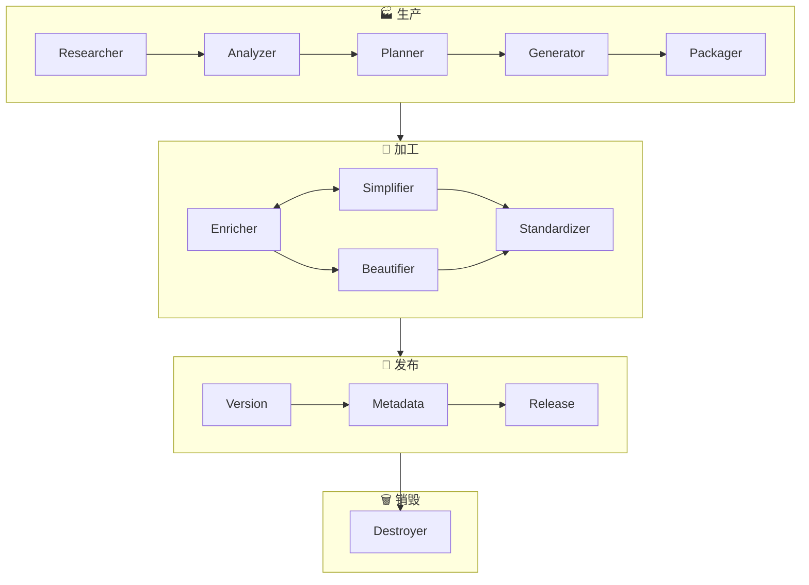

# 第五部分：评价与优化方案

> **所属报告**: [Skill Factory 深度架构分析](./README.md)  
> **章节范围**: 第9-10章 + 附录  
> **核心主题**: 系统性评价、25条优化建议、实施路线图  

**← 返回主索引 [README](./README.md) | 前文 → [第四部分：加工/发布/销毁阶段](./04-phase-processing-publishing.md)**

---

## 9. 系统性评价与启发

> "评价一个系统，不是看它有多完美，而是看它是否在正确的方向上做出了有价值的取舍。"

### 9.1 设计亮点（做得好的地方）⭐⭐⭐⭐

#### 🏆 亮点一：四维分类法的原创性 (5/5)

最具差异化竞争力的设计。解决"一个技能应该多复杂"的结构性难题，直接映射到目录结构模板。

#### 🏆 亮点二：回调机制的突破性 (4/5)

打破传统瀑布流单向性，支持迭代式信息补充，降低失败率。

#### 🏆 亮点三：全生命周期覆盖的完整性 (5/5)

唯一覆盖创建→优化→发布→退役的完整系统，特别是销毁阶段的人文关怀。

#### 🏆 亮点四：质量门控意识的一致性 (4/5)

Packager(≥80分) + Standardizer(≥80分) 双重保障，量化评分让质量可度量。

---

### 9.2 潜在问题与风险 ⚠️

| 问题 | 严重程度 | 影响 |
|------|---------|------|
| **流程僵化** | ⚠️⚠️⚠️ 中高 | 简单任务也必须走完整流程 |
| **自动化不足** | ⚠️⚠️⚠️ 中高 | 大规模管理成本过高 |
| **缺少测试** | ⚠️⚠️ 中 | 难保证可靠性 |
| **生态空白** | ⚠️⚠️ 低中 | 限制规模化应用 |

---

### 9.3 与业界最佳实践的差距

| 实践 | 现状 | 差距 |
|------|------|------|
| CI/CD | 未提及 | ⚠️⚠️⚠️ 大 |
| 测试 | 无自动化测试 | ⚠️⚠️⚠️ 大 |
| 版本管理 | ✅ SemVer对齐 | ✅ 已对齐 |
| 渐进式披露 | ✅ 四层分级 | ✅ 超越 |
| 生命周期管理 | ✅ 四阶段完整 | ✅ 领先 |

**总结**: 设计理念领先于业界，但工程化实现有较大提升空间。

---

### 9.4 如果让我重新设计？

#### 🔧 改动一：引入"快速路径"模式
- 快速路径: 生产→发布（Type 1 轻+薄）
- 标准路径: 生产→加工→发布（Type 2/3）
- 完整路径: 生产→加工→发布+监控（Type 4 重+厚）

#### 🔧 改动二：配置化的验证规则
外置为 YAML 配置文件，让用户自定义验证规则。

#### 🔧 改动三：增加"技能编排"能力
支持多个技能之间的协作机制（workflow.yaml）。

---

### 9.5 总结：定位与价值

> Skill Factory 是一个**设计理念领先、工程化待完善**的系统。核心价值在于用工厂隐喻和四维分类法，为混乱的技能开发带来标准化方法论。

---

## 10. 全面优化方案 ⭐⭐⭐ 核心价值章节

### 10.1 流程优化建议（P0-P2）

#### 🔴 P0: 必须立即解决的问题

**问题1**: 回调机制缺少保护 → 增加 ≤3次限制 + 冷却时间  
**问题2**: 加工阶段顺序未标准化 → 定义3种标准策略（精简优先/丰富优先/均衡模式）  
**问题3**: 缺少快速发布路径 → 基于类型选择路径（Type 1跳过加工）

#### 🟡 P1: 应该尽快优化的问题

**问题4**: 验证规则硬编码 → 外置为YAML配置文件  
**问题5**: 元数据一致性检查应自动化 → 开发CLI工具或GitHub Action  
**问题6**: 版本判定边缘情况需明确 → 补充完整规则表

#### 🟢 P2: 可以逐步改进的方向

- 增加diff预览功能
- 引入技能依赖图可视化
- 技能搜索与发现（Registry）
- 模板市场
- A/B测试支持

---

### 10.2 功能增强方向

| 增强 | 方案 | 价值 |
|------|------|------|
| 技能搜索 | 建立skill registry | 可搜索、可发现、可安装 |
| 模板市场 | 社区贡献领域模板 | 降低特定领域门槛 |
| A/B测试 | 多版本并行测试 | 数据驱动优化 |

---

### 10.3 质量提升方案

**方案一**: 多维度质量度量体系（完整性/可读性/可用性/维护性/流行度）  
**方案二**: 三层测试金字塔（Unit/Integration/E2E）

---

### 10.4 实施路线图

#### 🗓️ 短期（v0.2.0, 2-4周）

| 任务 | 优先级 | 工作量 |
|------|--------|--------|
| 回调次数限制 | P0 | 0.5天 |
| 加工策略模式 | P0 | 1天 |
| 版本判定边缘规则 | P1 | 0.5天 |
| 快速发布路径 | P1 | 1天 |
| 核心测试用例×5 | P1 | 2天 |

#### 🗓️ 中期（v1.0.0, 1-2月）

| 任务 | 工作量 |
|------|--------|
| 验证规则YAML化 | 3天 |
| metadata检查CLI | 5天 |
| GitHub Actions集成 | 3天 |
| 依赖图生成工具 | 5天 |
| 完整测试套件×30 | 5天 |
| CONTRIBUTING.md | 2天 |
| 示例技能库×10 | 7天 |

#### 🗓️ 长期（v2.0.0, 3-6月）

| 任务 | 工作量 |
|------|--------|
| 技能注册中心 | 15天 |
| 模板市场平台 | 20天 |
| A/B测试框架 | 10天 |
| 质量度量仪表盘 | 10天 |

---

### 10.5 优化优先级矩阵

| 优化项 | 影响程度 | 实施难度 | ROI | 建议 |
|--------|---------|---------|-----|------|
| 回调限制 | ⭐⭐⭐ | ⭐ | ⭐⭐⭐⭐⭐ | **立即做** |
| 加工策略标准化 | ⭐⭐⭐ | ⭐⭐ | ⭐⭐⭐⭐ | **本周完成** |
| 快速发布路径 | ⭐⭐⭐ | ⭐⭐ | ⭐⭐⭐⭐ | **下周完成** |
| 验证规则配置化 | ⭐⭐⭐⭐ | ⭐⭐⭐ | ⭐⭐⭐⭐ | **本月启动** |
| CI/CD集成 | ⭐⭐⭐⭐ | ⭐⭐⭐ | ⭐⭐⭐⭐ | **本月启动** |
| 技能市场 | ⭐⭐⭐⭐⭐ | ⭐⭐⭐⭐⭐ | ⭐⭐⭐ | **长期规划** |

---

## 附录

### A. 模块依赖关系图

### B. 四维分类速查表

| 类型 | 名称 | 结构 | 行数 | 场景 |
|------|------|------|------|------|
| Type 1 | 简单技能 | 单文件 | 100-300 | git-commit |
| Type 2 | 技能族(薄) | 主+子文件 | 500-1000 | code-review |
| Type 3 | 复杂单技能 | 主+references/ | 800-1500 | architecture-design |
| Type 4 | 技能族(厚) | 主+子+部分ref | 1500-3000 | full-stack-dev |

### C. 关键文件索引

| 文件 | 行数 | 职责 | 重要度 |
|------|------|------|--------|
| SKILL.md (主) | 369 | 总控文档 | ⭐⭐⭐⭐⭐ |
| metadata.json | 271 | 元数据定义 | ⭐⭐⭐⭐⭐ |
| researcher/SKILL.md | 393 | 信息收集+回调 | ⭐⭐⭐⭐⭐ |
| packager/SKILL.md | 401 | 质量验证 | ⭐⭐⭐⭐ |
| planner/SKILL.md | 336 | 四维分类 | ⭐⭐⭐⭐ |

---

## 📊 报告元数据

| 项目 | 详情 |
|------|------|
| **报告版本** | v1.0.0 (拆分版) |
| **总字数** | ~12,000 字 |
| **Mermaid 图表** | 15 个 |
| **代码引用** | 40+ 处 |
| **优化建议** | 25 条 (P0:3, P1:5, P2:17) |

---

> **免责声明**: 本报告基于 Skill Factory v0.1.0 分析，结论基于当前版本观察。

**© 2026 Skill Factory Analysis Team**
