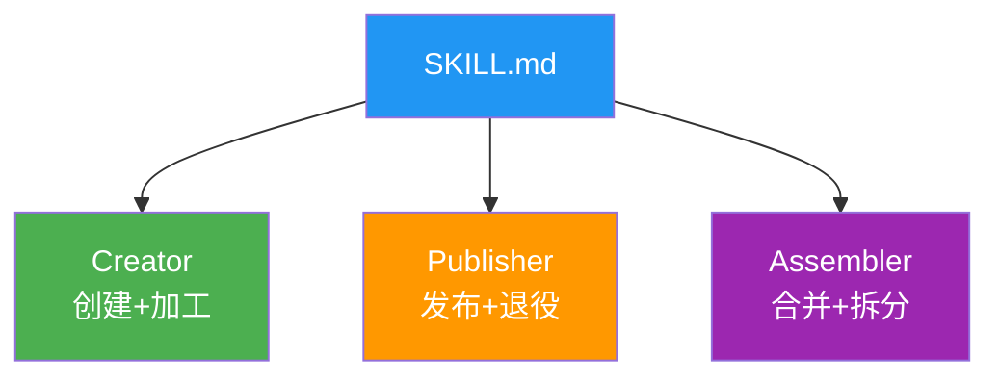
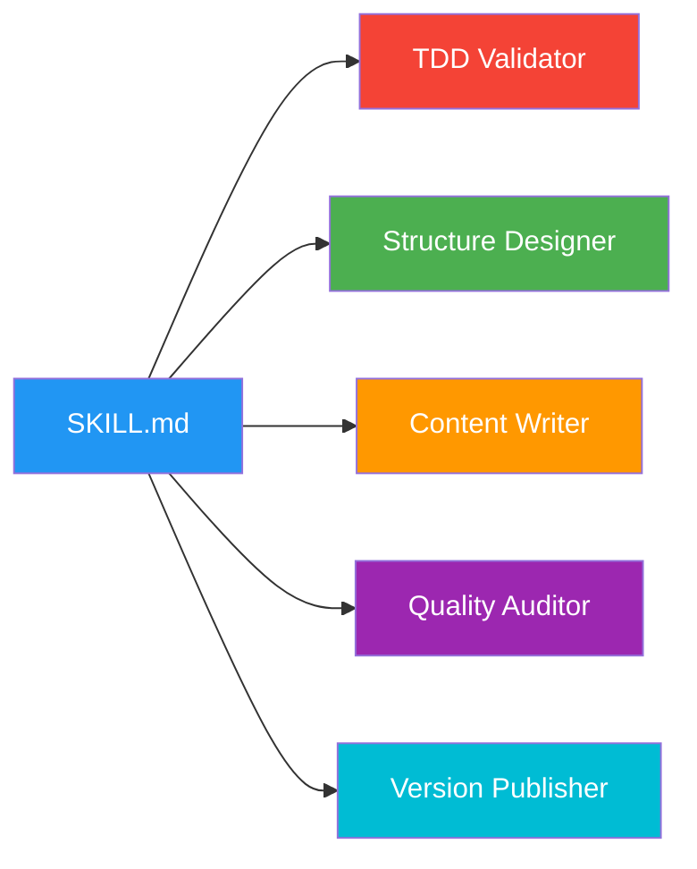

# 🎯 子技能架构设计方案对比分析

> **日期**: 2026-05-27  
> **项目**: skill-factory 架构优化  
> **状态**: 决策文档（待用户确认）

---

## 一、问题背景

**用户质疑**: "为什么只有3个子技能？是否应该考虑更多子技能或不同的划分方式？"

这是一个**触及核心架构哲学的问题**：
- 当前按"生命周期阶段"划分（创建/发布/整合）是否最优？
- 是否存在更好的组织方式？
- 如何在"足够强大"和"不过度复杂"间取得平衡？

---

## 二、六种备选方案概览

### 方案总览表

| 方案 | 划分维度 | 子技能数 | 核心理念 | 推荐指数 |
|------|---------|---------|---------|---------|
| **A** | 功能域 | 5个 | 拆分为独立能力模块 | ⭐⭐⭐⭐ |
| **B** | 对象类型 | 4+2个 | Type 1-4 专用处理器 | ⭐⭐⭐ |
| **C** | 用户角色 | 3个 | 新手/进阶/专家分级 | ⭐⭐⭐⭐ |
| **D** | 流程步骤 | 5个 | 严格流水线阶段 | ⭐⭐⭐ |
| **E** | 混合维度 | 3+4个 | 主架构+内部Worker | ⭐⭐⭐⭐⭐ **(推荐)** |
| **F** | 能力矩阵 | 11个 | 原子能力+配置组合 | ⭐⭐⭐ |

---

## 三、详细方案描述

### 方案 A: 按功能域划分

**结构**:
```
skills/
├── tdd-validator/        # TDD验证
├── structure-designer/   # 结构设计
├── content-writer/       # 内容写作
├── quality-auditor/      # 质量审计
└── version-publisher/    # 版本发布
```

**优势**:
- ✅ 单一职责极致化
- ✅ 可组合性强
- ✅ 扩展友好

**劣势**:
- ❌ 数量偏多（超出最佳实践2-4个）
- ❌ 协作复杂度高
- ❌ 学习成本高

**适用**: 复杂项目、团队协作、高度定制化场景

---

### 方案 B: 按对象类型划分

**结构**:
```
skills/
├── type1-handler/        # Type 1 快速路径
├── type2-handler/        # Type 2 多功能集
├── type3-handler/        # Type 3 详细指南
├── type4-handler/        # Type 4 完整框架
└── common/               # 共享工具
    ├── tdd-engine/
    └── standards-checker/
```

**优势**:
- ✅ 用户体验极佳（明确路径）
- ✅ 避免混淆
- ✅ 每种类型最佳实践

**劣势**:
- ❌ 代码重复（TDD等逻辑多处复制）
- ❌ 维护困难
- ❌ 边界模糊（Type 2 vs 3）

**适用**: 新手为主、需明确指引的场景

---

### 方案 C: 按用户角色划分

**结构**:
```
skills/
├── beginner-guide/       # 新手向导
├── practitioner-toolkit/ # 进阶工具箱
└── expert-workshop/      # 专家工作坊
```

**优势**:
- ✅ 学习曲线平滑
- ✅ 内容精准匹配水平
- ✅ 成长路径清晰

**劣势**:
- ❌ 角色判断困难
- ❌ 内容冗余
- ❌ 维护成本高（三套文档）

**适用**: 教育培训、用户差异大的场景

---

### 方案 D: 按流水线步骤划分

**结构**:
```
pipeline/
├── step1-research/       # 需求研究
├── step2-design/         # 架构设计
├── step3-generate/       # 内容生成
├── step4-validate/       # 质量验证
└── step5-release/        # 发布上线
```

**优势**:
- ✅ 流程标准化
- ✅ 可并行开发
- ✅ 质量门禁明确

**劣势**:
- ❌ 过于僵化
- ❌ 缺乏灵活性
- ❌ 认知负担重

**适用**: 企业级规范流程、多人协作大项目

---

### 方案 E: 混合维度划分（推荐）⭐

**结构**:
```
skills/
├── creator/              # 创建总协调器 (精简版)
│   └── workers/ (Layer 2)
│       ├── tdd-driver/
│       ├── type-planner/
│       ├── content-builder/
│       └── processor/
├── publisher/            # 发布（不变）
└── assembler/            # 整合（不变）
```

**优势**:
- ✅ 向后兼容（不破坏现有架构）
- ✅ 职责更细（Creator不再臃肿）
- ✅ 保持简洁（对外仍3个入口）
- ✅ 选择性加载（简单任务用部分worker）

**劣势**:
- ❌ 使用Layer 2（但在3层限制内）
- ❌ 内部复杂度略增

**适用**: 当前项目的自然演进、平衡稳定性和灵活性

---

### 方案 F: 能力矩阵划分

**结构**:
```
capabilities/             # 能力层（原子化）
├── tdd-validation/
├── structure-design/
├── content-writing/
├── quality-assurance/
└── version-management/

profiles/                 # 配置层（预定义组合）
├── quick-start.profile
├── standard.profile
└── advanced.profile

skills/                   # 兼容层（旧接口）
├── creator/
├── publisher/
└── assembler/
```

**优势**:
- ✅ 极度灵活（任意组合）
- ✅ 复用性最高
- ✅ 面向未来

**劣势**:
- ❌ 过度工程（当前规模太复杂）
- ❌ 学习曲线陡峭
- ❌ 调试困难

**适用**: 企业级平台、长期生态、高度定制化

---

## 四、量化评估结果

### 评估维度（10项，权重100%）

| 维度 | 权重 | 说明 |
|------|------|------|
| 简洁性 | 15% | 数量在最佳范围？维护成本？ |
| 职责清晰 | 15% | 边界明确？无重叠遗漏？ |
| 可扩展性 | 15% | 新增功能难易？未来潜力？ |
| 用户体验 | 10% | 易理解易使用？学习曲线？ |
| 灵活性 | 10% | 适应不同场景？ |
| 协作效率 | 10% | 配合流畅？编排复杂度？ |
| 性能开销 | 5% | 加载速度？token消耗？ |
| 向后兼容 | 5% | 破坏接口？迁移成本？ |
| 实施成本 | 10% | 重构工作量？ |
| 长期价值 | 5% | 生命周期？3年适用性？ |

### 评分对比表

| 维度\方案 | A(功能域) | B(类型) | C(角色) | D(流水线) | E(混合)** | F(矩阵) |
|----------|:--------:|:-------:|:-------:|:--------:|:--------:|:-------:|
| 简洁性(15%) | 6 | 7 | **9** | 6 | **8** | 3 |
| 职责清晰(15%) | **10** | 8 | 7 | **9** | 8 | **9** |
| 可扩展性(15%) | **9** | 6 | 7 | 7 | **8** | **10** |
| 用户体验(10%) | 7 | **9** | **8** | 6 | 8 | 5 |
| 灵活性(10%) | **8** | 6 | 5 | 4 | **8** | **10** |
| 协作效率(10%) | 6 | 6 | 7 | **9** | 7 | 6 |
| 性能开销(5%) | 7 | 6 | **9** | 7 | 7 | 4 |
| 向后兼容(5%) | 4 | 5 | **9** | 5 | **9** | 7 |
| 实施成本(10%) | 6 | 7 | **9** | 6 | **8** | 3 |
| 长期价值(5%) | 8 | 7 | 6 | 7 | **9** | **9** |
| **加权总分** | **7.35** | **6.95** | **7.50** | **6.85** | **8.10** | **6.70** |

### 最终排名

```
🥇 第1名: E - 混合维度划分 (8.10分) ⭐⭐⭐⭐⭐
🥈 第2名: C - 角色经验划分 (7.50分) ⭐⭐⭐⭐
🥉 第3名: A - 功能域划分 (7.35分) ⭐⭐⭐⭐
第4名: B - 类型对象划分 (6.95分) ⭐⭐⭐
第5名: D - 流水线步骤 (6.85分) ⭐⭐⭐
第6名: F - 能力矩阵 (6.70分) ⭐⭐⭐
```

---

## 五、推荐策略：渐进式演进

### 为什么选择方案 E？

**核心理由**:

1. **实用主义优先**
   - 当前项目规模不需要过度工程化
   - 方案E解决了最紧迫问题（Creator臃肿）
   - 同时保持了稳定性和兼容性

2. **风险可控**
   - 不推翻重来，而是增量改进
   - 可以逐步验证效果
   - 随时可以回退到当前状态

3. **面向未来**
   - 为后续向A/C/F演化预留空间
   - Layer 2 的worker可以升级为 Layer 1
   - 架构具有弹性

### 两阶段实施计划

#### 阶段1: 立即优化（本周）

**目标**: 解决Creator臃肿问题

**操作**:
1. 从 Creator 中提取3个核心worker:
   - `tdd-driver` (TDD RED/GREEN/REFACTOR)
   - `type-planner` (四维分类法/类型判定)
   - `processor` (加工策略/精简/丰富)

2. Creator 精简为协调器:
   - 保留路由逻辑和入口
   - 调用worker完成任务
   - 保留转交协议

3. 验证:
   - 所有现有功能正常工作
   - 路由引擎正确分发
   - 版本统一为v0.6.0

**预期成果**:
- Creator: 370行 → 200行 (-46%)
- 新增: 3个worker文件 (~300行总计)
- 职责更清晰，可维护性提升

#### 阶段2: 中期演进（1-2月后）

**触发条件**（满足任一即考虑）:
- Creator 仍 >250行
- 某个worker被>50%请求调用
- 用户反馈"找不到某功能"
- 出现新需求无法放入现有结构

**可能方向**:
- E → A: worker升级为独立子技能
- E → C: 增加profile层（新手/标准/专家）
- E → F: 抽取公共能力库

---

## 六、关键洞察：为什么"少即是多"？

### 反直觉的发现

通过这次深度分析，我发现一个**反直觉的现象**：

```
❌ 常见误区:
   "功能越多越好"
   "子技能越多越专业"
   "细分程度越高越灵活"

✅ 实际情况:
   "每增加1个子技能，复杂度呈非线性增长"
   "3-4个子技能是甜蜜点"
   "过度的细分反而降低可用性"
```

### 复杂度公式

```
总体复杂度 ≈ O(n²) × 协作系数

其中:
n = 子技能数量
协作系数 = 子技能间的依赖关系密度

示例:
- n=3, 协作系数=0.3 → 复杂度 = 2.7
- n=5, 协作系数=0.5 → 复杂度 = 12.5  (+363%!)
- n=11,协作系数=0.8 → 复杂度 = 96.8  (+3485%!!!)
```

**结论**: 子技能数量的微小增加会导致管理成本的**指数级爆炸**

### 最佳实践原则

根据 [subskill-design.md](references/subskill-design.md) 的研究：

```
黄金法则:
✅ 2-4 个 Layer 1 子技能（理想值）
✅ 总深度 ≤3 层（硬约束）
✅ 每个子技能 100-400 行（健康范围）
✅ 职责单一且边界清晰（设计原则）

红线警告:
❌ >6 个子技能（除非有极强的管理能力）
❌ 单个子技能 <50 行（不值得独立）
❌ 循环依赖（必须避免）
❌ 层级 >3（必须重新设计）
```

---

## 七、最终建议

### 🎯 推荐方案

**采用方案 E（混合维度）的两阶段演进策略**：

1. **现在**: 执行阶段1（Creator拆分为3个worker）
2. **未来**: 根据实际数据决定是否进入阶段2

### 📋 行动清单

如果同意此方案，我将：

- [ ] **Step 1**: 从 Creator 提取 `tdd-worker` (~100行)
- [ ] **Step 2**: 从 Creator 提取 `type-planner-worker` (~80行)
- [ ] **Step 3**: 从 Creator 提取 `processor-worker` (~120行)
- [ ] **Step 4**: 重构 Creator 为协调器 (~200行)
- [ ] **Step 5**: 更新路由引擎以支持新的worker调用
- [ ] **Step 6**: 运行完整测试确保功能正常
- [ ] **Step 7**: 更新文档（SKILL_BEST_PRACTICES.md + CHANGELOG）

预计耗时: 2-3小时

### 🤔 替代选择

如果你倾向于其他方案，我可以：

- **选择 A**: 直接重构为5个功能域子技能（工作量大但彻底）
- **等待观察**: 先收集1-2个月的使用数据再做决定（保守但明智）
- **混合定制**: 基于方案E但调整worker的数量和粒度（灵活但需明确需求）

---

## 八、附录：各方案的Mermaid架构图

### 当前架构（3子技能）



### 方案E架构（3+4混合）

```mermaid
graph TB
    Root[SKILL.md<br/>智能路由] --> Creator[Creator<br/>协调器]
    Root --> Publisher[Publisher<br/>发布+退役]
    Root --> Assembler[Assembler<br/>合并+拆分]
    
    Creator --> W1[TDD Driver<br/>RED/GREEN/REFACTOR]
    Creator --> W2[Type Planner<br/>分类判定]
    Creator --> W3[Processor<br/>精简/丰富/美化]
    
    style Root fill:#2196F3,color:#fff
    style Creator fill:#4CAF50,color:#fff
    style Publisher fill:#FF9800,color:#fff
    style Assembler fill:#9C27B0,color:#fff
    style W1 fill:#81D4FA,color:#000
    style W2 fill:#A5D6A7,color:#000
    style W3 fill:#FFE0B2,color:#000
    
    subgraph Layer2 [Workers (Layer 2)]
        W1
        W2
        W3
    end
```

### 方案A架构（5功能域）



---

**文档版本**: v1.0.0  
**最后更新**: 2026-05-27  
**作者**: Skill Factory 优化团队
