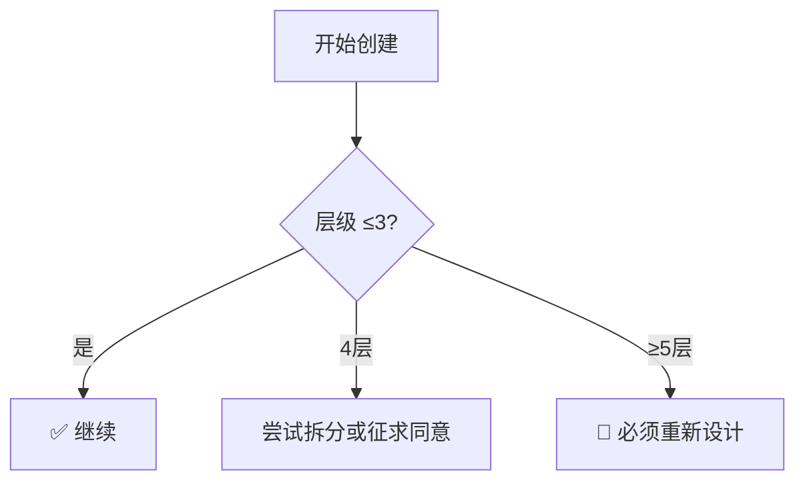
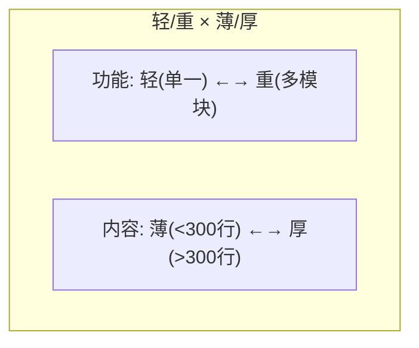
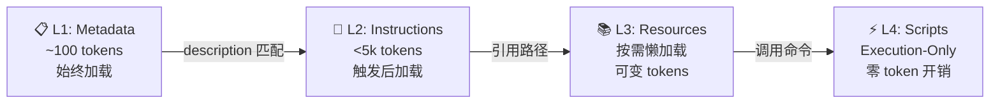

# 设计原则详解

> **来源**: [../SKILL.md](../SKILL.md) → 四级渐进加载 + 三层目录铁律 + 四维分类 + 设计模式 + 发布路径  
> **版本**: v0.6.0

---

## 1. 三层架构铁律

### 为什么是三层？

- **认知科学角度**：米勒定律指出人类工作记忆为 7±2 项，三层是最佳平衡点
- **软件工程角度**：分层过少信息杂乱，分层过多认知负担指数上升
- **实践验证**：三层可支持 50+ 子技能扩展，维护成本可控

### 强制执行机制



### 超三层处理

1. **拆分优先**：拆为多个 ≤3 层的独立技能族
2. **征求同意**：无法拆分时，向用户说明原因并获取授权
3. **特殊标记**：同意后在 SKILL.md 添加 `depth: N` + `layer-warning` 字段

#### 超三层处理 SOP

当检测到目录深度 ≥4 层时，**禁止擅自决定**，必须按以下流程处理：

```
检测(≥4层) → 暂停+告警 → 分析路径 → 生成方案 → 用户确认 → 标记
```

| 阶段 | 动作 | 输出 |
|------|------|------|
| **1. 检测** | 自动发现 ≥4 层时立即暂停 | 告警消息："⚠️ 检测到目录深度 N 层，超过 3 层铁律限制" |
| **2. 分析** | 列出导致超层的具体路径 | 路径列表：`skill/A/B/C/D/SKILL.md (4层)` |
| **3. 方案** | 至少生成 2 种拆分方案 | 方案 A（按功能拆）、方案 B（按场景拆），各含预估层数 |
| **4. 确认** | 向用户展示方案并征求同意 | 使用确认话术模板（见下文） |
| **5. 标记** | 用户同意后在 dependency 中标注 | 添加 `depth_override: true` + `reason: "用户已同意"` |

**用户确认话术模板**：

> 当前技能目录深度为 {N} 层，超过了三层架构铁律的限制。
>
> 导致超层的路径：{路径列表}
>
> 建议方案：
> - **方案 A**：{功能拆分方式}，拆后最大深度 {M} 层
> - **方案 B**：{场景拆分方式}，拆后最大深度 {K} 层
>
> 是否同意采用方案 A/B 继续创建？（如坚持保持当前结构，请明确回复"同意保留"）

---

## 2. 四维分类法详解



### 四种类型

| 类型 | 结构 | 创建流程 | 预计耗时 |
|------|------|---------|---------|
| **Type 1 (轻+薄)** | 单文件 SKILL.md | 🚀 快速路径（跳过加工） | 30min |
| **Type 2 (重+薄)** | SKILL.md + skills/ | 📋 标准路径 | 2h |
| **Type 3 (轻+厚)** | SKILL.md + references/ | 📋 标准路径 | 3h |
| **Type 4 (重+厚)** | 全部 | 🔄 完整路径 | 5h+ |

### 快速路径 (Type 1 专用)


### 判定标准

```yaml
type_1:
  功能: "单一能力"
  内容: "<300行"
  示例: "≤3个"
  依赖: "无或极少"

type_4:
  功能: "多模块可独立"
  内容: ">300行 + 详细refs"
```

---

## 3. 关键设计模式

### 流水线模式
适用于有固定顺序的多步操作。每步有明确输入输出和门禁。

**规则**：
- 定义 `depends_on` 前置步骤
- 每步失败可回调上一步（限制回调次数 ≤2）
- Type 1 可启用快速模式（跳过非关键步骤）

### 策略选择模式
适用于根据条件动态决策的场景。加工阶段根据体量自动选择：

| 行数 | 策略 | 流程 |
|------|------|------|
| >500 | 精简优先 | 精简冗余 → 丰富内容 → 美化格式 → 规范检查 |
| <200 | 丰富优先 | 丰富内容 → 美化格式 → 规范检查 |
| 200-500 | 均衡 | 精简冗余 → 丰富内容 → 美化格式 → 规范检查 |

> 📖 完整加工操作说明: [../skills/skill-factory-creator/SKILL.md](../skills/skill-factory-creator/SKILL.md) — 加工策略章节

**循环保护**：同技能最多加工 3 轮，行数变化 <5% 触发警告。

### 整合模式
将多个技能合并。三种子模式：
- **序列**：A→B→C 顺序执行，上一步输出是下一步输入
- **并行**：A/B/C 同时执行，结果汇总
- **嵌套**：B 嵌入 A 作为子流程调用，如"部署流程中的健康检查"

### 拆分模式
将复杂技能拆分。按功能/场景/角色三维拆，确保每个子技能 ≤3 层。

---

## 4. 发布路径选择

| 类型 | 路径 | 核心区别 |
|------|------|---------|
| Type 1 | 🚀 快速 | 跳过加工，版本 minor+1 |
| Type 2/3 | 📋 标准 | 选择性加工 |
| Type 4 | 🔄 完整 | 全量加工+监控 |

**版本规则**：

| 变更类型 | 版本变化 | Commit 前缀 |
|---------|---------|------------|
| Bug 修复、文字修正 | patch +1 | `fix` |
| 新功能、新增章节 | minor +1 | `feat` |
| 重构、结构调整 | minor +1 | `refactor` |
| 类型升级（Type 变化） | minor +1 | `refactor` |
| 破坏性变更、接口删除 | major +1 | `feat!` |

> 📖 完整版本管理: [../skills/skill-factory-publisher/SKILL.md](../skills/skill-factory-publisher/SKILL.md) — 发布器含语义化版本详细规则和 git commit 规范

---

## 5. 物理目录约定

**轻量工坊模式**（推荐，≤5 个子技能）：

```
{skill-name}/
├── SKILL.md                         ← Layer 0: 入口
├── references/                      ← 不算层级
└── skills/                          ← Layer 1
    ├── {skill-name}-creator/SKILL.md    ← 创建指南
    ├── {skill-name}-publisher/SKILL.md  ← 发布指南
    └── {skill-name}-assembler/SKILL.md  ← 整合指南
```

**完整工厂模式**（大项目，5+ 子技能）：

```
{skill-name}/
├── SKILL.md                              ← Layer 0: 入口
├── references/                           ← 不算层级
└── skills/                               ← Layer 1
    ├── {skill-name}-{domain}/SKILL.md    ← 阶段协调器
    │   └── {worker}/SKILL.md             ← Layer 2 (最深层)
    └── ...
```

---

## 6. 四级渐进加载系统 (Progressive Disclosure)

> **来源**: [agentskills.io 官方规范](https://agentskills.io/specification) + AQUA 日本 Agent Skills 完全ガイド + SKILL.md Pattern 实战验证
> **核心**: 技能内容按需加载，理解此机制 = 理解"为什么技能不触发"和"为什么上下文爆了"
> **v0.6.0 更新**: 从三级(L1/L2/L3)升级为四级，新增 L4 Script 执行层（源自 AQUA 四层架构模型）

### 四级架构 (L1 / L2 / L3 / L4)

| 层级 | 名称 | 加载时机 | Token 消耗 | 内容 | 作用 |
|------|------|---------|-----------|------|------|
| **L1** | Metadata | 启动时（始终） | ~100 tokens | name + description | Agent 决定是否激活 |
| **L2** | Instructions | 触发匹配时 | <5,000 tokens | SKILL.md 全文 | Agent 知道怎么做 |
| **L3** | Resources | 按需引用时 | 可变 | references/ + assets/ | 提供深度知识/参考文档 |
| **L4** | **Scripts** | **仅执行时** | **零** | scripts/ (PS/Py/SH/JS) | **执行操作不读内容** |



### L4 Script 层详解

> **来源**: [AQUA LLC](https://aquallc.jp) — Agent Skills 完全ガイド (日本)
> **核心理念**: 脚本在执行时不占用上下文窗口——Agent 调用脚本 → 脚本独立运行 → 返回结果文本

#### 为什么需要独立的 L4 层

在旧的三级模型中，`scripts/` 和 `references/`、`assets/` 同属 L3。但它们有本质区别：

| 维度 | references/ (L3) | scripts/ (L4) |
|------|-------------------|---------------|
| **消费方式** | Agent **读取**文件内容到上下文 | Agent **调用**脚本执行，只接收输出 |
| **Token 成本** | 文件大小 = Token 消耗 | **零**（脚本运行在外部进程） |
| **适用场景** | 知识型：模板/规范/指南 | 操作型：审计/生成/转换/部署 |
| **Agent 角色** | 读者（理解后决策） | 调用者（发起→等待结果） |
| **上下文污染** | 有（内容进入 context window） | 无（只有结果返回） |

#### L4 脚本设计原则

| 原则 | 说明 | 示例 |
|------|------|------|
| **零上下文依赖** | 脚本应自包含，不依赖 Agent 的内部状态 | audit.ps1 接收 `-Path` 参数而非假设当前目录 |
| **结构化输出** | 输出应易于解析（表格/JSON/分级） | audit.ps1 输出 `[+]`/`[!]`/`[-]` 前缀 + 分数汇总 |
| **幂等性** | 多次运行结果一致 | validate 脚本对同一输入始终返回相同结果 |
| **错误友好** | 失败时给出明确修复建议而非堆栈跟踪 | "Missing SKILL.md at {path}" 而非 `FileNotFoundException` |

#### L4 与 L3 的协作模式

```
典型工作流:

  L2 (SKILL.md) 指导 Agent 决策
       ↓
  "运行审计" → 调用 L4: scripts/audit.ps1
       ↓
  audit.ps1 输出: "72/100, Grade B"
       ↓
  Agent 根据结果决定:
    ├─ 需要了解评分细则? → 加载 L3: references/audit-criteria.md
    └─ 分数足够? → 直接基于 L2 规则继续操作
```

**关键设计**: L4 先行（快速获取客观结果），L3 按需（仅在需要深度知识时加载），最大化 Token 效率。

#### L4 支持的脚本类型

| 类型 | 扩展名 | 典型用途 | skill-factory 实例 |
|------|--------|---------|-------------------|
| PowerShell | `.ps1` | Windows 环境/审计/文件操作 | `processor/scripts/audit.ps1` |
| Python | `.py` | 数据处理/复杂逻辑/跨平台 | (待扩展) |
| Shell | `.sh` | Linux/Mac CI/CD | (待扩展) |
| JavaScript | `.js` | Node.js 生态/JSON 处理 | (待扩展) |

### 对写技能意味着什么

- **description 是唯一触发信号** — 写得不好，技能永远不会被自动激活
- **SKILL.md 建议 <500 行, <5k tokens** — 这是 L2 的预算上限
- **重知识放 references/** — 仅在 L3 按需加载，不污染上下文
- **重操作放 scripts/** — L4 执行层零 Token 开销，适合审计/生成/批量任务
- **一个仓库可装 50+ Skills** — L1 阶段只占 ~100 tokens/skill，开销极小
- **idle 时零 token 开销** — 未触发的技能不占任何上下文
- **L4 是免费的性能加速器** — 能用脚本做的操作不要写在 SKILL.md 里

### 关键设计原则 (来自 agentskills.io best-practices)

| 原则 | 一句话 | 反模式 |
|------|--------|--------|
| **加 Agent 缺少的，省略已知的** | 不解释 PDF、HTTP、数据库等通用概念 | 用 10 行解释通用概念 |
| **设计内聚单元** | 一个技能 = 一个连贯工作单元 | 既做查询又做管理 |
| **适度细节** | 过于全面反而有害 — Agent 难提取相关内容 | 覆盖所有边缘情况 |
| **脆弱度匹配精度** | 操作精密→高指令性；操作灵活→高自由度 | 所有部分同样详细 |
| **提供默认值而非菜单** | 选一个默认方案，简提替代方案 | 列出 5 个平等选项让 Agent 选择 |
| **过程优于声明** | 教"怎么思考一类问题" | 写死具体答案 |

### 引用格式规范

告诉 Agent **何时**加载每个文件：

```
✅ 好: "如果 API 返回非 200 状态码，读取 references/api-errors.md"
❌ 差: "详细文档见 references/"  (Agent 不知道什么时候该读)
```

---

## 7. Token 效率原则

> 核心思想（来自 Anthropic）：找到**最小可能的高信号 token 集合**，最大化期望行为的概率。

### 实操建议

| 原则 | 说明 |
|------|------|
| **SKILL.md <500 行** | 确保完整加载后不占用过多 context window（L2 预算） |
| **详细内容放 references/** | 大段参考信息仅在执行阶段按需加载（L3 懒加载） |
| **操作逻辑放 scripts/** | 可执行的审计/生成/转换任务走 L4 零 Token 路径 |
| **每个 section 可自辩** | 如果说不清某个章节为什么需要存在，就删掉它 |
| **精简优先于丰富** | 新技能先写最小可行版本（MVP），不够再补，而非先塞满再删 |
| **表格 > 段落** | AI 解析结构化数据比阅读长段落更准确、更省 token |

### Token 效率自检

```
✅ SKILL.md <500 行 (L2 预算内)
✅ 大段知识在 references/，有明确引用路径 (L3)
✅ 操作型任务有 scripts/ 支持 (L4)
✅ 每个章节都能回答"用户会怎么用到这个信息"
✅ 表格和列表优先于自然语言段落
```

---

> 📖 **统一速查**: [best-practices.md](./best-practices.md) — 全项目知识导航枢纽
> 📋 **规范清单**: [skill-standards.md](./skill-standards.md) — 100分评分体系
> ✍️ **写作规则**: [writing-rules.md](./writing-rules.md) — R1-R10 高级规则