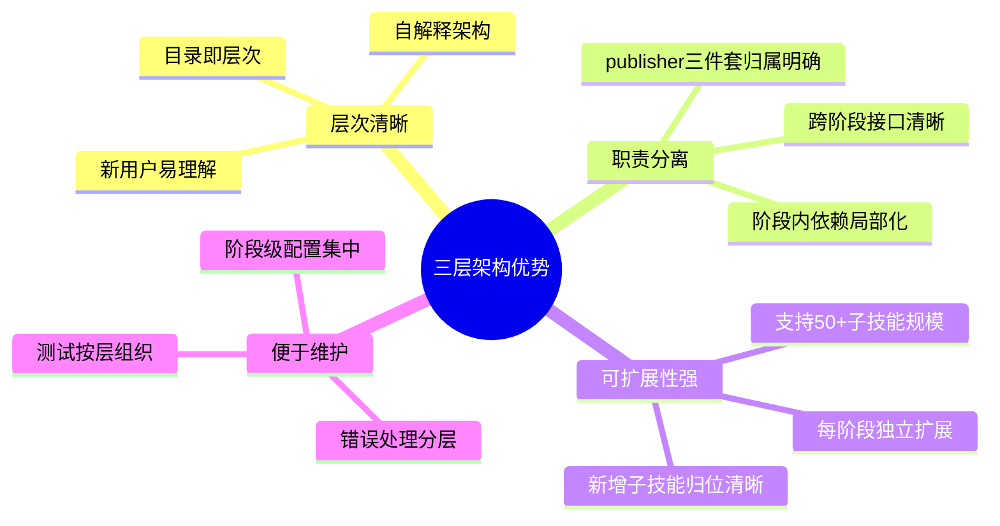
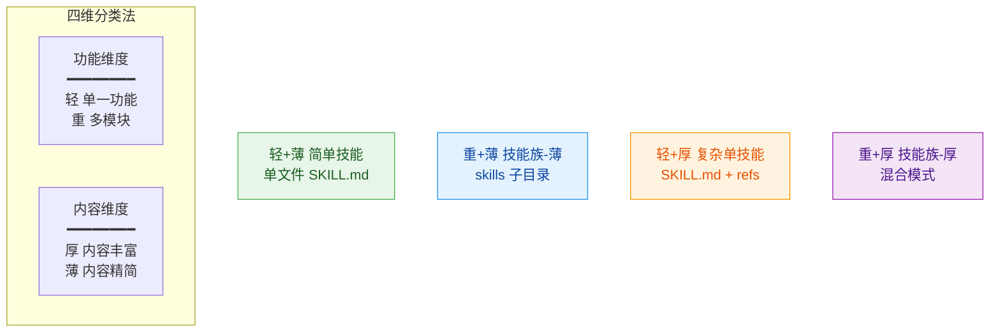
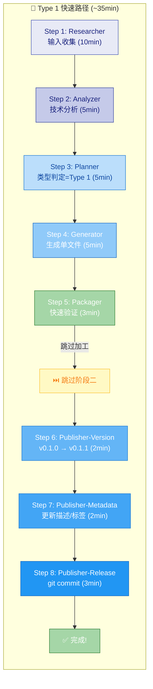
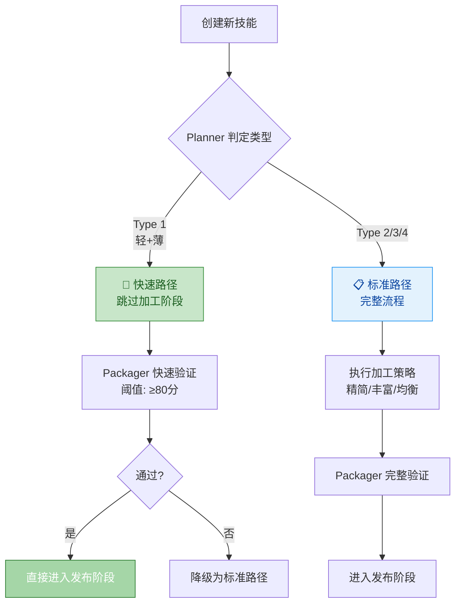

# 工厂架构详细说明

> **来源**: [../SKILL.md](../SKILL.md) → 工厂全景架构 / 四维分类 / 发布路径  
> **版本**: v0.3.0

---

## 三层架构优势与实践收益



> **💡 与"为什么是三层？"的关系**：[铁律说明](./three-layer-iron-rule.md) 阐述理论基础（认知科学+软件工程），本节聚焦**工程实践收益**。两者互补：理论指导设计，实践验证价值。

---

## 四阶段定位

| 阶段 | 类比现实工厂 | 输入 | 输出 | 核心问题 |
|------|------------|------|------|---------|
| **① 生产** | 原料→成品 | 文档/URL/需求 | SKILL.md 技能包 | 怎么造？ |
| **② 加工** | 成品→精加工 | 已有技能 | 升级后的技能 | 怎么改？ |
| **③ 发布** | 质检→出厂 | 加工后技能 | 版本发布记录 | 怎么发？ |
| **④ 销毁** | 退役→回收 | 过时技能 | deprecated 标记 | 怎么废？ |

---

## 四维分类体系详细



| 维度 | 定义 | 判断标准 | 输出结构 |
|------|------|---------|---------|
| **轻** | 功能单一 | 1 个核心能力 | 单个 SKILL.md |
| **重** | 功能复杂 | 多个模块，可独立使用 | `skills/{子}/SKILL.md` |
| **薄** | 内容精简 | <300 行能描述清楚 | 无需额外文件 |
| **厚** | 内容丰富 | 需要详细说明/示例/代码 | `references/` + 可选 `scripts/` |

---

## 发布路径选择详细

### 路径矩阵

| 技能类型 | 推荐路径 | 流程步骤 | 预计耗时 | 效率提升 |
|---------|---------|---------|---------|---------|
| **Type 1 (轻+薄)** | 🚀 **快速路径** | 生产→发布 | **30-40min** | **+85%** |
| Type 2 (重+薄) | 📋 标准路径 | 生产→选择性加工→发布 | 2h | - |
| Type 3 (轻+厚) | 📋 标准路径 | 生产→加工→发布 | 3h | - |
| Type 4 (重+厚) | 🔄 完整路径 | 生产→全量加工→发布+监控 | 5h+ | - |

---

### 快速路径详细流程 (Type 1 专用)



---

### 路径选择决策树



---

### Type 1 判定标准（快速路径准入）

```yaml
type_1_criteria:
  功能维度: "轻"  # 单一核心能力
  内容维度: "薄"  # <300行可描述清楚
  输出结构: "单个 SKILL.md 文件"
  复杂度评估:
    示例数量: "<= 3 个"
    决策分支: "<= 2 个"
    外部依赖: "无或极少"

fast_path_requirements:
  - ✅ 前言区完整（name/version/description/tags）
  - ✅ 单文件 SKILL.md（无 skills/ 或 references/）
  - ✅ 正文 < 300 行
  - ✅ Packager 快速验证 ≥ 80 分
  - ⏭️ 跳过 Enricher/Simplifier/Beautifier/Standardizer
```

---

## 物理目录结构

```
skills/
├── phase-production/     ← Layer 1 + Layer 2 (5 workers)
├── phase-processing/     ← Layer 1 + Layer 2 (4 workers)
├── phase-publishing/     ← Layer 1 + Layer 2 (3 workers)
└── phase-destruction/    ← Layer 1 + Layer 2 (1 worker)
```

---

## 相关链接

- [skill-factory 主文件](../SKILL.md)
- [三层架构铁律详情](./three-layer-iron-rule.md)
- [超三层处理 SOP](./over-three-layer-sop.md)
