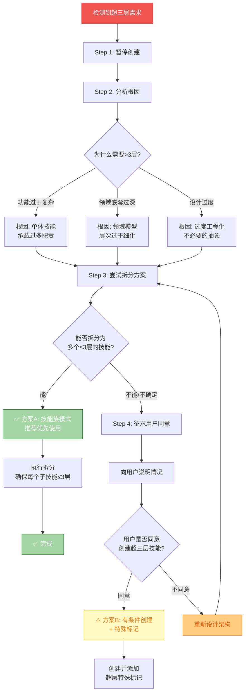
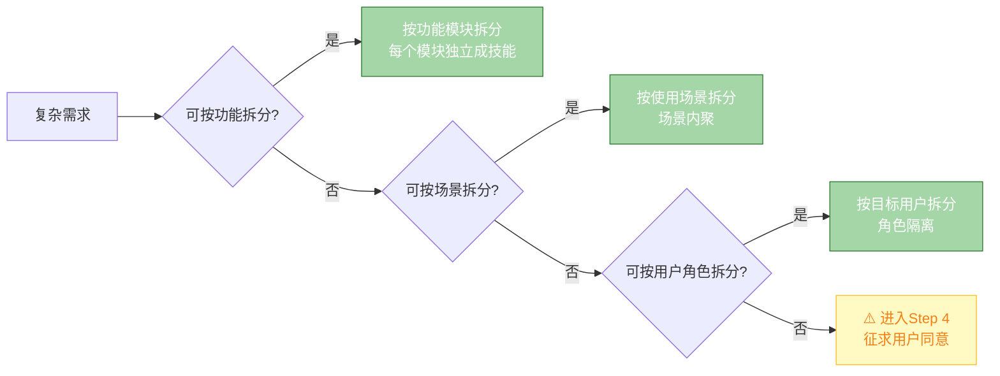

# 超三层处理流程 SOP（标准操作程序）

> **来源**: [../SKILL.md](../SKILL.md) → 超三层处理流程章节  
> **版本**: v0.3.0

---

## 触发条件

```yaml
触发场景:
  - planner 预检发现需求需要 ≥4层才能完整表达
  - generator 生成过程中发现输出结构会超过3层
  - packager 验证时检测到层级深度 > 3
  - 用户主动提出需要深层级结构的需求

自动检测机制:
  - 每个生产阶段节点内置层级计数器
  - 目录深度实时监控（从根 SKILL.md 开始）
  - references/ 和 scripts/ 排除在计数外
```

---

## 标准处理流程



---

## 详细步骤说明

### Step 1-2: 暂停与分析

| 步骤 | 操作 | 输出 |
|------|------|------|
| **暂停** | 立即停止当前创建流程，不生成任何文件 | 系统暂停状态 |
| **分析** | 识别导致超层的根本原因 | 根因报告（功能复杂/领域嵌套/过度设计） |

---

### Step 3: 拆分方案设计（首选）

**方案 A：技能族模式（推荐）**

```
❌ 超三层结构 (禁止):
skill-name/
└── skills/
    └── phase-1/
        └── worker/
            └── sub-worker/     ← 第4层！违规！
                └── SKILL.md

✅ 拆分为技能族 (推荐):
skill-name/                          ← Layer 0: 工厂根
├── SKILL.md
└── skills/
    ├── skill-a/                    ← Layer 2: 独立技能A (轻+薄)
    │   └── SKILL.md               ← 总共3层 ✓
    ├── skill-b/                    ← Layer 2: 独立技能B (轻+厚)
    │   ├── SKILL.md
    │   └── references/            ← 不算层级
    └── skill-c/                    ← Layer 2: 独立技能C (轻+薄)
        └── SKILL.md               ← 总共3层 ✓
```

---

### 拆分决策树



---

### Step 4: 用户确认流程（备选）

当且仅当**无法拆分**或**拆分成本过高**时，才进入此步骤：

#### 必须向用户说明的内容

```markdown
## ⚠️ 超三层架构申请

### 当前情况
- 计划层级深度：{N} 层
- 三层铁律限制：≤3 层
- 超出层数：{N-3} 层

### 尝试过的拆分方案
1. {方案1描述} → 结果：{为何不可行}
2. {方案2描述} → 结果：{为何不可行}

### 申请理由
{详细说明为什么必须使用超三层结构}

### 承诺与标记
- ✅ 同意在 SKILL.md 中添加 `depth: {N}` 标记
- ✅ 同意添加 `warning: 超三层架构` 警示
- ✅ 承担未来维护成本增加的风险

### 请求确认
请确认是否同意创建此超三层技能？[是/否]
```

---

### 如果用户同意

```yaml
# 必须在 SKILL.md 前言区添加的特殊标记
---
name: {skill-name}
version: v0.1.0
depth: 4  # ⚠️ 超出三层铁律限制
layer-warning: "本技能采用 {N} 层架构，已获得用户特别授权"
authorization:
  date: "{YYYY-MM-DD}"
  reason: "{授权原因}"
  user-confirmed: true
---
```

---

### 如果用户不同意

→ 返回 Step 3，重新设计更激进的拆分方案，或简化需求范围。

---

## 处理结果记录

无论最终采用哪种方案，都必须在技能的 metadata 中记录：

| 字段 | 说明 |
|------|------|
| `layer_check_date` | 层级检查日期 |
| `layer_depth` | 最终采用的层级数 |
| `layer_decision` | 决策结果（normal/split/authorized） |
| `layer_note` | 处理过程备注 |

---

## 相关链接

- [skill-factory 主文件](../SKILL.md)
- [三层架构铁律详情](./three-layer-iron-rule.md)
- [工厂架构详情](./factory-architecture.md)
