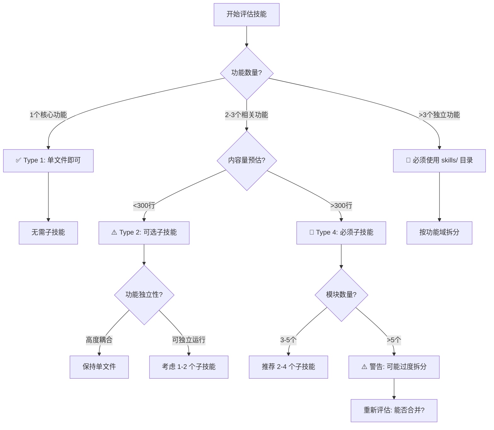

# 🎯 子技能设计决策矩阵

> **版本**: v1.0.0
> **来源**: skill-factory 优化项目
> **适用**: 需要设计复杂技能（Type 2/4）的架构师和开发者
> **更新日期**: 2026-05-27

---

## 📌 核心问题

**"我的技能什么时候需要子技能？该拆成几个？怎么组织？"**

本文档提供系统性的决策框架，帮助你：
- ✅ 判断是否需要子技能（以及为什么）
- ✅ 规划合理的子技能数量
- ✅ 设计清晰的层级结构
- ✅ 避免常见的子技能设计反模式

---

## 🧠 一、复杂度决策树

### 是否需要子技能？



### 快速判断清单

回答以下 **5 个问题**，如果 ≥3 个答案是 "Yes"，则需要子技能：

| # | 问题 | Yes 权重 | 说明 |
|---|------|---------|------|
| 1 | 技能有 **≥2 个独立的功能模块**？ | ⭐⭐⭐ | 每个模块可单独使用 |
| 2 | 预计内容会 **超过 300 行**？ | ⭐⭐⭐ | 单文件维护困难 |
| 3 | 不同用户可能 **只用到部分功能**？ | ⭐⭐ | 渐进式加载优势 |
| 4 | 功能间 **可以并行开发/测试**？ | ⭐⭐ | 独立性指标 |
| 5 | 未来可能 **扩展新功能模块**？ | ⭐ | 可扩展性需求 |

#### 判定结果

- **0-1 个 Yes** → **不需要子技能** (Type 1 或 Type 3)
- **2-3 个 Yes** → **建议使用子技能** (Type 2)
- **4-5 个 Yes** → **必须使用子技能** (Type 4)

---

## 🔢 二、子技能数量规划

### 黄金法则

```
理想数量: 2-4 个 Layer 1 子技能
上限:     ≤10 个（需要极强的管理能力）
下限:     ≥2 个（否则不如单文件）
```

### 数量决策矩阵

| 总功能数 | 推荐子技能数 | 结构示例 | 适用场景 |
|---------|-------------|---------|---------|
| **2-3 个** | **2-3 个** | 主技能 + 1-2个子技能 | 小型工具集 |
| **4-6 个** | **3-4 个** | 按阶段或领域分组 | 中型框架 |
| **7-10 个** | **4-6 个** | 多层级（Layer 1+Layer 2） | 大型平台 |
| **>10 个** | **⚠️ 考虑拆分为多个独立技能族** | - | 超大型系统 |

### 具体案例参考

#### 案例1: skill-factory（本项目）- 3个子技能 ✅

```
skill-factory/
├── SKILL.md                          # 入口 + 路由引擎
├── references/                       # 参考文档
└── skills/
    ├── skill-factory-creator/        # 创建+加工
    ├── skill-factory-publisher/      # 发布+退役
    └── skill-factory-assembler/      # 合并+拆分
    
理由:
✅ 3个明确的阶段（创建→发布→整合）
✅ 职责清晰，无重叠
✅ 可独立使用（如只用 creator）
✅ 符合 2-4 个的最佳实践
```

#### 案例2: 假设的 devops-toolkit - 4个子技能 ✅

```
devops-toolkit/
├── SKILL.md
├── skills/
    ├── devops-build/                # CI/CD 构建
    ├── devops-deploy/               # 部署流程
    ├── devops-monitor/              # 监控告警
    └── devops-rollback/             # 回滚操作
    
理由:
✅ 4个独立的运维场景
✅ 用户可能只用到其中1-2个
✅ 每个子技能 <300行
✅ 符合三层铁律（2层结构）
```

#### 案例3: ❌ 反例 - 过度拆分（8个子技能）

```
❌ bad-design/
├── SKILL.md
└── skills/
    ├── step1-init/
    ├── step2-validate/
    ├── step3-process/
    ├── step4-transform/
    ├── step5-output/
    ├── step6-notify/
    ├── step7-log/
    └── step8-cleanup/

问题:
❌ 太多细碎的子技能（8个！）
❌ 每个子技能太简单（<50行）
❌ 强依赖顺序（本质是流水线，不该拆）
❌ 用户无法理解整体流程

改进方案:
✅ 合并为 2-3 个阶段性子技能
   - setup/ (init+validate)
   - process/ (process+transform+output)
   - cleanup/ (notify+log+cleanup)
```

---

## 🏗️ 三、层级设计最佳实践

### 三层架构应用指南

#### Layer 0: 根入口（必需）

**职责**:
- 全局路由和分发
- 提供快速入门指南
- 定义元数据和版本
- 协调子技能协作

**内容要求**:
```yaml
# 必须包含:
- description (CSO优化, Use when...)
- 智能路由表（关键词→子技能映射）
- 复合场景编排规则
- 版本历史和变更记录

# 不应包含:
- 详细的实现步骤（交给子技能）
- 冗长的代码示例（放 references/）
- >500行的正文（精简或拆分）
```

#### Layer 1: 阶段指南（可选但推荐）

**职责**:
- 特定阶段的完整工作流
- 独立可调用的功能单元
- 明确的输入输出接口

**命名规范**:
```
{skill-name}-{phase-or-domain}

好的例子:
✅ skill-factory-creator     (阶段: creation)
✅ skill-factory-publisher   (阶段: publishing)  
✅ devops-deploy            (领域: deployment)

坏的例子:
❌ skill-factory-part1       (无意义编号)
❌ helper-functions          (太泛化)
❌ misc-stuff                (不明确)
```

**设计原则**:
1. **单一职责**: 每个子技能只做一件事
2. **独立可用**: 可以不依赖其他子技能单独使用
3. **明确接口**: 定义清晰的触发条件和输出格式
4. **规模适中**: 理想 100-400 行（不含引用）

#### Layer 2: 执行者（仅大项目需要）

**何时需要 Layer 2**:
- Layer 1 的某个子技能本身很复杂（>300行）
- 需要进一步细分专业领域
- 有明显的子流程可独立复用

**示例**:

```
testing-framework/           ← Layer 0
├── SKILL.md                 ← 入口
└── skills/
    ├── testing-unit/        ← Layer 1: 单元测试
    │   └── skills/
    │       ├── testing-jest/    ← Layer 2: Jest 专用
    │       └── testing-vitest/  ← Layer 2: Vitest 专用
    ├── testing-integration/  ← Layer 1: 集成测试
    └── testing-e2e/          ← Layer 1: 端到端测试

⚠️ 注意: 此结构已达 3 层极限！不能再深入。
```

**⚠️ Layer 2 使用警告**:
- 仅在确实需要时才使用（大多数项目不需要）
- 每个 Layer 2 子技能应该非常聚焦（<200行）
- 必须确保总深度 ≤3 层

---

## 🎯 四、子技能协作模式

### 模式1: 序列流水线（最常见）

适用场景：有固定顺序的多步骤流程。

```
用户请求 → Creator(创建) → Assembler[可选](拆分) → Publisher(发布)

特点:
✅ 简单清晰
✅ 易于理解和调试
✅ 大多数场景的首选

示例: "帮我创建并发布一个技能"
```

### 模式2: 条件分支

适用场景：根据条件选择不同路径。

```
用户请求 → 判断复杂度?
                ├─→ 简单(Type 1) → Creator(快速路径) → Publisher
                └─→ 复杂(Type 4) → Creator → Assembler(拆分) → Creator(验证) → Publisher

特点:
✅ 灵活适应不同场景
✅ 避免过度设计简单任务
⚠️ 需要清晰的判断条件
```

### 模式3: 并行执行

适用场景：多个独立任务可同时处理。

```
用户请求 → 并行启动:
                ├→ Assembler(拆分技能A)
                ├→ Assembler(拆分技能B)
                └→ Assembler(拆分技能C)
         → 汇总结果 → Publisher(批量发布)

特点:
✅ 效率高（适合大批量操作）
✅ 子任务互不干扰
⚠️ 需要协调机制（避免冲突）
```

### 模式4: 嵌套调用

适用场景：子技能内部需要调用另一个子技能的特定功能。

```
Creator(创建主技能)
    ↓
步骤3需要特殊处理
    ↓
嵌套调用 → Assembler(仅用其"合并"功能)
    ↓
返回 Creator 继续完成

特点:
✅ 复用已有能力
⚠️ 增加复杂度
💡 应该提供清晰的 API 文档说明如何嵌套调用
```

---

## ❌ 五、反模式案例库

### 反模式1: 虚原子技能（Padding）

**错误表现**:
```
my-skill/
├── SKILL.md (50行)
└── skills/
    └── my-skill-helper/ (30行, 只有一个辅助函数)
```

**问题**:
- ❌ 子技能太简单（<50行），不值得独立
- ❌ 增加了认知负担和维护成本
- ❌ 违反"最小惊讶原则"

**正确做法**:
```
my-skill/
├── SKILL.md (100行, 包含辅助函数)
└── references/
    └── helper-functions.md (详细参考)
```

---

### 反模式2: 循环依赖（Circular Dependency）

**错误表现**:
```
skill-A/SKILL.md: "遇到X情况时调用 skill-B"
skill-B/SKILL.md: "遇到Y情况时调用 skill-A"
```

**问题**:
- ❌ 形成死循环风险
- ❌ 无法确定执行顺序
- ❌ 测试和调试极其困难

**正确做法**:
```
方案1: 提取公共逻辑到第三个子技能 skill-common
方案2: 在根 SKILL.md 中协调，避免子技能互相调用
方案3: 重新设计职责边界，消除交叉需求
```

---

### 反模式3: 上帝技能（God Skill）

**错误表现**:
```
god-skill/
├── SKILL.md (800行, 包含一切)
└── skills/
    └── god-skill-everything/ (1000行, 更离谱)
```

**问题**:
- ❌ 违反单一职责原则
- ❌ 无法渐进式加载（全部塞进上下文）
- ❌ 维护噩梦（改一处崩全局）

**正确做法**:
```
# 按 Domain 拆分
domain-a/  ← 独立技能
domain-b/  ← 独立技能
domain-c/  ← 独立技能

# 如果必须有协调器
orchestrator/
├── SKILL.md (轻量级路由, <200行)
└── skills/
    ├── task-a/
    ├── task-b/
    └── task-c/
```

---

### 反模式4: 编号地狱（Number Hell）

**错误表现**:
```
skills/
├── part1-introduction/
├── part2-setup/
├── part3-execution/
├── part4-validation/
├── part5-cleanup/
└── part6-reporting/
```

**问题**:
- ❌ 编号暗示强顺序（但实际可能不需要）
- ❌ 新增功能需要重编号（破坏性变更）
- ❌ 名称无语义（不知道 part3 干嘛的）

**正确做法**:
```
skills/
├── setup/           ← 语义化命名
├── execution/
├── validation/
├── cleanup/
└── reporting/
```

---

### 反模式5: 孤岛技能（Island Skill）

**错误表现**:
```
orphan-skill/SKILL.md  # 没有 parent 声明
# 与主技能完全断开联系
# 用户根本不知道它的存在
```

**问题**:
- ❌ 发现率极低（Agent 和用户都找不到）
- ❌ 无法参与协作流程
- ❌ 版本管理混乱

**正确做法**:
```yaml
---
name: orphan-skill
dependency:
  parent: main-skill  # ✅ 声明父技能
  layer: 1
  phase: auxiliary
---
```

并在父技能的路由表中引用它。

---

## 📊 六、质量检查清单

### 设计阶段检查

在设计子技能结构时，逐项确认：

| # | 检查项 | 通过标准 | 你的答案 |
|---|--------|---------|---------|
| 1 | **必要性** | 有充分理由使用子技能（不是为拆而拆） | □ Yes / □ No |
| 2 | **数量合理** | 2-4 个 Layer 1 子技能（≤10 个上限） | □ Yes / □ No |
| 3 | **职责清晰** | 每个子技能有单一、明确的职责 | □ Yes / □ No |
| 4 | **独立可用** | 每个子技能可单独使用（不强依赖其他） | □ Yes / □ No |
| 5 | **层级合规** | 最大深度 ≤3 层 | □ Yes / □ No |
| 6 | **命名规范** | kebab-case + 语义化（不用编号） | □ Yes / □ No |
| 7 | **接口明确** | 触发条件、输入输出都有定义 | □ Yes / □ No |
| 8 | **规模适中** | 每个子技能 100-400 行（理想值） | □ Yes / □ No |
| 9 | **无循环依赖** | 子技能之间没有相互调用 | □ Yes / □ No |
| 10 | **可发现** | 父技能的路由表能找到所有子技能 | □ Yes / □ No |

### 评分标准

- **9-10 个 Yes** → ✅ **优秀设计**，可以直接实施
- **7-8 个 Yes** → ⚠️ **良好**，有小问题需调整
- **5-6 个 Yes** → ❌ **需重构**，存在明显设计缺陷
- **<5 个 Yes** → 🚨 **禁止实施**，重新设计整个架构

---

## 🎓 七、学习路径

### 初学者（第一次设计子技能）

```
1. 阅读"复杂度决策树" → 判断是否真的需要
2. 参考"案例1: skill-factory" → 模仿 3 子技能结构
3. 使用"质量检查清单" → 自检设计
预计耗时: 2-3小时
```

### 进阶者（设计中型技能体系）

```
1.深入研究"协作模式" → 选择合适的模式
2. 学习"层级设计最佳实践" → 规划 Layer 1/2
3. 阅读"反模式案例库" → 避免常见陷阱
4. 实际设计一个 Type 4 技能 → 动手实践
预计耗时: 1-2天
```

### 专家（设计大型平台级技能）

```
1. 研究"数量规划" → 处理 5+ 子技能的场景
2. 设计自定义路由引擎 → 优化智能分发
3. 建立团队规范 → 统一子技能设计标准
4. 贡献反模式案例 → 持续完善知识库
预计耗时: 持续迭代
```

---

## 💡 八、实战技巧

### Tip 1: 从简到繁（Incremental Design）

```
❌ 错误: 一开始就设计完美的 5 层结构
✅ 正确: 先做 Type 1，需要时再拆分为 Type 2/4

好处:
- 避免过度设计（YAGNI 原则）
- 基于真实需求演化（不是猜测）
- 降低前期投入成本
```

### Tip 2: 优先组合而非继承

```
❌ 错误: base-skill → child-skill-a, child-skill-b (继承)
✅ 正确: skill-a + skill-b + orchestrator (组合)

原因:
- 组合更灵活（可动态选择）
- 降低耦合度（修改不影响其他）
- 更符合 Unix 哲学（做好一件事）
```

### Tip 3: 保持向后兼容

```
当重构子技能时:
1. 保留旧路径 30 天（deprecation period）
2. 在旧位置添加迁移指引
3. 更新版本号为 major（breaking change）
4. 同步更新所有文档和示例
```

### Tip 4: 文档化决策理由

```
在每个子技能的 SKILL.md 中添加:

## 设计决策

**为什么独立为子技能?**
- 原因1: ...
- 原因2: ...

**为什么不与 XXX 合并?**
- 理由: ...

**未来可能的演化方向:**
- 方向1: ...
- 方向2: ...

价值:
✅ 帮助后续维护者理解设计意图
✅ 避免重复讨论相同的问题
✅ 为重构提供依据
```

---

## 📚 九、参考资料

### 内部文档

| 文档 | 内容 |
|------|------|
| [SKILL.md](../SKILL.md) | 工坊主入口（含智能路由引擎） |
| [design-principles.md](./design-principles.md) | 三层架构铁律 + 四维分类法 |
| [skill-standards.md](./skill-standards.md) | 规范检查清单（100分评分） |
| [writing-rules.md](./writing-rules.md) | 写作高级规则（R1-R10） |

### 外部资源

| 来源 | 主题 | 链接 |
|------|------|------|
| Unix 哲学 | KISS / Do One Thing Well | Wikipedia |
| SOLID 原则 | 单一职责原则 | Clean Code (Robert C. Martin) |
| Domain-Driven Design | Bounded Context | Eric Evans |
| 微服务架构 | 服务拆分模式 | Martin Fowler |

---

## 📝 版本历史

| 版本 | 日期 | 主要变更 |
|------|------|---------|
| **v1.0.0** | 2026-05-27 | 🎉 初始版本：基于 skill-factory v0.6.0 子技能优化项目的经验总结 |

---

> 💡 **反馈与贡献**: 如果你遇到了新的反模式或有更好的设计实践，欢迎补充到本文档中！
>
> 🎯 **核心理念**: 好的子技能设计 = 清晰的职责边界 + 高内聚低耦合 + 渐进式演化能力
