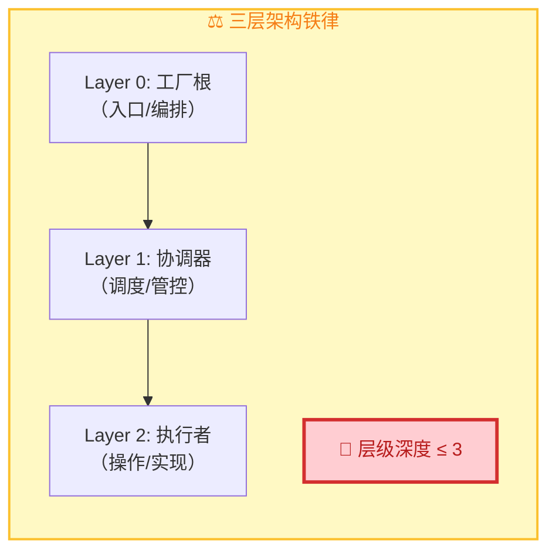
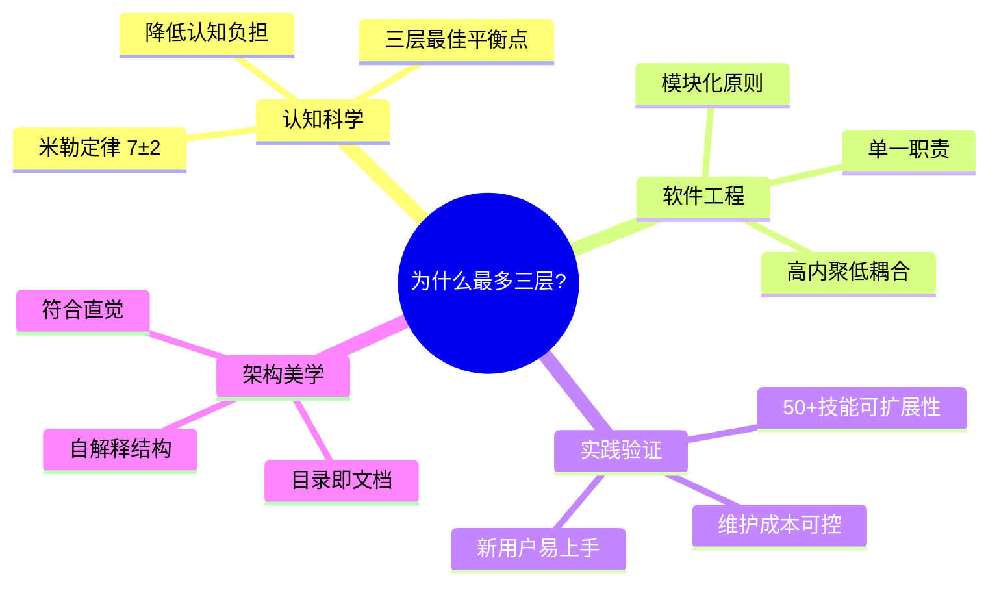
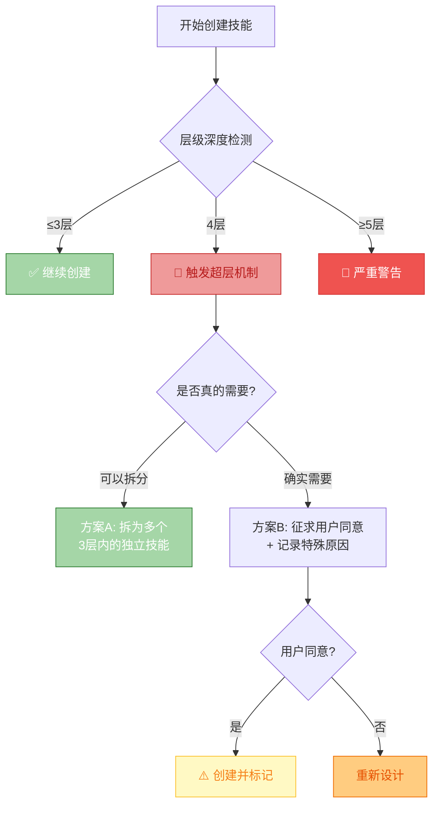

# 三层架构铁律详细说明

> **来源**: [../SKILL.md](../SKILL.md) → 三层架构铁律章节  
> **版本**: v0.3.0

---

## 铁律定义



---

## 三层结构标准模板

| 层级 | 命名规范 | 职责特征 | 典型数量 |
|------|---------|---------|---------|
| **Layer 0** | `{skill-name}` | 全局入口、跨层编排 | 1 个 |
| **Layer 1** | `phase-{name}` 或 `{domain}-coordinator` | 阶段调度、质量门禁 | 2-6 个 |
| **Layer 2** | `{specific-worker}` | 单一职责操作 | 5-20+ 个 |

---

## 为什么是三层？



---

## 层级深度计算方法

```
计算规则：
- 从技能根目录（SKILL.md）开始计数
- 每深入一级子目录 +1
- references/ 和 scripts/ 不算层级（辅助资源）

示例：
✅ skill-factory/SKILL.md                              = Layer 0 (1层)
✅ skills/phase-production/SKILL.md                     = Layer 1 (2层)
✅ skills/phase-production/researcher/SKILL.md          = Layer 2 (3层) ✓
❌ skills/phase-production/researcher/sub-worker/SKILL.md = Layer 3 (4层) ✗ 违规！
```

---

## 强制执行机制



---

## 违规处理策略

| 层级深度 | 处置方式 | 是否需要确认 |
|---------|---------|------------|
| **1-3层** | ✅ 正常流程 | 否 |
| **4层** | ⚠️ 先尝试拆分，若无法拆分则征求用户同意 | **是** |
| **≥5层** | 🚨 必须重新设计，强制拆分为多个技能 | **必须** |

---

## 常见的"假性超三层"场景

| 场景 | 实际情况 | 正确做法 |
|------|---------|---------|
| 技能有多个子功能 | 功能复杂但可拆分 | 使用 **重+薄** 技能族模式（仍在3层内） |
| 需要引用外部文档 | 内容丰富 | 放入 `references/` （**不算层级**） |
| 有配置文件/脚本 | 辅助资源 | 同级目录存放（**不算层级**） |
| 动态加载模块 | 运行时行为 | 在 SKILL.md 内描述逻辑（不增加物理层级） |

---

## 相关链接

- [skill-factory 主文件](../SKILL.md)
- [超三层处理 SOP](./over-three-layer-sop.md)
- [工厂架构详情](./factory-architecture.md)
