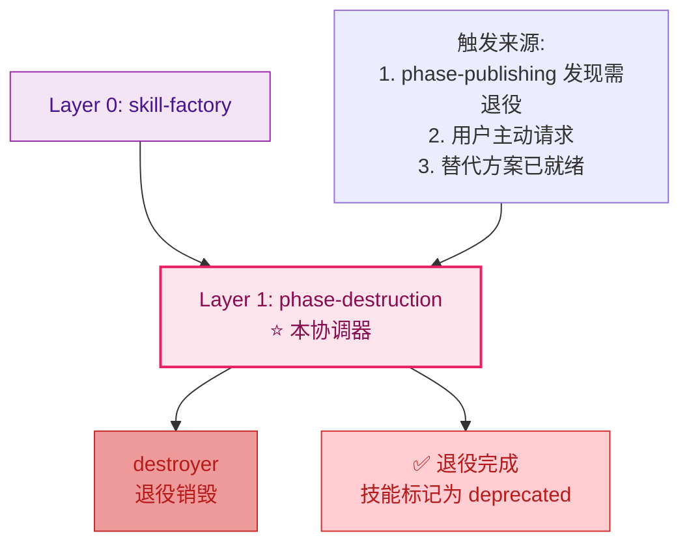
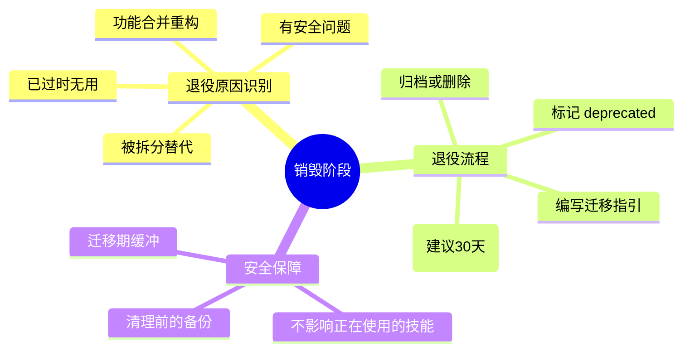
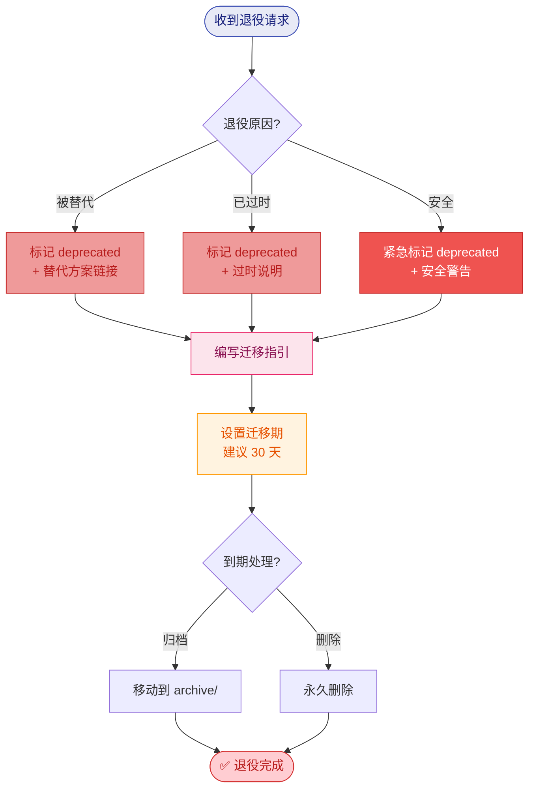
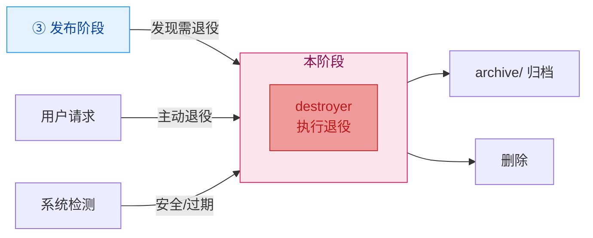

# Phase Destruction - 销毁阶段协调器

## 职责边界

**负责**: 协调销毁阶段的退役流程
**不负责**: 生产、加工、发布阶段

---

## 在三层架构中的位置



---

## 核心职责



---

## 销毁流程编排



---

## Deprecated 模板

```yaml
---
name: <原技能名>
version: v0.1.0
description: "[已废弃] 请使用以下替代技能:"
tags: [deprecated]
---

## 退役通知

本技能已于 {日期} 标记为废弃。

### 替代方案
- [<新技能A>](../<new-skill-a>/SKILL.md): <用途>
- [<新技能B>](../<new-skill-b>/SKILL.md): <用途>

### 迁移指南
<简要说明如何从旧技能迁移到新技能>
```

---

## 与其他阶段的关系

销毁阶段通常由以下情况触发：



---

## 配置参数

```yaml
phase_config:
  name: destruction
  layer: 1
  coordinator_type: single_task  # 单任务协调器
  
  steps:
    - id: 1
      skill: destroyer
      required: true
      estimated_time: "15-30min"
  
  safety_settings:
    migration_period_days: 30       # 默认迁移期
    backup_before_delete: true       # 删除前必须备份
    confirm_before_action: true      # 重要操作需确认
    
  triggers:
    - from_phase: publishing
      condition: "技能被替代或不再维护"
    - manual: true
      condition: "用户主动请求"
```

---

## 参考

- [skill-factory](../SKILL.md) - 工厂根 (Layer 0)
- [skill-factory-phase-publishing](../skill-factory-phase-publishing/SKILL.md) - 可能的上游触发者 (Layer 1)
- [destroyer](../skill-factory-destroyer/SKILL.md) - 唯一子技能 (Layer 2)
