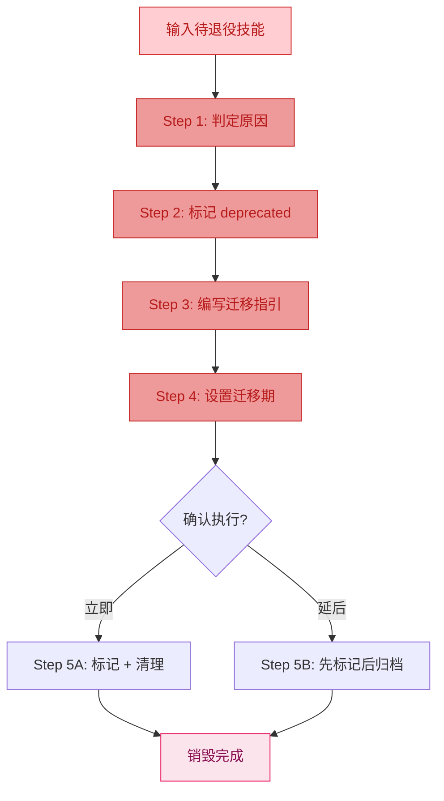
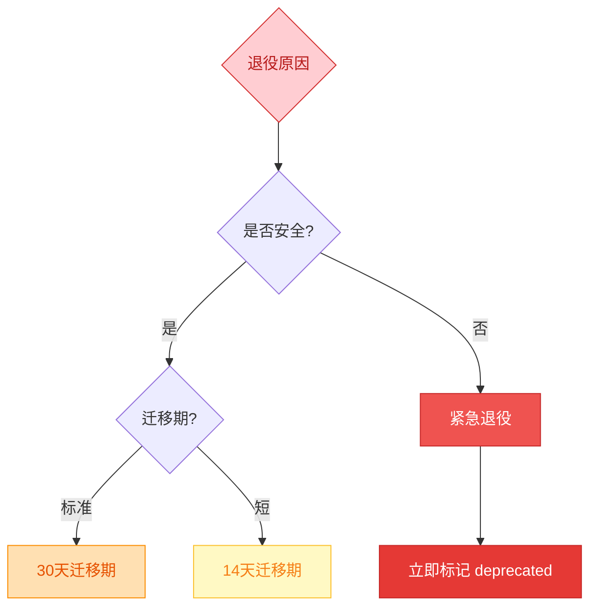

# Skill Factory Destroyer - 技能销毁器

## 职责边界

**负责**: 技能的退役、标记 deprecated、迁移指引、归档清理
**不负责**: 内容修改（processing）、物理删除（需用户确认）

---

## 销毁流程



---

## Step 1：判定退役原因

### 原因分类

| 原因 | 说明 | 紧急程度 | 迁移期 |
|------|------|---------|--------|
| **被替代** | 已拆分为多个新技能 | 低 | 30 天 |
| **过时废弃** | 技术/需求已过时 | 低 | 30 天 |
| **安全风险** | 存在安全问题 | 高 | 0 天（立即） |
| **重复冗余** | 与其他技能功能重叠 | 低 | 14 天 |

### 决策矩阵



---

## Step 2：标记 Deprecated

### 修改前言区

```yaml
---
name: <原技能名>
version: v0.1.0              # 递增版本
author: <原作者>
description: "[已废弃] 请使用以下替代技能:"
tags: [deprecated]           # 添加 deprecated 标签
deprecated:
  date: <YYYY-MM-DD>
  reason: <被替代/过时/安全/冗余>
  replacement:
    - skill: <新技能A>
      path: ../<new-a>/SKILL.md
    - skill: <新技能B>
      path: ../<new-b>/SKILL.md
---
```

### 修改正文

在正文顶部添加醒目的退役通知：

```markdown
# ⚠️ 本技能已废弃

> **废弃日期**: YYYY-MM-DD
> **原因**: <原因说明>
> **替代方案**: 见下方迁移指引

---

# <原标题>

<保留原有内容供参考>
```

---

## Step 3：编写迁移指引

### 必须包含的信息

| 信息项 | 说明 |
|--------|------|
| 废弃原因 | 为什么退役 |
| 替代方案 | 用什么代替 |
| 映射关系 | 旧功能 → 新技能的对应关系 |
| 迁移步骤 | 用户如何切换 |
| 兼容性说明 | 旧版是否仍可用 |

### 迁移指引模板

```markdown
## 迁移指引

### 废弃原因
<简短说明为什么退役>

### 替代方案

| 原功能 | 替代技能 | 位置 |
|--------|---------|------|
| <功能A> | <新技能名> | [SKILL.md](path) |
| <功能B> | <新技能名> | [SKILL.md](path) |

### 迁移步骤

1. 了解替代技能的功能
2. 调整调用方式（如有接口变化）
3. 更新依赖配置
4. 测试验证

### 时间线

- YYYY-MM-DD: 标记为 deprecated
- YYYY-MM-DD+(N): 正式移除或归档
```

---

## Step 4：设置迁移期

### 迁移期长度

| 场景 | 建议时长 | 说明 |
|------|---------|------|
| 被拆分替代 | 30 天 | 给用户充足时间了解新技能 |
| 过时废弃 | 30 天 | 通知用户停止使用 |
| 安全风险 | 0 天 | 立即标记，尽快移除 |
| 重复冗余 | 14 天 | 短期过渡即可 |

### 迁移期内的状态

- ✅ 技能文件保留在原位置
- ✅ 内容可被读取和引用
- ⚠️ 新项目不应使用
- ⚠️ 顶部显示废弃警告
- ❌ 不应再进行功能扩展

---

## Step 5：执行销毁

### 方案 A：仅标记（推荐默认）

- 修改 SKILL.md 添加 deprecated 标记
- 保留文件在原位置
- 用户仍可查看历史内容
- 适用于大多数场景

### 方案 B：标记 + 归档

1. 标记 deprecated
2. 将目录移动到 `_archive/` 下：
   ```
   _archive/
   └── <原技能名>/
       ├── SKILL.md
       └── ...
   ```
3. 更新所有内部链接

### 方案 C：完全删除（谨慎）

⚠️ **仅在以下情况使用**：
- 确认无任何引用
- 确认无用户在使用
- 有完整的 Git 历史可恢复

```bash
# 删除前确认
git rm -r <skill-directory>
git commit -m "chore(<skill>): 移除已废弃技能"
```

---

## 特殊场景：拆分后的退役

当一个大技能被拆分为多个小技能时：


**关键点**: 并行维护期间新旧共存，给用户缓冲时间。

---

## 输出报告

```markdown
## 技能退役报告

### 基本信息
- 技能名称: <name>
- 退役日期: <date>
- 退役原因: <原因>

### 执行操作
- [x] 判定退役原因
- [x] 标记 deprecated
- [x] 编写迁移指引
- [x] 设置迁移期: <N> 天
- [x] 选择方案: <A/B/C>

### 替代方案
| 原技能 | 替代者 |
|--------|--------|
| <this> | <replacement> |

### 后续计划
- <日期>: 迁移期结束
- <动作>: 归档/删除
```

---

## 参考

- [skill-factory](../../SKILL.md) - 工厂主文件
- [skill-factory-publisher-version](../skills/skill-factory-publisher-version/SKILL.md) - 版本管理（退役也是版本变更）
