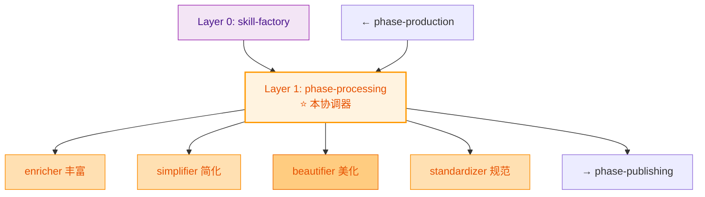
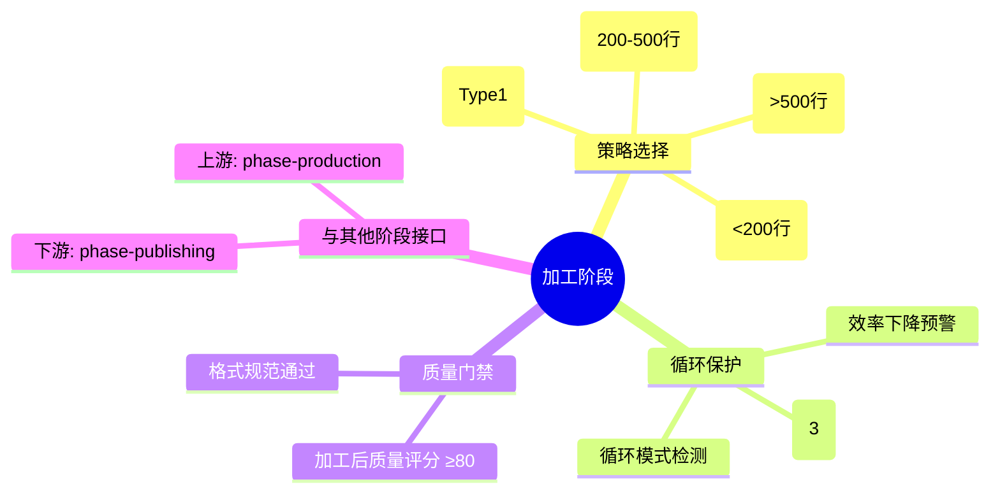
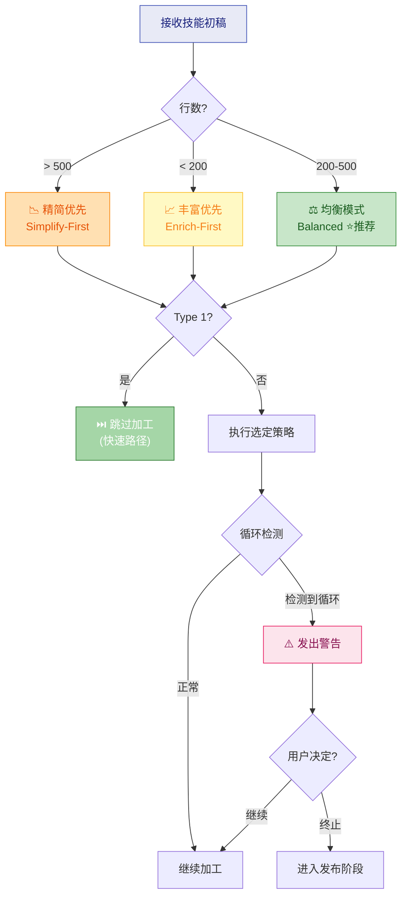
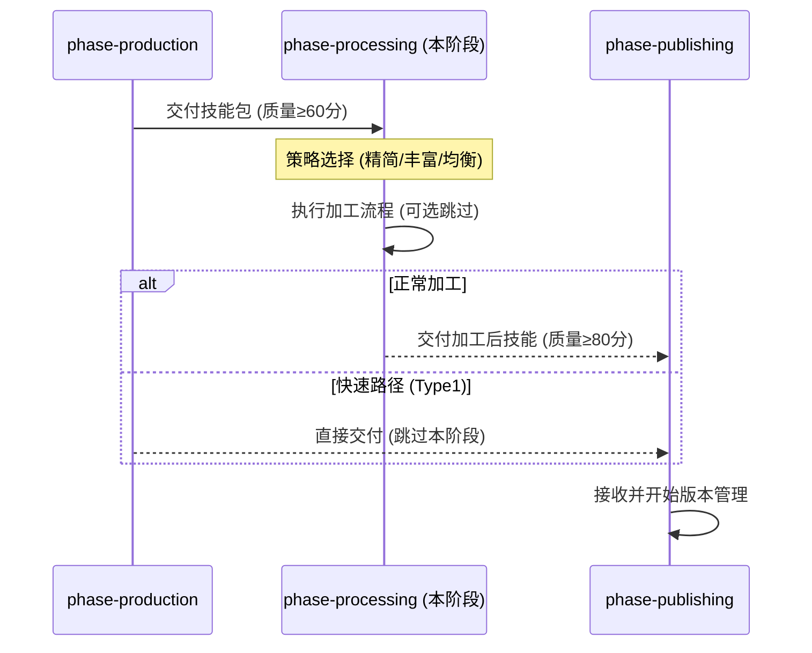

# Phase Processing - 加工阶段协调器

## 职责边界

**负责**: 协调加工阶段的 4 个子技能，根据策略模式选择执行顺序
**不负责**: 生产阶段（production）、发布阶段（publishing）

---

## 在三层架构中的位置



---

## 核心职责



---

## 三种策略模式编排

### 策略一：精简优先 (Simplify-First)

**触发条件**: 初稿 >500 行


### 策略二：丰富优先 (Enrich-First)

**触发条件**: 初稿 <200 行


### 策略三：均衡模式 (Balanced) ⭐ 推荐

**触发条件**: 200-500 行（默认）


---

## 策略选择决策树



---

## 循环保护机制

### 配置

```yaml
processing_protection:
  max_rounds: 3                    # 最大加工轮次
  circular_detection: true         # 启用循环检测
  efficiency_threshold: 0.05       # 行数变化 <5% 认为无实质改进
  
  circular_patterns:
    - pattern: "enrich→simplify"
      max_consecutive: 2           # 连续2次触发警告
    - pattern: "net_change < 5%"
      trigger: always              # 总是检测
```

### 保护流程

当检测到循环时：
1. ✅ 记录历史（每轮操作和净变化）
2. ⚠️ 发出警告（含效率分析）
3. ❓ 询问用户：终止 or 继续最后一轮？
4. 终止 → 直接进入发布阶段
5. 继续 → 最多再执行 1 轮

---

## 与上下游的关系



---

## 配置参数

```yaml
phase_config:
  name: processing
  layer: 1
  coordinator_type: strategy_selector
  
  strategies:
    simplify_first:
      trigger: "line_count > 500"
      order: [simplifier, enricher, standardizer]
      estimated_time: "2-3h"
      
    enrich_first:
      trigger: "line_count < 200"
      order: [enricher, beautifier, standardizer]
      estimated_time: "3-4h"
      
    balanced:
      trigger: "default"
      order: [simplifier, enricher, beautifier, standardizer]
      estimated_time: "2.5-3.5h"
  
  fast_path:
    enabled: true
    trigger: "type == Type1 (light-thin)"
    action: "完全跳过本阶段"
  
  protection:
    max_rounds: 3
    cooldown_between_rounds: 0
    auto_warn_on_circular: true
```

---

## 参考

- [skill-factory](../SKILL.md) - 工厂根 (Layer 0)
- [skill-factory-phase-production](../skill-factory-phase-production/SKILL.md) - 上游阶段 (Layer 1)
- [skill-factory-phase-publishing](../skill-factory-phase-publishing/SKILL.md) - 下游阶段 (Layer 1)
- [docs/processing-strategies.md](../../docs/processing-strategies.md) - 详细策略定义
- [enricher](../skill-factory-enricher/SKILL.md) - 子技能 (Layer 2)
- [simplifier](../skill-factory-simplifier/SKILL.md) - 子技能 (Layer 2)
- [beautifier](../skill-factory-beautifier/SKILL.md) - 子技能 (Layer 2)
- [standardizer](../skill-factory-standardizer/SKILL.md) - 子技能 (Layer 2)
