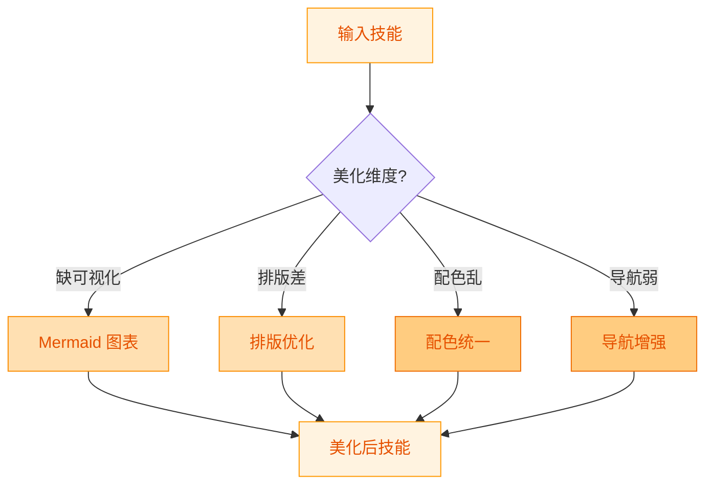
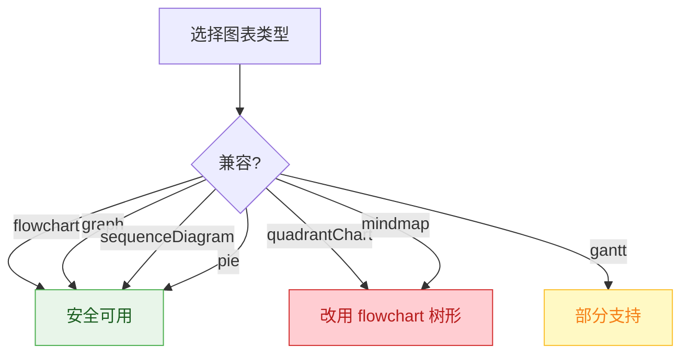
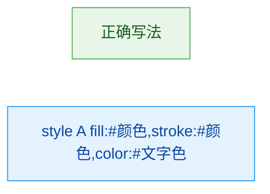
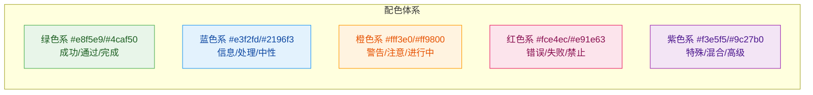

# Skill Factory Beautifier - 技能美化器

## 职责边界

**负责**: 提升技能的可读性和视觉表现
**不负责**: 内容增删（enricher/simplifier）、规范校验（standardizer）

---

## 美化维度



---

## 维度一：Mermaid 图表

### 何时添加图表

| 内容特征 | 推荐图表 | 说明 |
|---------|---------|------|
| 有顺序步骤 | flowchart TD/LR | 流程图 |
| 有条件分支 | flowchart TD | 决策树 |
| 多对象交互 | sequenceDiagram | 时序图 |
| 数据占比 | pie chart | 饼图 |
| 层次结构 | flowchart TB + subgraph | 架构图 |

### 兼容性规则



### 节点文本规范

| 规则 | 正确 | 错误 |
|------|------|------|
| 无特殊字符 | `节点名称` | `<节点>` / `{节点}` |
| 无内部 emoji | `成功状态` | `✅ 成功` |
| 长度适中 | < 20 字符 | 过长换行 |
| 使用引号 | `"带空格的文本"` | 不加引号 |

### Style 必需属性

每个 style 定义必须包含:



**必需三要素**: `fill`(背景) + `stroke`(边框) + `color**(文字)**

---

## 维度二：排版优化

### 标题层级

```
# 一级标题 (仅一个，技能名称)
## 二级标题 (主要章节)
### 三级标题 (章节内的分类)
#### 四级标题 (具体项目)
```

### 表格规范

| 规则 | 说明 |
|------|------|
| 表头对齐 | 左对齐为主 |
| 单元格内容 | 避免过长，超长时换行 |
| 空单元格 | 用 `-` 或 `无` 表示 |
| 对比表格 | 保持列数一致 |

### 代码块

````markdown
`inline code` 用于行内术语

```language
code block 用于完整示例
```
````

### 列表规范

- 有序列表用于有顺序的操作步骤
- 无序列表用于并列项、特征列表
- 嵌套层级不超过 3 层
- 列表项保持长度一致

---

## 维度三：配色统一

### 语义配色方案



| 场景 | 背景色 | 边框色 | 文字色 |
|------|--------|--------|--------|
| 成功/通过 | #e8f5e9 | #4caf50 | #1b5e20 |
| 信息/默认 | #e3f2fd | #2196f3 | #0d47a1 |
| 警告/注意 | #fff3e0 | #ff9800 | #e65100 |
| 错误/失败 | #fce4ec | #e91e63 | #880e4f |
| 特殊/混合 | #f3e5f5 | #9c27b0 | #4a148c |

### 渐变色（同阶段深浅）


---

## 维度四：导航增强

### 目录锚点

对于长文档（>200行），在顶部添加内容索引：

```markdown
## 目录

- [任务目标](#任务目标)
- [操作步骤](#操作步骤)
- [使用示例](#使用示例)
- [注意事项](#注意事项)
```

### 快速跳转

在关键位置添加返回顶部的链接：

```markdown
[↑ 返回目录](#目录)
```

### 子技能导航（重类型）

```markdown
## 子技能索引
- [子技能A](skills/sub-a/SKILL.md): 一句话说明
- [子技能B](skills/sub-b/SKILL.md): 一句话说明
```

---

## 美化检查清单

- [ ] 至少 1 处使用 Mermaid 图表（如有流程/架构/决策）
- [ ] 所有 Mermaid 节点文本符合规范
- [ ] 所有 style 包含 color 属性
- [ ] 标题层级不超过 4 级
- [ ] 表格对齐整齐
- [ ] 配色符合语义方案
- [ ] 长文档有目录索引
- [ ] 子技能有导航链接

---

## 输出报告

```markdown
## 美化操作报告

### 美化维度
- Mermaid 图表: 新增 X 个
- 排版优化: X 处
- 配色修正: X 处
- 导航增强: 是/否

### 兼容性检查
- 所有可能不兼容的图表: 已替换
- 节点文本规范: 全部通过
- Style 完整性: 全部通过
```

---

## 推荐使用策略 (v0.2.0 新增)

本加工器在以下策略中使用：
- ✅ **精简优先 (Simplify-First)**: 不使用
- ✅ **丰富优先 (Enrich-First)**: 第2步（可视化增强）
- ✅ **均衡模式 (Balanced)**: 第3步（关键图表）
- ❌ **快速路径**: 不使用（跳过加工）

**与其他加工器的协作关系**:
| 关系 | 加工器 | 说明 |
|------|--------|------|
| 前置依赖 | Enricher | 通常在内容丰富后执行 |
| 后续触发 | Standardizer | 美化后最终校验 |
| 可选配合 | Simplifier | 视情况决定是否需要 |

**详细策略定义**: [docs/processing-strategies.md](../../docs/processing-strategies.md)

---

## 参考

- [skill-factory](../../SKILL.md) - 工厂主文件
- [skill-factory-enricher](../skills/skill-factory-enricher/SKILL.md) - 丰富器（可能先执行）
- [skill-factory-standardizer](../skills/skill-factory-standardizer/SKILL.md) - 规范化（最后执行）
