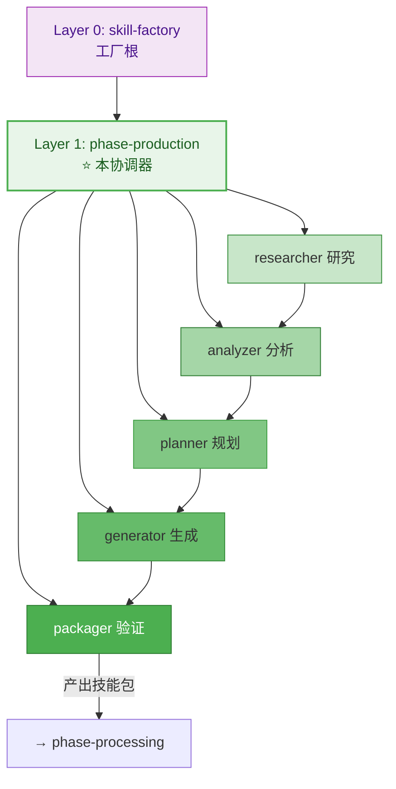
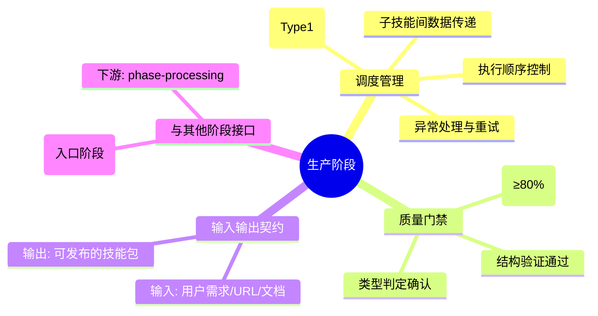
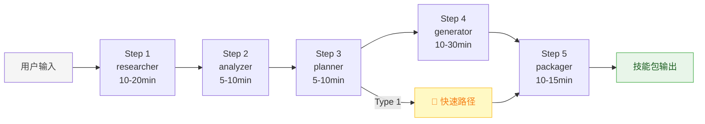

# Phase Production - 生产阶段协调器

## 职责边界

**负责**: 协调生产阶段的 5 个子技能，确保流水线顺畅执行
**不负责**: 加工阶段（processing）、发布阶段（publishing）、销毁阶段（destruction）

---

## 在三层架构中的位置



---

## 核心职责



---

## 流水线编排

### 标准路径（Type 2/3/4）



### 路径选择逻辑

| 条件 | 选择路径 | 说明 |
|------|---------|------|
| Planner 判定 Type 1 | 🚀 **快速路径** | 跳过加工阶段直接发布 |
| Planner 判定 Type 2/3/4 | 📋 **标准路径** | 进入后续加工阶段 |

### 各步骤职责概览

| 步骤 | 子技能 | 核心输出 | 耗时 |
|------|--------|---------|------|
| 1 | researcher | 完整需求文档 | 10-20min |
| 2 | analyzer | 技术分析报告 | 5-10min |
| 3 | planner | 四维类型判定 | 5-10min |
| 4 | generator | SKILL.md 文件(s) | 10-30min |
| 5 | packager | 验证报告 + 质量评分 | 10-15min |

---

## 数据流协议

### 步骤间传递的数据结构

```yaml
step_1_researcher_output:
  基本信息:
    technology_name: string
    version: string
    type: framework/library/tool
  用户需求:
    purpose: learn/develop/teach
    target_user: beginner/experienced/team
  内容资源:
    main_doc: URL/path
    api_doc: URL/path
    examples: list
  研究结论:
    complexity: simple/medium/complex
    suggested_type: light-thin/heavy-thin/light-thick/heavy-thick

step_2_analyzer_output:
  技术特征:
    capabilities_count: int
    estimated_lines: int
    has_external_deps: bool
  完整度评分: 0-100
  建议:
    recommended_type: same as above
  
step_3_planner_output:
  最终判定:
    type: Type1/2/3/4
    type_code: light-thin etc.
    confidence: high/medium/low
  路径选择:
    selected_path: fast/standard/full
    reason: string

step_4_generator_output:
  生成的文件:
    - path: string
      type: SKILL.md/references/scripts
      line_count: int
  类型符合: bool

step_5_packager_output:
  验证结果:
    passed: bool
    quality_score: 0-100
    grade: excellent/good/acceptable/fail
  问题列表: []
```

---

## 错误处理策略

| 失败场景 | 处理方式 | 重试策略 |
|---------|---------|---------|
| researcher 信息不足 | 回调补充（≤3次） | 自动重试 |
| analyzer 完整度 <80% | 返回 researcher 补充 | 允许 1 次回调 |
| planner 无法判定 | 询问用户期望 | 交互式解决 |
| generator 模板错误 | 返回 planner 重新设计 | 自动重试 |
| packager 验证 <60分 | 返回 generator 修复 | 最多 2 轮 |
| packager 类型判定错误 | 返回 planner 重新判定 | 最多 1 次 |

---

## 与其他阶段的关系

```mermaid
flowchart LR
    subgraph Production["① 生产 (本阶段)"]
        direction TB
        R[researcher] --> A[analyzer] --> PL[planner] --> G[generator] --> PA[packager]
    end
    
    subgraph Processing["② 加工 (下游)"]
        E[enricher] SI[simplifier] B[beautifier] ST[standardizer]
    end
    
    subgraph Publishing["③ 发布 (最终)"]
        V[version] M[metadata] RE[release]
    end
    
    Production -->|技能包| Processing
    Processing -->|加工完成| Publishing
    
    style Production fill:#e8f5e9,stroke:#4caf50,color:#1b5e20
    style Processing fill:#fff3e0,stroke:#ff9800,color:#e65100
    style Publishing fill:#e3f2fd,stroke:#2196f3,color:#0d47a1
```

---

## 配置参数

```yaml
phase_config:
  name: production
  layer: 1
  coordinator_type: pipeline
  
  steps:
    - id: 1
      skill: researcher
      required: true
      timeout: 30min
      
    - id: 2
      skill: analyzer
      required: true
      depends_on: [1]
      timeout: 15min
      
    - id: 3
      skill: planner
      required: true
      depends_on: [2]
      timeout: 15min
      
    - id: 4
      skill: generator
      required: true
      depends_on: [3]
      timeout: 45min
      
    - id: 5
      skill: packager
      required: true
      depends_on: [4]
      timeout: 20min

  fast_path:
    enabled: true
    trigger_condition: "type == Type1"
    skipped_steps: []  # 生产阶段不跳过任何步骤
    time_savings: "仅 researcher 使用快速模式(-50%)"
  
  quality_gates:
    analyzer_completeness_min: 80
    packager_score_min: 60
```

---

## 参考

- [skill-factory](../SKILL.md) - 工厂根 (Layer 0)
- [skill-factory-phase-processing](../skill-factory-phase-processing/SKILL.md) - 下游阶段 (Layer 1)
- [researcher](../skill-factory-researcher/SKILL.md) - 子技能 (Layer 2)
- [analyzer](../skill-factory-analyzer/SKILL.md) - 子技能 (Layer 2)
- [planner](../skill-factory-planner/SKILL.md) - 子技能 (Layer 2)
- [generator](../skill-factory-generator/SKILL.md) - 子技能 (Layer 2)
- [packager](../skill-factory-packager/SKILL.md) - 子技能 (Layer 2)
