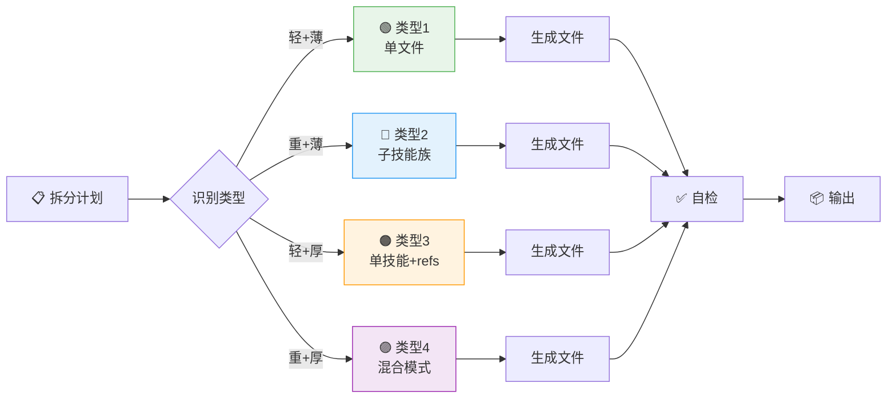
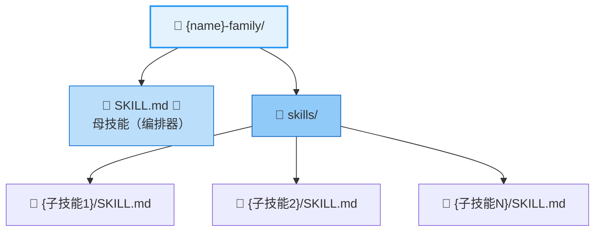
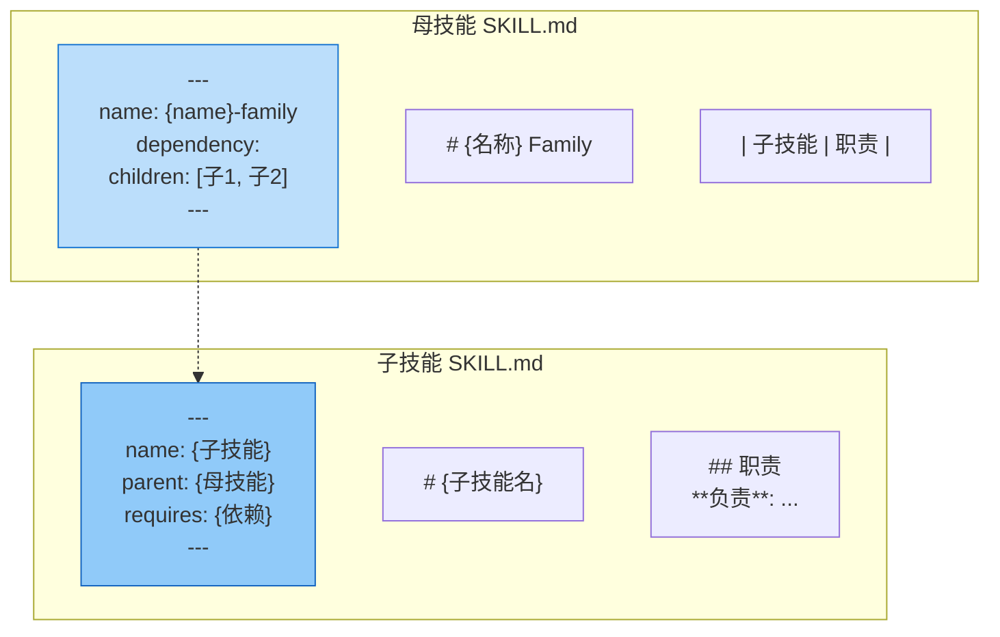
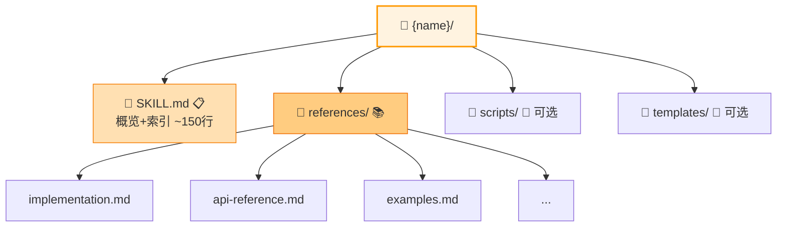
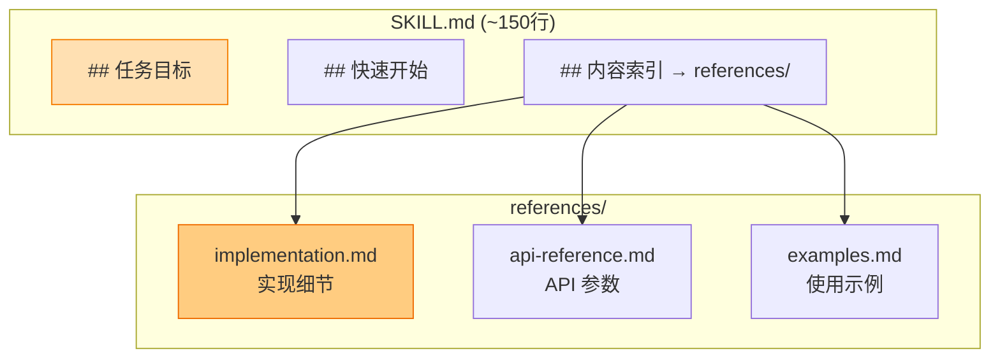
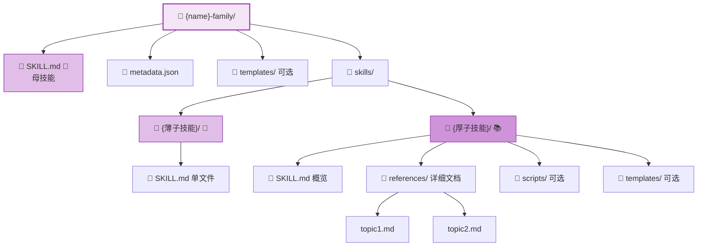
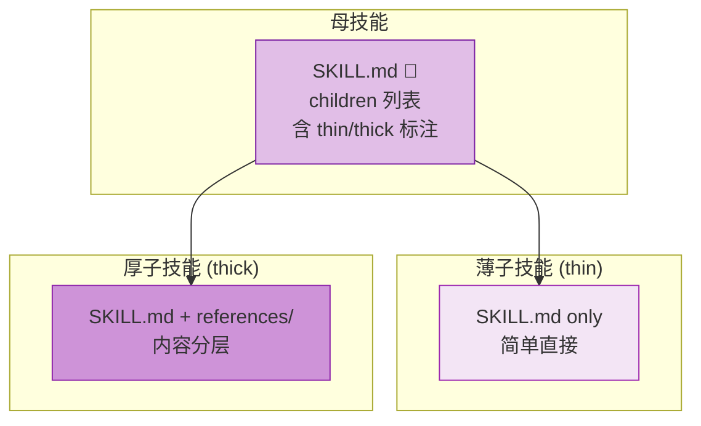
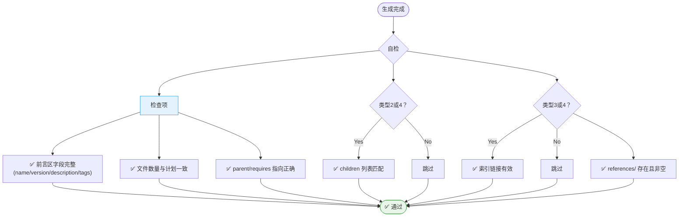

# Skill Factory Generator - 技能生成器

## 职责边界

**负责**：根据拆分计划的类型（轻/重/薄/厚），生成对应目录结构和文件
**不负责**：分析内容（analyzer）、判定类型（planner）、验证打包（packager）

---

## 四种输出模式



---

## 类型 1：轻+薄（简单技能）

**适用**：单一功能 + 内容精简 (<300行)

### 输出结构


### SKILL.md 模板

```markdown
---
name: {name}
version: v0.1.0
author: {author}
description: {100-150字符}
tags: [{tag1}, {tag2}, {tag3}]
---

# {标题}

## 任务目标
- 本 Skill 用于: <一句话>
- 核心能力: <能力列表>
- 触发条件: <何时使用>

## 操作步骤
1. <步骤1>
2. <步骤2>
3. ...

## 使用示例
<完整示例>

## 注意事项
<注意点>
```

### 生成规则


---

## 类型 2：重+薄（技能族-薄）

**适用**：多模块可独立 + 每个模块都精简

### 输出结构



### 模板关系



### 生成规则


---

## 类型 3：轻+厚（复杂单技能）

**适用**：单一功能 + 内容丰富 (>300行)

### 输出结构



### 文档层次关系



### 生成规则


---

## 类型 4：重+厚（技能族-厚）⭐

**适用**：多模块可独立 + 部分模块内容丰富

### 输出结构



### 混合模式说明



### 生成规则


---

## 通用自检清单



| 类型 | 必检项 |
|------|--------|
| **全部** | 前言区字段完整 (name/version/description/tags) |
| **全部** | 文件数量与计划一致 |
| **全部** | parent/requires 指向正确 |
| **类型2/4** | children 列表与实际匹配 |
| **类型3/4** | 索引链接有效 |
| **类型3/4** | references/ 文件存在且非空 |

---

## 参考

- [skill-factory](../../SKILL.md) - 母技能（四维分类说明）
- [skill-factory-packager](../skills/skill-factory-packager/SKILL.md) - 下游验证
