# Skill Factory Packager - 技能打包器

## 职责边界

**负责**：识别技能类型 → 验证对应结构 → 输出报告
**不负责**：分析内容（analyzer）、判定类型（planner）、生成文件（generator）

---

## 四种验证模式

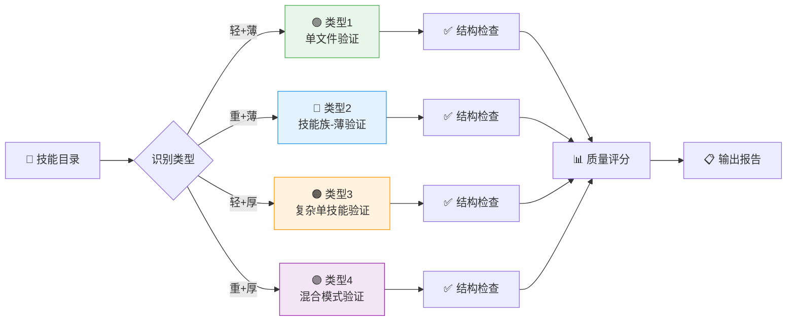

---

## 类型 1：轻+薄（简单技能）验证

### 必须存在的结构

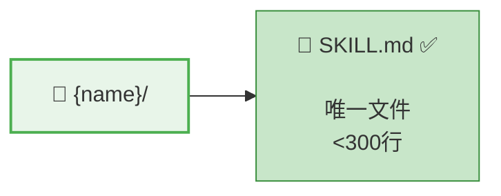

### 验证项

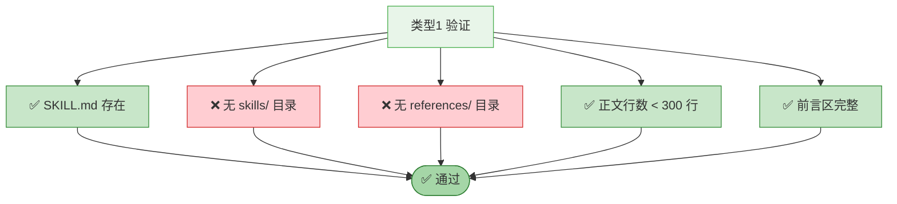

| 检查项 | 标准 |
|--------|------|
| SKILL.md 存在 | ✅ 必需 |
| 无 skills/ 目录 | ✅ 不应有 |
| 无 references/ 目录 | ✅ 不应有 |
| 正文行数 | < 300 行 |
| 前言区完整 | name/version/description/tags |

---

## 类型 2：重+薄（技能族-薄）验证

### 必须存在的结构

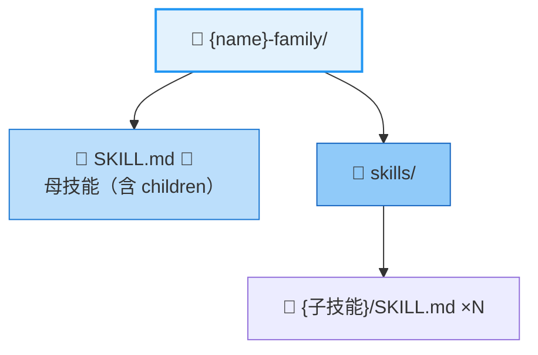

### 验证项

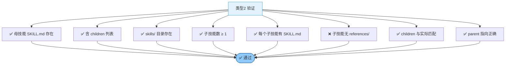

| 检查项 | 标准 |
|--------|------|
| 母技能 SKILL.md | 存在，含 children 列表 |
| skills/ 目录 | 存在 |
| 子技能数量 | ≥ 1 个 |
| 每个子技能有 SKILL.md | ✅ |
| 子技能无 references/ | ✅ （薄=单文件） |
| children 一致 | 与实际子技能匹配 |
| parent 指向 | 子技能 → 母技能 |

---

## 类型 3：轻+厚（复杂单技能）验证

### 必须存在的结构

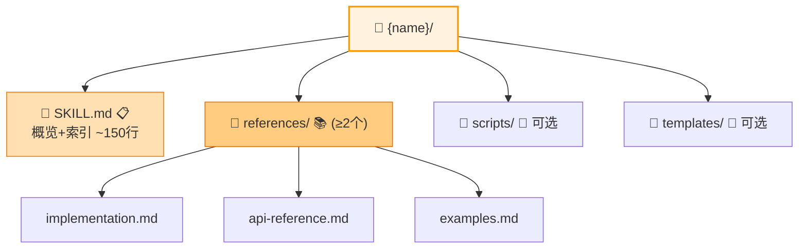

### 验证项

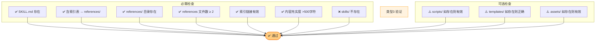

| 检查项 | 标准 |
|--------|------|
| SKILL.md 存在 | ✅ 必需 |
| SKILL.md 含索引表 | ✅ （指向 references/） |
| references/ 目录 | 存在 |
| references 文件数 | ≥ 2 个 .md |
| 索引链接有效 | 所有链接指向存在的文件 |
| 内容充实度 | references 总量 > 500 字符 |
| skills/ 不存在 | ✅ （轻=不拆分） |

---

## 类型 4：重+厚（技能族-厚）验证 ⭐

### 必须存在的结构

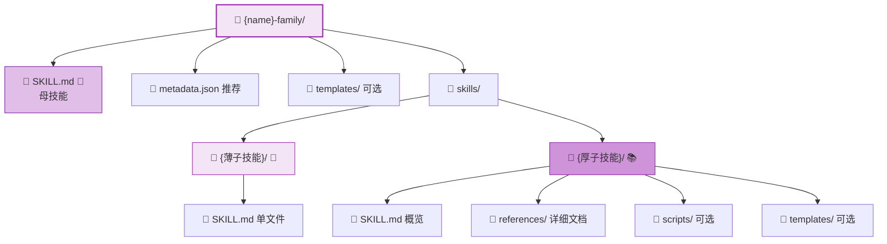

### 验证项

#### A. 通用验证

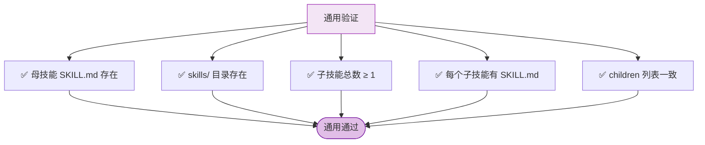

#### B. 子技能分类验证

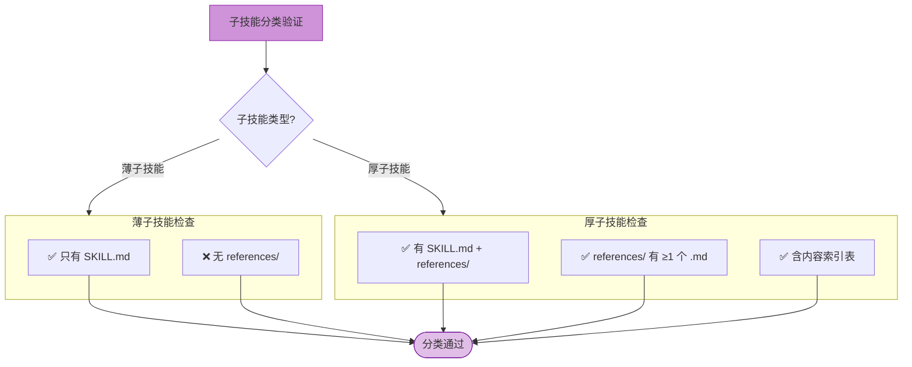

| 检查项 | 标准 |
|--------|------|
| **薄子技能** | 只有 SKILL.md，无 references/ |
| **厚子技能** | 有 SKILL.md + references/ + ≥1 个 .md |
| **厚子技能索引** | SKILL.md 内含内容索引表 |

#### C. 混合模式专项检查

```mermaid
flowchart TD
    C["混合模式专项检查"]
    
    C --> C1["✅ 分类合理性<br/>应拆的已拆，应分层的已分层"]
    C --> C2["✅ 索引完整性<br/>所有厚子技能链接有效"]
    C --> C3["✅ 无冗余<br/>无错误拆分的 references"]
    C -> C4["✅ 共享资源位置合理"]
    
    C1 & C2 & C3 & C4 --> CPass([专项通过])
    
    style C fill:#ba68c8,stroke:#7b1fa2
    style CPass fill:#e1bee7,stroke:#7b1fa2
```

| 检查项 | 标准 |
|--------|------|
| 分类合理性 | 应拆的已拆为子技能（重），应分层已在 references（厚） |
| 索引完整性 | 所有厚子技能的索引链接全部有效 |
| 无冗余 | 不存在本应是 references 的内容被错误拆成子技能 |
| 共享资源 | templates/ 在母级或各子技能内位置合理 |

---

## 通用验证：前言区检查

### 标准字段（所有类型）

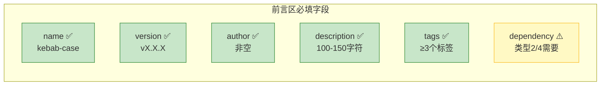

| 字段 | 必须 | 格式要求 |
|------|------|----------|
| name | ✅ | kebab-case |
| version | ✅ | vX.X.X |
| author | ✅ | 非空 |
| description | ✅ | 100-150 字符 |
| tags | ✅ | ≥ 3 个标签 |
| dependency | 类型2/4 需要 | 含 parent + children/requires |

### 版本号格式

- ✅ `v1.0.0`、`v2.1.3`
- ❌ `v1.0`、`v1`、`1.0.0`

---

## 质量评分

### 评分维度

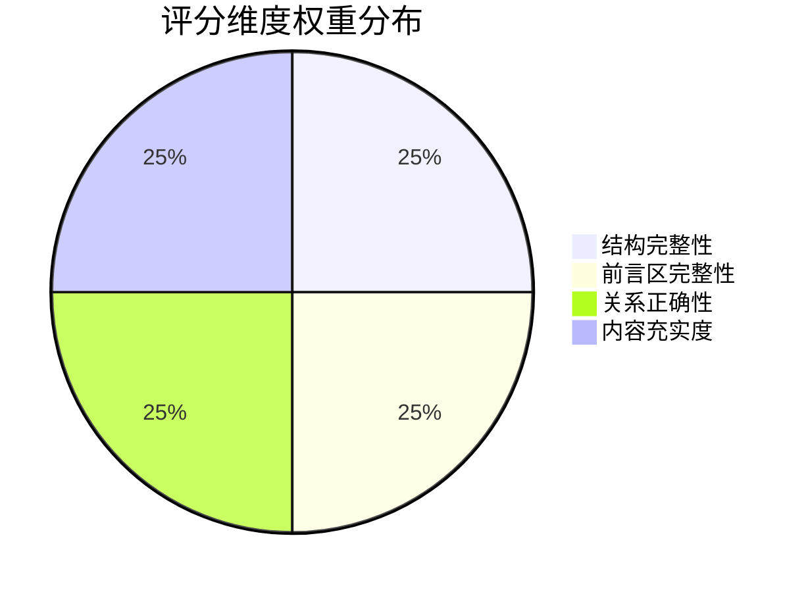

| 维度 | 权重 | 说明 |
|------|------|------|
| 结构完整性 | 25% | 对应类型的必需文件/目录是否齐全 |
| 前言区完整性 | 25% | 标准字段是否齐全且格式正确 |
| 关系正确性 | 25% | parent/requires/children/索引链接是否正确 |
| 内容充实度 | 25% | 文件内容是否有实质内容（>200字符） |

### 评分等级

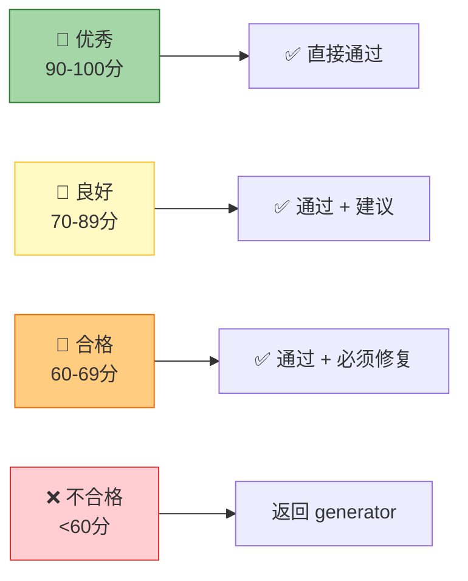

| 总分 | 等级 | 处理方式 |
|------|------|----------|
| 90-100 | 🥇 优秀 | 通过 |
| 70-89 | 🥈 良好 | 通过 + 改进建议 |
| 60-69 | 🥉 合格 | 通过 + 必须修复项 |
| <60 | ❌ 不合格 | 返回 generator 修复 |

---

## 输出格式

```markdown
## 技能打包验证报告

### 基本信息
- **技能名称**: {名称}
- **判定类型**: light-thin / heavy-thin / light-thick / **heavy-thick**
- **验证时间**: {时间}

### 结构验证结果

#### 类型 {N} 专项检查
| 检查项 | 标准 | 实际 | 状态 |
|--------|------|------|------|
| {项目} | {标准} | {实际} | ✅ / ❌ |

{如为类型4，显示子技能分类}
#### 子技能分类（仅类型4）
| 子技能 | 判定类型 | 结构 | references数 | 状态 |
|--------|----------|------|--------------|------|
| {子技能A} | thin | 单文件 | 0 | ✅ |
| {子技能B} | thick | 多文件 | 3 | ✅ |

### 关系验证
| 验证项 | 状态 |
|--------|------|
| parent 指向 | ✅ |
| requires 依赖 | ✅ |
| children 列表一致性 | ✅ |
| 索引链接有效性 | ✅ |

### 质量评分
| 维度 | 得分 | 加权分 |
|------|------|--------|
| 结构完整性 | XX | XX |
| 前言区完整性 | XX | XX |
| 关系正确性 | XX | XX |
| 内容充实度 | XX | XX |
| **总分** | | **XX** |

**等级**: 🥇/🥈/🥉/❌

### 结论
✅ 通过 / ❌ 需修复: {问题列表}
```

---

## 失败处理流程

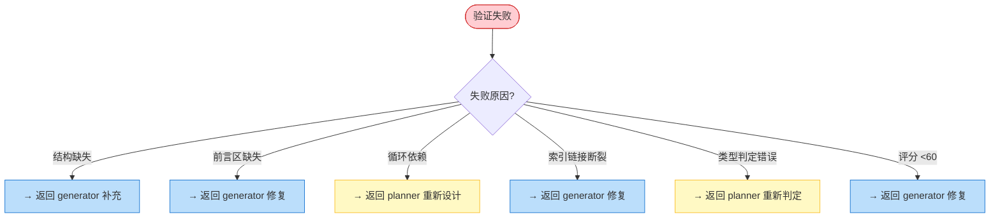

| 场景 | 处理 |
|------|------|
| 结构缺失 | 返回 generator 补充 |
| 前言区缺失 | 返回 generator 修复 |
| 循环依赖 | 返回 planner 重新设计 |
| 索引链接断裂 | 返回 generator 修复 |
| 类型判定错误 | 返回 planner 重新判定（如：薄子技能有 references） |
| 评分 <60 | 返回 generator 修复 |

---

## 参考

- [skill-factory](../../SKILL.md) - 母技能（四维分类说明）

---

## 快速验证模式 (Type 1 专用) - v0.2.0 新增

当技能被判定为 **Type 1（轻+薄）** 时，使用快速验证模式：

```yaml
type_1_quick_check:
  适用条件:
    - 判定类型: 轻+薄
    - 输出结构: 单个 SKILL.md 文件
    - 预期行数: < 300 行

  检查项:
    must_have:
      - frontmatter_exists: "前言区存在且格式正确"
      - single_file_valid: "仅有 SKILL.md，无 skills/ 或 references/"
      - description_length_ok: "100-150字符"
      - at_least_2_examples: "至少包含2个使用示例"

  验证阈值:
    quality_score_threshold: 80  # 保持与标准模式一致
    estimated_time: "3min"       # vs 标准模式的15min (-80%)

  失败处理:
    score_60_79: "通过 + 建议后续优化（可进入发布）"
    score_below_60: "返回 generator 修复（或降级为标准路径）"
```

### 快速验证 vs 标准验证对比

| 维度 | 标准验证 | 快速验证 (Type 1) |
|------|---------|-------------------|
| **检查项数量** | 15-20 项 | **5 项**（核心必填） |
| **验证范围** | 全量结构检查 | **最小必要集** |
| **预计耗时** | 10-15 min | **3 min** |
| **详细程度** | 详细报告 | **简化报告** |
| **失败处理** | 返回修复 | **修复 or 降级** |

### 快速验证流程图

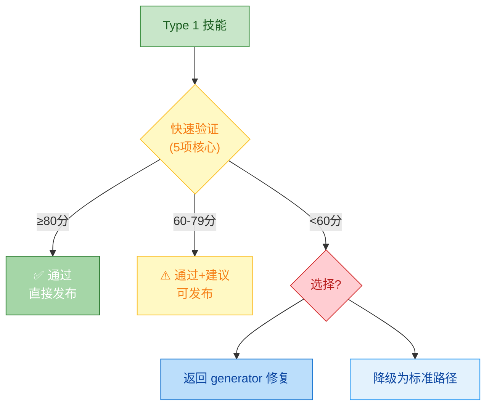

### 快速验证输出报告（简化版）

```markdown
## Type 1 快速验证报告

### 基本信息
- **技能名称**: {name}
- **判定类型**: light-thin
- **验证时间**: {time}
- **验证模式**: 🚀 快速验证 (3min)

### 核心检查结果
| 检查项 | 状态 | 备注 |
|--------|------|------|
| 前言区完整 | ✅ / ❌ | |
| 单文件结构 | ✅ / ❌ | 无 skills/references |
| description 长度 | ✅ / ❌ | XX字符 |
| 示例数量 | ✅ / ❌ | X 个 |

### 质量评分
- **总分**: XX / 100
- **等级**: 🥇🥈🥉❌

### 结论
✅ 可直接发布 / ⚠️ 建议优化后发布 / ❌ 需修复
```
