# Skill Factory Researcher - 信息研究员

## 职责边界

**负责**：接收用户输入、初步浏览、交互确认、补充信息、输出完整需求
**不负责**：技术深度分析（analyzer）、类型判定（planner）、文件生成（generator）

**核心价值**：在正式分析前，通过研究和调查确保信息充分、需求明确

---

## 在流程中的位置

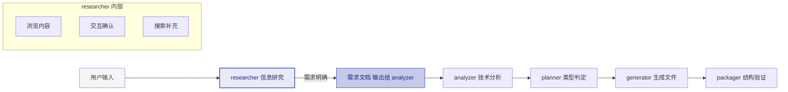

---

## 核心工作流

### 六步研究流程

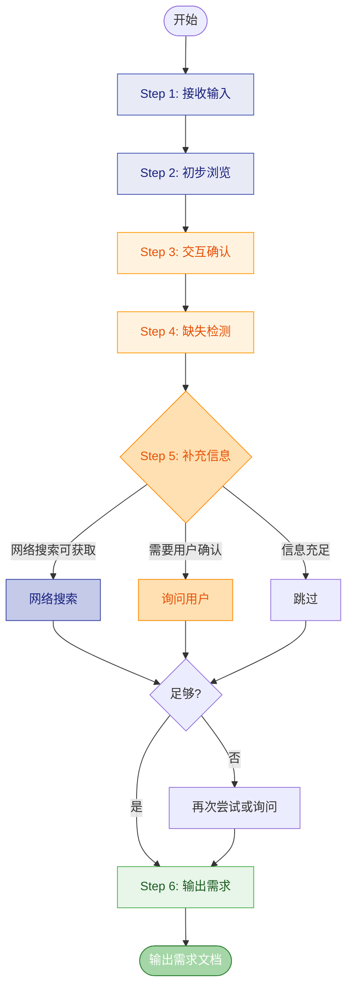

---

## Step 1：接收输入

### 支持的输入类型

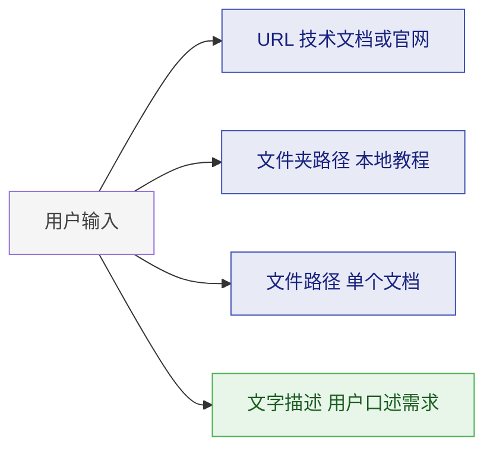

### 输入验证

| 输入类型 | 有效条件 | 无效处理 |
|---------|---------|---------|
| URL | HTTP 可访问，返回 HTML/文档 | 提示用户检查链接 |
| 文件夹 | 路径存在，含文档文件 | 提示正确路径 |
| 文件 | 文件存在，可读取 | 提示检查文件 |
| 文字描述 | 长度 > 20 字符 | 引导用户提供更多信息 |

---

## Step 2：初步浏览

### 浏览目标

快速了解内容的**概况**，不需要深入细节：

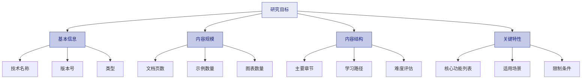

### 浏览操作

| 操作 | 说明 |
|------|------|
| **URL 输入** | 访问页面，提取标题、目录、关键概念 |
| **文件夹** | 列出文件结构，读取 README 或入口文档 |
| **单文件** | 扫描头部、章节标题、代码块数量 |
| **文字描述** | 提取关键词，判断是否需要更多上下文 |

### 浏览结果输出

```yaml
研究报告:
  来源: URL 或文件夹或文件
  技术名称: 名称
  类型: 框架或库或工具
  版本: 版本号
  内容规模:
    章节: N 个
    示例: N 个
  初步印象:
    复杂度: 简单或中等或复杂
    可能的类型判定: 轻加薄 或 重加薄 或 轻加厚 或 重加厚
```

---

## Step 3：交互确认

### 必须确认的信息

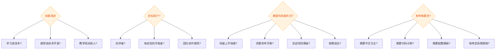

### 交互原则

| 原则 | 说明 |
|------|------|
| **渐进式** | 从宽泛到具体，不要一次性问太多 |
| **提供选项** | 给出选项让用户选择，而非开放式问题 |
| **智能推断** | 能从上下文推断的不用问 |
| **记录决策** | 记录用户的每个选择，用于后续步骤 |

### 交互示例

**推荐方式**（提供选项）：
> 这个技能的主要用途是什么？
> - A) 学习理解该技术
> - B) 使用该技术开发项目
> - C) 教授/培训他人
> - D) 其他（请说明）

**避免方式**（开放式）：
> ❌ 请详细描述你的需求...

---

## Step 4：缺失检测

### 检查清单

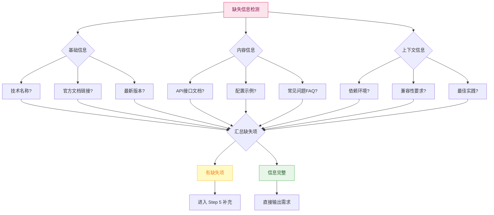

### 常见缺失项及优先级

| 缺失项 | 优先级 | 获取难度 | 推荐来源 |
|--------|--------|---------|---------|
| 技术名称 | 高 | 低 | 页面标题/用户确认 |
| 官方文档 | 高 | 低 | URL 本身/搜索 |
| API 文档 | 中 | 中 | 官网/API 文档站 |
| 配置示例 | 中 | 中 | 文档/GitHub |
| 最佳实践 | 低 | 高 | 博客/社区/询问用户 |

---

## Step 5：补充信息

### 补充策略优先级


### 网络搜索策略

| 搜索目标 | 搜索关键词模板 | 预期结果 |
|---------|---------------|---------|
| 技术概述 | `{技术名} introduction tutorial` | 入门教程链接 |
| API 文档 | `{技术名} API reference` | 官方 API 文档 |
| 配置示例 | `{技术名} config example` | 配置文件模板 |
| 最佳实践 | `{技术名} best practices` | 经验文章 |
| 更新日志 | `{技术名} changelog release notes` | 版本信息 |

### 搜索结果处理

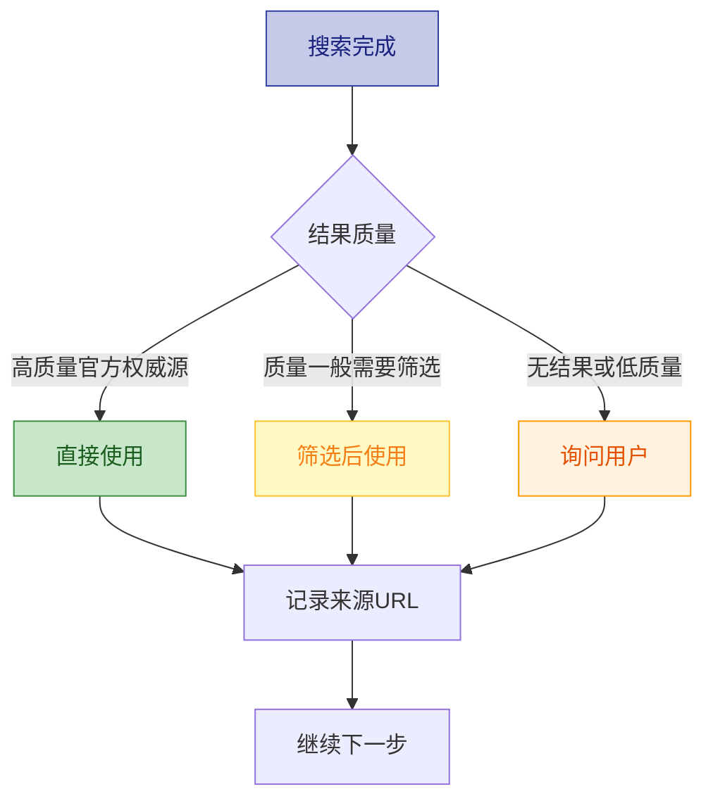

### 询问用户时机

以下情况应该**主动询问用户**：

| 场景 | 询问内容 | 示例 |
|------|---------|------|
| 多个版本 | 使用哪个版本？ | "Vue2 还是 Vue3？" |
| 多种用法 | 主要用于什么？ | "主要用于 SPA 还是 SSR？" |
| 特殊环境 | 有特殊限制吗？ | "需要在 Node 还是浏览器运行？" |
| 搜索失败 | 你有相关资料吗？ | "找不到 XXX 的文档，你有吗？" |
| 歧义需求 | 具体指什么？ | "你说高效是指性能还是开发效率？" |

### 询问技巧

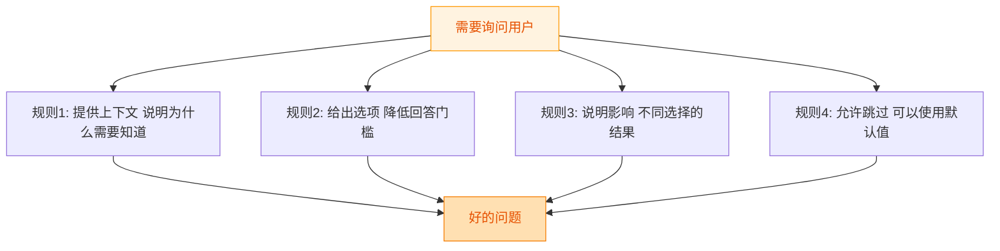

---

## Step 6：输出需求文档

### 输出格式

```markdown
# 技能需求文档

## 基本信息
- 来源: 原始输入
- 技术名称: 确认后的名称
- 版本: 版本号
- 类型: 框架或库或工具

## 用户需求
- 主要用途: 学习或开发或教学或其他
- 目标用户: 初学者或有经验或团队
- 期望形式: 快速上手或完整参考或项目模板
- 特殊要求: 列出各项

## 内容资源
- 主文档: URL 或路径
- API 文档: URL 或路径
- 配置示例: 有或无加来源
- 最佳实践: 有或无加来源
- 补充资料: 搜索获得的额外资源

## 研究结论
- 复杂度预估: 简单或中等或复杂
- 可能类型: 轻加薄 或 重加薄 或 轻加厚 或 重加厚
- 建议方向: 基于用户需求的建议

## 交互记录
- 时间: 问题 到 用户回答
- 时间: 搜索 到 结果
```

### 传递给下游

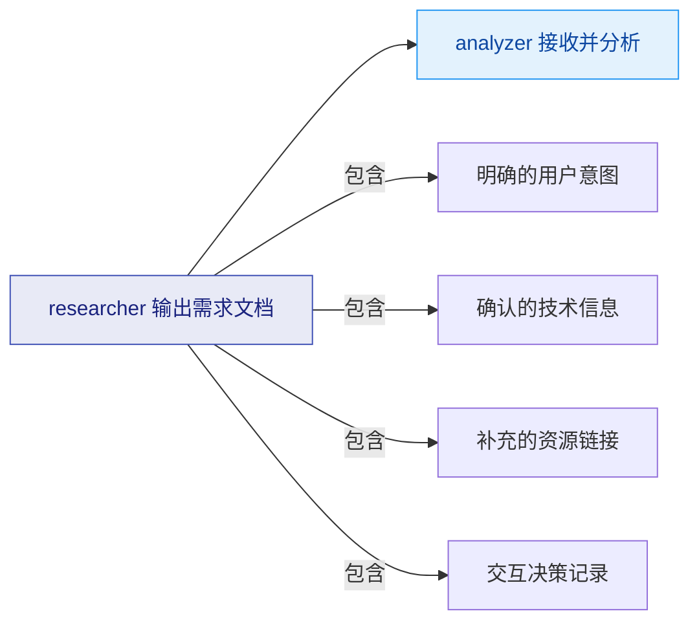

---

## 全程回调机制

在后续阶段（analyzer/planner/generator/packager）中如果发现信息不足，可以**回调** researcher：

### 回调配置 (v0.2.0 新增)

```yaml
callback_config:
  max_callbacks: 3              # 最大回调次数（硬限制）
  cooldown_seconds: 60          # 回调间隔冷却时间（秒）
  auto_escalate_threshold: 2    # 超过N次自动升级为人工介入
  callback_history_log: true    # 是否记录回调历史
```

### 回调行为规则

- 每次回调前检查 `callback_count < max_callbacks`
- 超过限制时：停止回调 → 标记 warning → 建议人工 review
- 记录每次回调的：时间戳、触发者、请求内容、补充结果
- 冷却期内重复请求返回"请等待冷却"

### 回调保护流程（v0.2.0 更新）

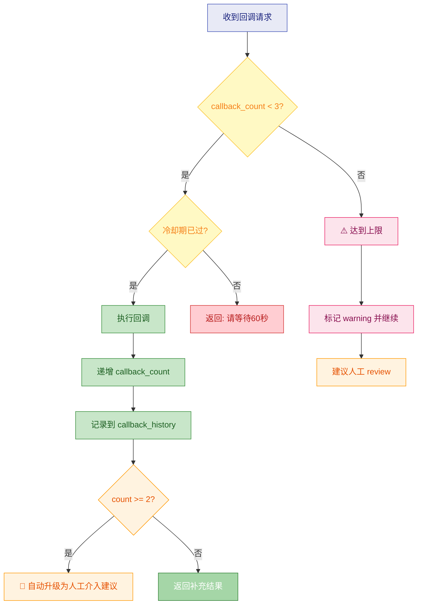

### 回调时序示例

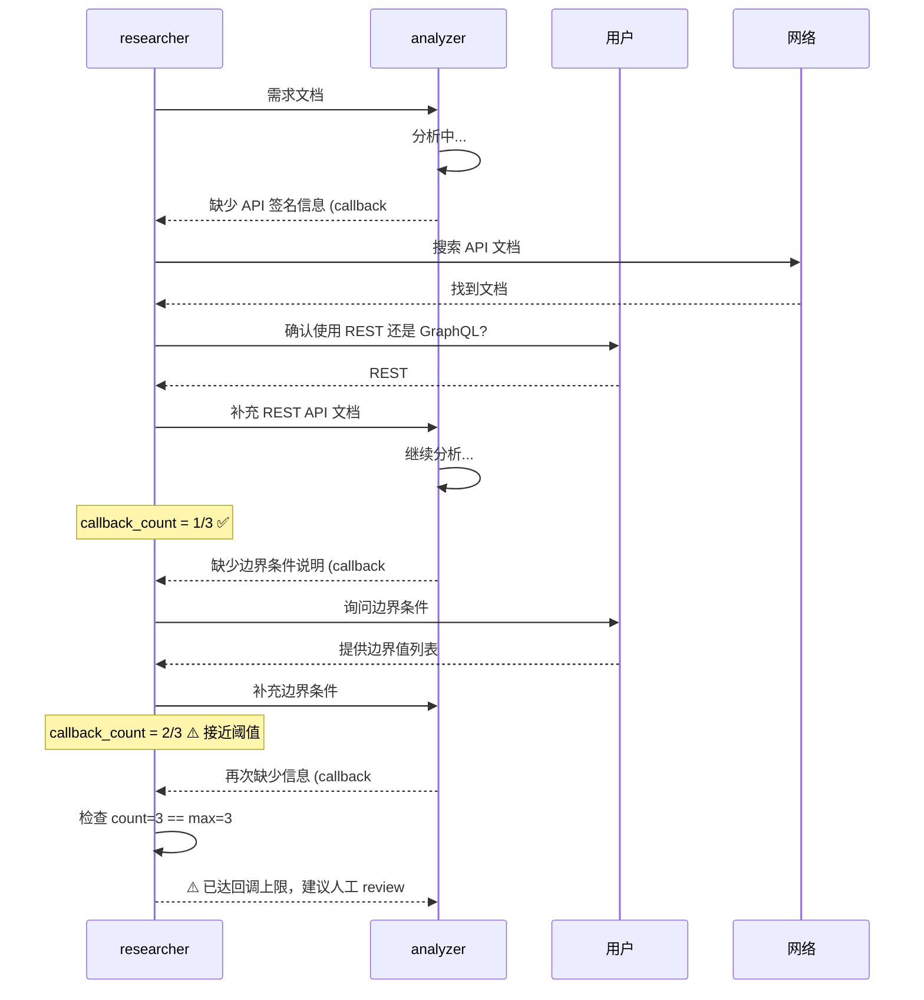

### 回调触发条件

| 触发阶段 | 触发条件 | 回调动作 |
|---------|---------|---------|
| analyzer | 技术细节不清楚 | 搜索或询问 |
| planner | 无法判断轻重薄厚 | 询问用户期望 |
| generator | 缺少具体示例 | 搜索示例或询问 |
| packager | 格式规范有歧义 | 查询最新规范 |

---

## 注意事项

| 原则 | 说明 |
|------|------|
| **不过度研究** | 信息够用即可，无需完美 |
| **尊重用户时间** | 问题精简，每次最多 3 个 |
| **保留决策依据** | 记录为什么做某个决定 |
| **允许迭代** | 后续可以回来补充信息 |
| **超时机制** | 单次交互等待不超过合理时间 |

---

## 快速路径优化 (Type 1) - v0.2.0 新增

当检测到可能是 **Type 1（轻+薄）** 技能时，启用快速研究模式：

```yaml
fast_research_mode:
  触发条件:
    - 用户明确表示"简单技能"
    - 输入内容 < 500 字符
    - 预计输出 < 300 行

  简化措施:
    缺失检测清单:
      - 仅检查必填项（技术名称、官方文档）
      - 跳过可选信息（最佳实践、FAQ等）
    交互确认:
      - 减少为 1-2 个关键问题
      - 使用默认值填充非关键项
    目标耗时:
      - 标准: 20min → 快速: 10min (-50%)
```

### 快速模式 vs 标准模式对比

| 维度 | 标准模式 | 快速模式 (Type 1) |
|------|---------|-------------------|
| **输入收集** | 完整浏览+深度分析 | 快速扫描关键信息 |
| **缺失检测** | 9 项全检 | 仅检必填 3 项 |
| **交互确认** | 4 组问题（12个） | 1 组问题（2-3个） |
| **补充策略** | 自动→搜索→询问 | 自动→默认值 |
| **预计耗时** | 20min | 10min |
| **适用场景** | Type 2/3/4 | **Type 1** |

### 快速模式流程图

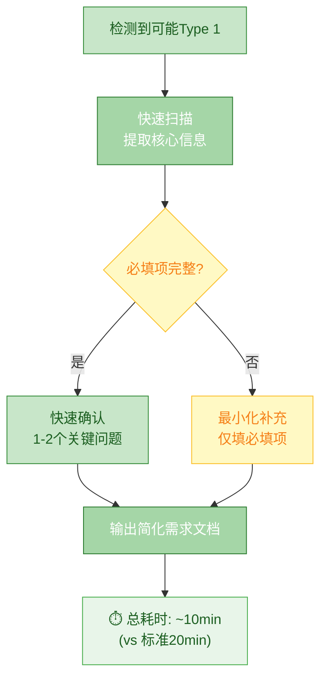

---

## 参考

- [skill-factory](../../SKILL.md) - 母技能
- [skill-factory-analyzer](../skill-factory-analyzer/SKILL.md) - 下游技能
