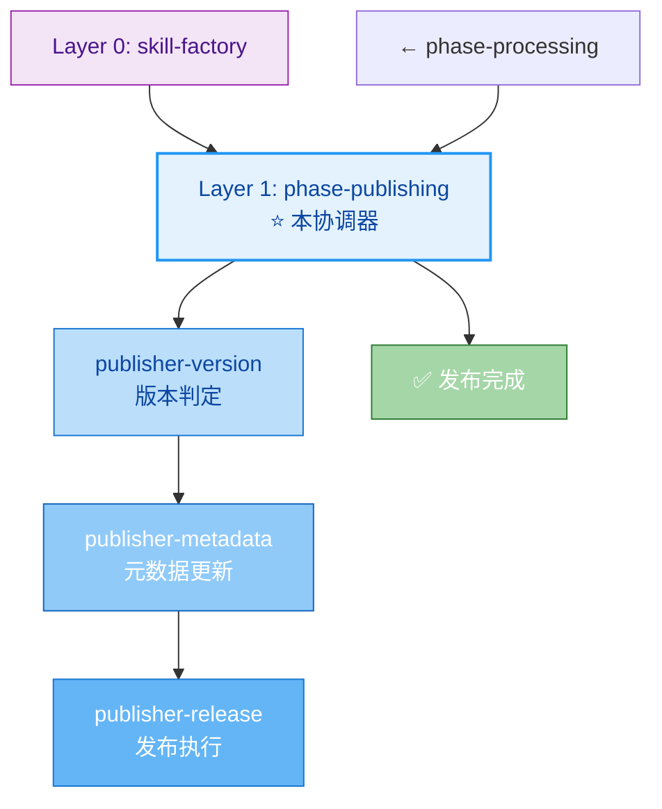
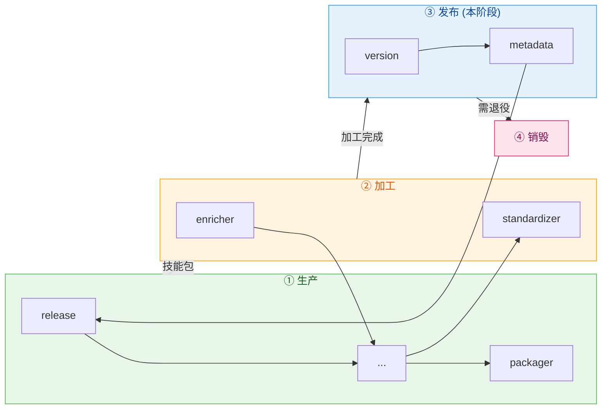

# Phase Publishing - 发布阶段协调器

## 职责边界

**负责**: 强顺序协调 version → metadata → release 三步发布流水线
**不负责**: 生产阶段、加工阶段、销毁阶段

---

## 在三层架构中的位置



---

## 核心特点：强顺序依赖

与其他阶段不同，**发布阶段的三件套是严格顺序的**：

```mermaid
sequenceDiagram
    participant V as publisher-version
    participant M as publisher-metadata
    participant R as publisher-release
    
    Note over V,M,R: ⚠️ 强顺序依赖，不可跳步
    
    V->>V: 判定变更类型
    V->>V: 决定版本号递增
    V-->>M: 新版本号 vA.B.C
    
    M->>M: 更新 description (100-150字符)
    M->>M: 更新 tags (≥3个)
    M->>M: 更新 dependency
    M-->>R: 元数据已就绪
    
    R->>R: git add .
    R->>R: git commit (-m "...")
    R->>R: git tag (-a vA.B.C)
    R->>R: git push (--tags)
    
    R-->>Done: ✅ 发布成功!
```

---

## 三步骤详解

### Step 1: Publisher-Version（版本判定）

**核心任务**: 决定这次变更是什么级别？

```yaml
输入: 变更内容清单
输出: 
  current_version: vX.Y.Z
  change_type: breaking/type-upgrade/feature/fix
  new_version: vA.B.C
  变更说明: 一句话描述

决策规则 (5步法):
  1. 删除了能力/文件? → Breaking (major+1)
  2. 修改了接口? → Breaking (major+1)
  3. 改变了类型(轻↔重/薄↔厚)? → Type Upgrade (minor+1)
  4. 新增了内容? → Feature (minor+1)
  5. 其他 → Fix (patch+1)

详细规则: [docs/versioning-rules.md](../../docs/versioning-rules.md)
```

### Step 2: Publisher-Metadata（元数据更新）

**核心任务**: 确保前言区元数据准确反映当前状态

```yaml
必检字段:
  description:
    长度: 100-150字符
    内容: 用途+能力+场景+分类
    
  tags:
    数量: ≥3个
    分类: 功能标签+技术域标签+分类标签
    
  dependency:
    parent: 如有父技能则填写
    children: 如有子技能则列出
    requires: 如有外部依赖则声明

一致性验证:
  - children ↔ skills/ 目录匹配?
  - parent 指向有效?
  - requires 可达?
```

### Step 3: Publisher-Release（发布执行）

**核心任务**: 执行 Git 操作完成正式发布

```bash
# 标准发布序列
git add .                                    # 暂存所有变更
git commit -m "<type>(<scope>): <subject>"   # 规范化提交
git tag -a v<version> -m "Release v<ver>"     # Annotated Tag
git push origin main                          # 推送代码
git push origin --tags                        # 推送标签

# Commit Message 格式
<type>(<scope>): <subject>

type: feat / fix / refactor / feat! / docs / chore
scope: 技能名称 (kebab-case)
subject: 中文描述，不超过50字，祈使语气
```

---

## 快速发布支持（Type 1 专用）

当上游判定为 **Type 1（轻+薄）** 且走**快速路径**时：

```yaml
fast_publish_mode:
  version:
    判断简化: 仅 fix/feature 两类
    初始版本: v0.1.0 (保持不变)
    首次发布: v0.1.0 → v0.1.1 (patch)
    
  metadata:
    描述模板: "<名称>，<用途>；核心：<能力>"
    tags自动提取: 从 description 关键词生成
    时间节省: 2min vs 标准5min (-60%)
    
  release:
    commit_message: 自动生成
    tag: 可选跳过（首次可仅commit）
    batch_support: 支持一次提交多个 Type 1
    时间节省: 3min vs 标准7min (-57%)
```

---

## 错误处理

| 失败场景 | 处理方式 |
|---------|---------|
| 版本判定歧义 | 引用完整规则文档，人工确认 |
| description 长度不符 | 精炼或扩充至 100-150 字符 |
| tags < 3 个 | 补充至 ≥3 个 |
| git 冲突 | 先 pull 解决冲突再提交 |
| tag 已存在 | 检查是否重复发布，调整版本号 |
| push 失败 | 检查网络和权限，重试 |

---

## 与其他阶段的关系



---

## 配置参数

```yaml
phase_config:
  name: publishing
  layer: 1
  coordinator_type: strict_pipeline  # 强顺序流水线
  
  steps:
    - id: 1
      skill: publisher-version
      required: true
      cannot_skip: true
      estimated_time: "2-5min"  # 标准模式 / "2min" 快速模式
      
    - id: 2
      skill: publisher-metadata
      required: true
      depends_on: [1]
      cannot_skip: true
      estimated_time: "3-5min"  # 标准模式 / "2min" 快速模式
      
    - id: 3
      skill: publisher-release
      required: true
      depends_on: [1, 2]
      cannot_skip: true
      estimated_time: "5-7min"  # 标准模式 / "3min" 快速模式
  
  total_estimated_time:
    standard: "10-17min"
    fast_path_type1: "7min"  # Type1 快速模式
  
  quality_gates:
    version_format_valid: true  # vX.Y.Z format
    metadata_complete: true     # all required fields filled
    commit_message_valid: true  # follows conventional commits
```

---

## 参考

- [skill-factory](../SKILL.md) - 工厂根 (Layer 0)
- [skill-factory-phase-processing](../skill-factory-phase-processing/SKILL.md) - 上游阶段 (Layer 1)
- [docs/versioning-rules.md](../../docs/versioning-rules.md) - 版本判定完整规则
- [publisher-version](../skill-factory-publisher-version/SKILL.md) - 子技能 (Layer 2)
- [publisher-metadata](../skill-factory-publisher-metadata/SKILL.md) - 子技能 (Layer 2)
- [publisher-release](../skill-factory-publisher-release/SKILL.md) - 子技能 (Layer 2)
