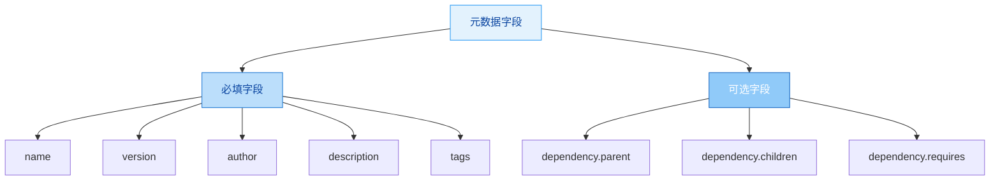
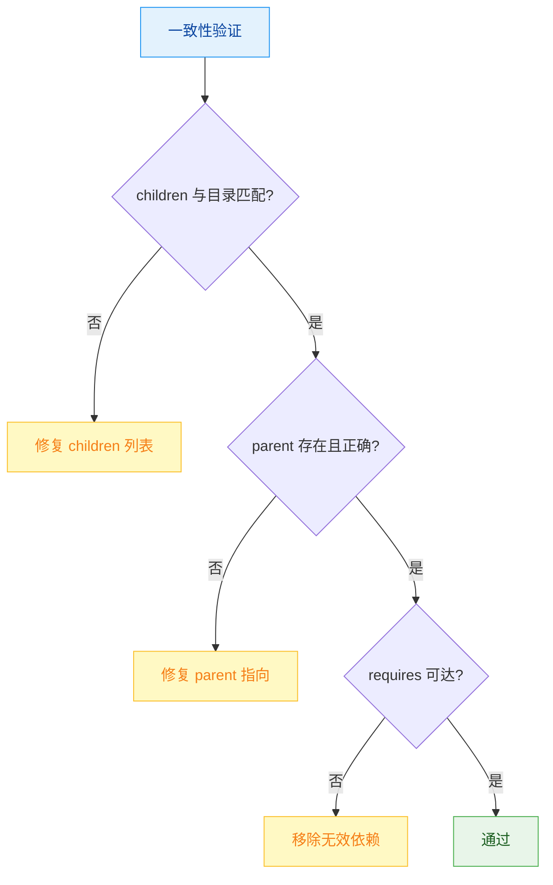

# Publisher Metadata - 元数据管理器

## 职责边界

**负责**: 维护前言区元数据字段的一致性和准确性
**不负责**: 版本判定（version-publisher）、内容修改（processing）

---

## 元数据字段总览



---

## 字段一：Description

### 标准

- **长度**: 100-150 字符
- **内容**: 说明用途 + 核心能力 + 适用场景

### 更新时机

| 事件 | 操作 |
|------|------|
| 能力变化 | 重写以反映新能力 |
| 类型升级 | 更新结构描述 |
| 每次发布前 | 重新评估长度 |

### 写作模板

```
<技能名称>，用于<核心用途>；包含<能力列表>；
支持<适用场景>；基于<轻/重><薄/厚>四维分类。
```

### 示例

```
data-cleaner 数据清洗工具，用于清洗和标准化原始数据；
包含空值处理、格式统一、去重能力；
支持 CSV/JSON 输入；基于轻+薄四维分类。  (98字符 - 需补充)
```

```
vue-family Vue.js 技能学习包，用于系统化学习 Vue.js 框架；
包含核心概念、组件系统、路由管理、状态管理能力；
覆盖 Vue2/Vue3 版本；基于重+厚四维分类，含 references 详细文档。 (108字符 ✓)
```

---

## 字段二：Tags

### 标准

- **数量**: >= 3 个标签
- **格式**: 小写、连字符分隔复合词
- **内容**: 覆盖功能、技术域、分类维度

### 标签分类

| 类别 | 示例 | 数量建议 |
|------|------|---------|
| 功能标签 | data-cleaner, text-formatter | 1-2 个 |
| 技术域标签 | vue, react, python | 1-2 个 |
| 分类标签 | skill-family, four-dimensions | 1 个 |
| 阶段标签 | production, processing | 视情况 |

### 更新时机

- 新增能力 → 添加功能标签
- 类型变化 → 更新分类标签
- 发现缺失 → 补充至 3 个以上

---

## 字段三：Dependency

### 何时需要

| 技能类型 | 是否需要 dependency |
|---------|-------------------|
| 轻+薄 | 不需要 |
| 轻+厚 | 不需要 |
| 重+薄 | ✅ 需要 children |
| 重+厚 | ✅ 需要 children |
| 子技能 | ✅ 需要 parent |
| 有外部依赖 | ✅ 需要 requires |

### Parent（父技能指向）

```yaml
dependency:
  parent: skill-factory       # 父技能 name
```

### Children（子技能列表）

```yaml
dependency:
  children:
    - skill-factory-researcher
    - skill-factory-analyzer
    - skill-factory-planner
    - skill-factory-generator
    - skill-factory-packager
```

**规则**: children 列表必须与实际 skills/ 目录一致

### Requires（外部依赖）

```yaml
dependency:
  requires:
    - some-other-skill        # 依赖的其他技能
```

### 一致性检查



---

## 元数据更新流程


---

## 输出

```markdown
## 元数据更新报告

### 更新摘要
- description: <已更新/无需更改>
  - 长度: XX字符
  - 状态: ✅ 符合标准
- tags: <已更新/无需更改>
  - 数量: X个
- dependency: <已更新/无需更改>
  - parent: <值>
  - children: X个子技能
  - requires: X个依赖

### 一致性验证
- children ↔ skills/ 目录: ✅/❌
- parent 指向有效: ✅/❌
- requires 可达: ✅/❌
```

---

## 参考

- [skill-factory](../../SKILL.md) - 工厂主文件
- [skill-factory-publisher-version](../skills/skill-factory-publisher-version/SKILL.md) - 版本管理（上一步）
- [skill-factory-publisher-release](../skills/skill-factory-publisher-release/SKILL.md) - 发布执行（下一步）

---

## 快速元数据更新 (Type 1 专用) - v0.2.0 新增

当技能为 **Type 1（轻+薄）** 时，使用简化元数据更新：

```yaml
type_1_metadata:
  description:
    目标长度: "100-150字符"
    简化模板: "<名称>，<一句话用途>；核心：<能力>；适用：<场景>"
    更新时机: "内容变化时"

  tags:
    最少数量: "3个"
    推荐组合: "[功能标签, 技术域标签, 分类标签]"
    快速生成: "基于 description 自动提取关键词"

  dependency:
    parent: "可选（如有父技能）"
    children: "❌ 不需要（Type 1 无子技能）"
    requires: "仅在有外部依赖时添加"

  批量处理:
    支持批量: true
    预计耗时: "2min vs 标准5min (-60%)"
```

### Type 1 元数据检查清单（简化版）

```markdown
## Type 1 元数据快速检查

- [ ] name: kebab-case 格式 ✅
- [ ] version: vX.Y.Z 格式 ✅
- [ ] author: 非空 ✅
- [ ] description: 100-150字符 ✅
- [ ] tags: ≥3个标签 ✅
- [ ] dependency: 仅在需要时添加 ⚠️
```
