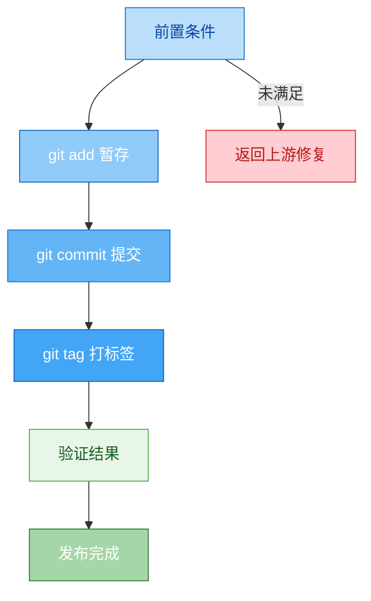

# Publisher Release - 发布执行器

## 职责边界

**负责**: 执行 git 操作完成正式发布
**不负责**: 版本判定（version-publisher）、元数据更新（metadata-publisher）

---

## 发布流程



---

## 前置条件检查

- [ ] 版本号已由 version-publisher 判定并更新
- [ ] 元数据已由 metadata-publisher 更新
- [ ] 所有文件已保存
- [ ] 无未完成的改动

---

## Commit Message 规范

### 格式

```
<type>(<scope>): <subject>

<body>
```

### Type 类型

| Type | 前缀 | 适用场景 |
|------|------|---------|
| **feat** | `feat` | 新增功能、新能力 |
| **fix** | `fix` | 错误修复、bug 修正 |
| **refactor** | `refactor` | 类型升级、重构、结构调整 |
| **feat!** | `feat!` | 破坏性变更（! 表示 breaking） |
| **docs** | `docs` | 仅文档更新 |
| **chore** | `chore` | 构建/工具链变更 |

### Scope 范围

- 技能名称（kebab-case）
- 例: `feat(data-cleaner): 添加去重能力`

### Subject 主题

- 使用中文
- 不超过 50 字符
- 不以句号结尾
- 使用祈使语气

### 完整示例

```bash
# 新功能
"feat(skill-factory): 新增加工阶段，含 enricher/simplifier/beautifier/standardizer"

# 错误修复
"fix(skill-factory-researcher): 修正 Fillter 拼写错误为 Filter"

# 类型升级
"refactor(skill-factory): 整合 skill-lifecycle，升级为四阶段工厂架构 v10.0"

# 破坏性变更
"feat!(skill-factory): 移除 parent: skill-lifecycle 依赖，改为独立顶层"
```

---

## Tag 规范

### 格式

```bash
git tag -a v<版本号> -m "Release v<版本号>: <说明>"
```

### 示例

```bash
git tag -a v10.0.0 -m "Release v10.0.0: 整合 skill-lifecycle，新增加工/发布/销毁阶段"
```

### Tag 推送

```bash
git push origin main
git push origin --tags
```

---

## 发布命令序列

### 标准发布

```bash
# 1. 暂存所有变更
git add .

# 2. 提交（使用规范的 commit message）
git commit -m "<type>(<scope>): <subject>"

# 3. 创建 annotated tag
git tag -a v<version> -m "Release v<version>: <description>"

# 4. 推送代码和标签
git push origin main
git push origin --tags
```

### 热修复发布（hotfix）

```bash
# 从最新 tag 创建修复分支
git checkout -b hotfix/vX.Y.Z-main v.X.Y.(Z-1)

# ... 修复问题 ...

# 提交修复
git commit -m "fix(<scope>): <修复描述>"

# 打补丁 tag
git tag -a vX.Y.Z -m "Release vX.Y.Z: hotfix - <描述>"
```

---

## 发布后验证

```bash
# 验证 tag 已创建
git tag -l "v*"

# 验证 tag 信息
git show v<version>

# 验证 log 显示正确
git log --oneline -5
```

### 验证清单

- [ ] Commit message 格式正确
- [ ] Tag 版本号与 SKILL.md 中一致
- [ ] Tag 含有描述信息（annotated tag）
- [ ] 代码已推送
- [ ] Tag 已推送

---


---

## 参考

- [skill-factory](../../SKILL.md) - 工厂主文件
- [skill-factory-publisher-version](../skills/skill-factory-publisher-version/SKILL.md) - 版本管理（上一步）
- [skill-factory-publisher-metadata](../skills/skill-factory-publisher-metadata/SKILL.md) - 元数据管理（再上一步）

---

## 快速发布支持 (Type 1 专用) - v0.2.0 新增

当技能为 **Type 1（轻+薄）** 且走**快速路径**时，使用简化发布流程：

```yaml
type_1_release:
  commit_message:
    自动生成: true
    模板: "feat(<name>): <auto-generated-summary>"
    示例: "feat(git-commit): 创建 git 提交技能 (Type 1 快速路径)"

  tag_strategy:
    可选跳过: true
    首次发布: "可仅 commit 不 tag"
    后续版本: "建议打 tag"

  batch_support:
    支持批量: true
    场景: "一次创建多个 Type 1 技能"
    操作: "单个 commit 包含多个技能"

  estimated_time: "3min vs 标准7min (-57%)"
```

### 快速发布命令序列

```bash
# Type 1 快速发布（简化版）
git add .
git commit -m "feat(<skill-name>): initial release (Type 1 fast-path)"
# 可选: git tag -a v0.1.0 -m "Release v0.1.0: <description>"
git push origin main
```

### 批量发布多个 Type 1 技能

```bash
# 场景：一次性创建 3 个简单技能
git add skill-a/ skill-b/ skill-c/
git commit -m "feat(skills): batch create 3 Type 1 skills (fast-path)
- skill-a: <描述>
- skill-b: <描述>
- skill-c: <描述>"
git push origin main
```

### 标准发布 vs 快速发布对比

| 维度 | 标准发布 | 快速发布 (Type 1) |
|------|---------|-------------------|
| **Commit message** | 手动编写 | **自动生成** |
| **Tag** | 必须打 | **可选跳过** |
| **批量支持** | 不建议 | **✅ 支持** |
| **验证步骤** | 5 项全检 | **3 项核心** |
| **预计耗时** | 7min | **3min** (-57%) |
