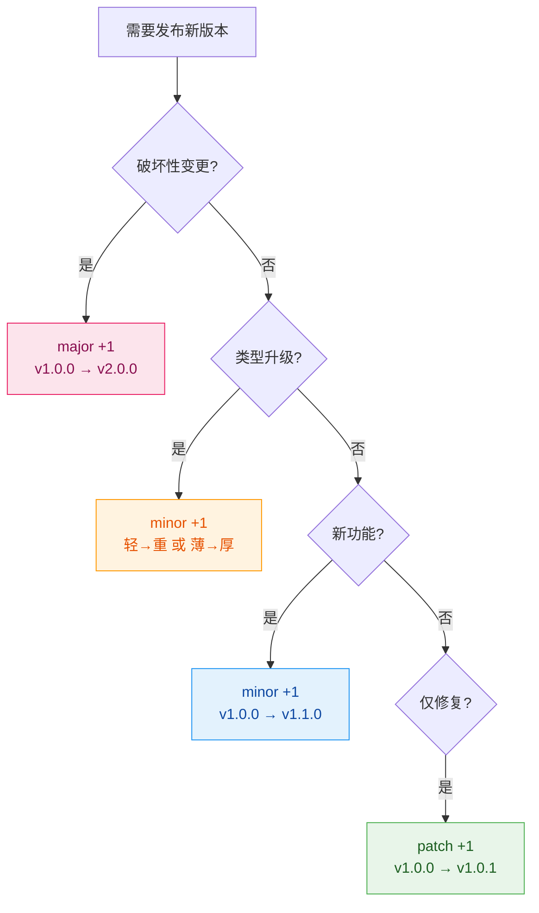
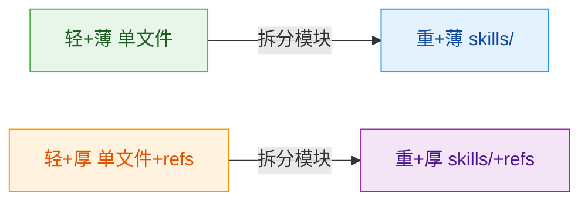
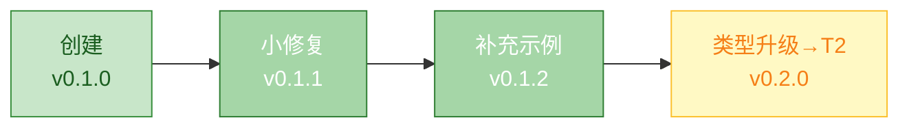

# Publisher Version - 版本管理器

## 职责边界

**负责**: 判定变更类型，决定版本号递增策略
**不负责**: 元数据更新（metadata-publisher）、git 操作（release-publisher）

---

## 版本判定流程



---

## 变更类型定义

### Breaking（破坏性变更）→ major +1

| 触发条件 | 示例 |
|---------|------|
| 删除核心能力 | 移除某项主要功能 |
| 修改输入输出接口 | 参数格式变化 |
| 改变技能定位 | 从 A 用途变为 B 用途 |
| 父子关系重构 | parent 指向改变 |

### Type Upgrade（类型升级）→ minor +1

| 升级路径 | 触发条件 | 操作 |
|---------|---------|------|
| 轻 → 重 | 功能拆分为多模块 | 创建 skills/ |
| 薄 → 厚 | 内容超 300 行 | 创建 references/ |
| 重+薄 → 重+厚 | 子技能需详细文档 | 部分子加 references/ |

### Feature（新功能）→ minor +1

| 触发条件 | 示例 |
|---------|------|
| 新增能力 | 添加新的操作步骤 |
| 新增示例 | 补充使用场景 |
| 扩展范围 | 覆盖更多用例 |

### Fix（修复）→ patch +1

| 触发条件 | 示例 |
|---------|------|
| 错别字修正 | 文字错误 |
| 描述澄清 | 表述不清 |
| 示例修正 | 示例代码有误 |
| 链接修复 | 死链修正 |

---

## 版本号格式

### 标准格式

```
v主版本.次版本.修订版本
```

- ✅ `v1.0.0`, `v2.1.3`, `v10.0.0`
- ❌ `v1.0`, `v1`, `1.0.0`, `V1.0.0`

### 初始版本

- 新创建的技能从 **v0.1.0** 开始（开发中）
- 首次正式发布时变为 **v1.0.0**

---

## 类型升级详解

### 升级路径 A：轻 → 重



**操作**: 创建 skills/ 目录，原文件改为协调器

### 升级路径 B：薄 → 厚


**操作**: 创建 references/，详细内容移入，主文件保留概览

### 升级路径 C：重+薄 → 重+厚

**操作**: 为需要详细说明的子技能添加 references/

---

## 输出

```yaml
版本决策:
  当前版本: vX.Y.Z
  变更类型: <breaking / type-upgrade / feature / fix>
  新版本: vA.B.C
  变更说明: <一句话描述>
  
  如有类型升级:
    原类型: <旧类型>
    新类型: <新类型>
    升级路径: <具体路径>
```

---

## 参考

- [skill-factory](../../SKILL.md) - 工厂主文件
- [skill-factory-publisher-metadata](../skills/skill-factory-publisher-metadata/SKILL.md) - 元数据管理（下一步）
- [skill-factory-publisher-release](../skills/skill-factory-publisher-release/SKILL.md) - 发布执行（再下一步）
- [docs/versioning-rules.md](../../docs/versioning-rules.md) - **完整版本判定规则** (v0.2.0 新增)

---

## 版本判定参考速查 (v0.2.0 新增)

详细的边缘情况判定规则请参见: **[docs/versioning-rules.md](../../docs/versioning-rules.md)**

### 快速判断 5 步法

```yaml
Step_1: "是否删除了能力或文件？"
  → 是: Breaking (major +1)

Step_2: "是否修改了接口（trigger/input/output）？"
  → 是: Breaking (major +1)

Step_3: "是否改变了类型（轻↔重 or 薄↔厚）？"
  → 是: Type Upgrade (minor +1)

Step_4: "是否新增了内容（能力/示例/文档）？"
  → 是: Feature (minor +1)

Step_5: "其他情况"
  → Fix (patch +1)
```

### 常见边缘场景

| 场景 | 类型升级？ | Breaking? | 版本递增 |
|------|-----------|-----------|---------|
| T1→T2（拆分子技能） | ✅ | ❌ | minor+1 |
| T1→T3（加references/） | ✅ | ❌ | minor+1 |
| 删除某能力 | - | ✅ | major+1 |
| 修改trigger | - | ✅ | major+1 |
| 纯内容优化 | ❌ | ❌ | patch+1 |

---

## 快速发布版本管理 (Type 1 专用) - v0.2.0 新增

当技能为 **Type 1（轻+薄）** 且走**快速路径**时，使用简化版版本管理：

```yaml
type_1_versioning:
  初始版本: "v0.1.0"
  首次发布: "v0.1.0 → v0.1.1" (patch +1)
  后续迭代: "v0.1.N" (持续 patch)

  简化规则:
    - 首次创建: 直接设为 v0.1.0
    - 小修正: patch +1 (v0.1.0 → v0.1.1)
    - 内容补充: minor +1 (v0.1.1 → v0.2.0)
    - 类型升级: minor +1 (如变为 Type 2/3)

  跳过复杂判断:
    - ❌ 不需判断 breaking（Type 1 结构简单）
    - ✅ 默认按 fix/feature 分类即可
```

### Type 1 版本递增示例



### 标准模式 vs 快速模式对比

| 维度 | 标准模式 | 快速模式 (Type 1) |
|------|---------|-------------------|
| **判断流程** | 4 层决策树 | **2 类判断**（fix/feature） |
| **初始版本** | v0.1.0 | **v0.1.0**（相同） |
| **首次发布** | v1.0.0 | **v0.1.1**（跳过 major） |
| **预计耗时** | 5min | **2min** (-60%) |
| **复杂场景** | 支持 breaking | **不支持**（无需） |
