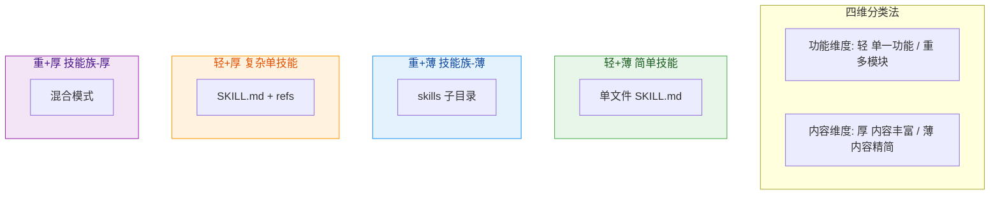
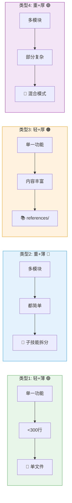
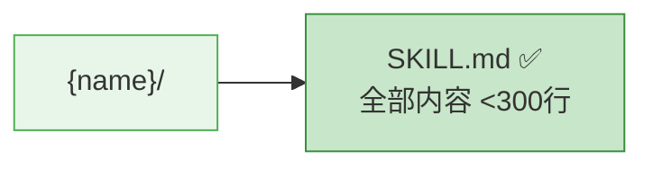
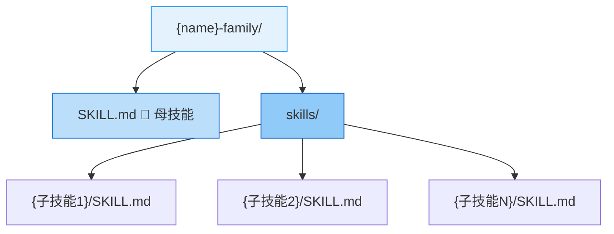
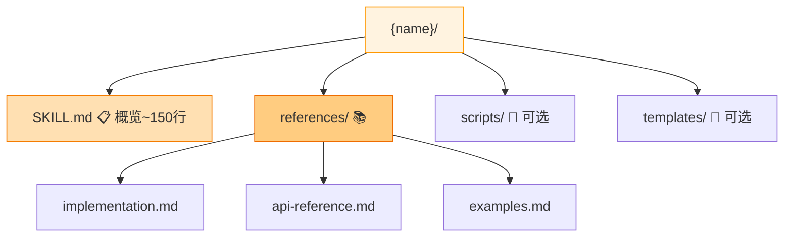
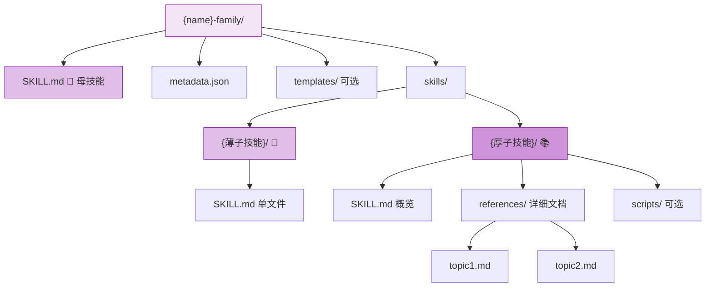
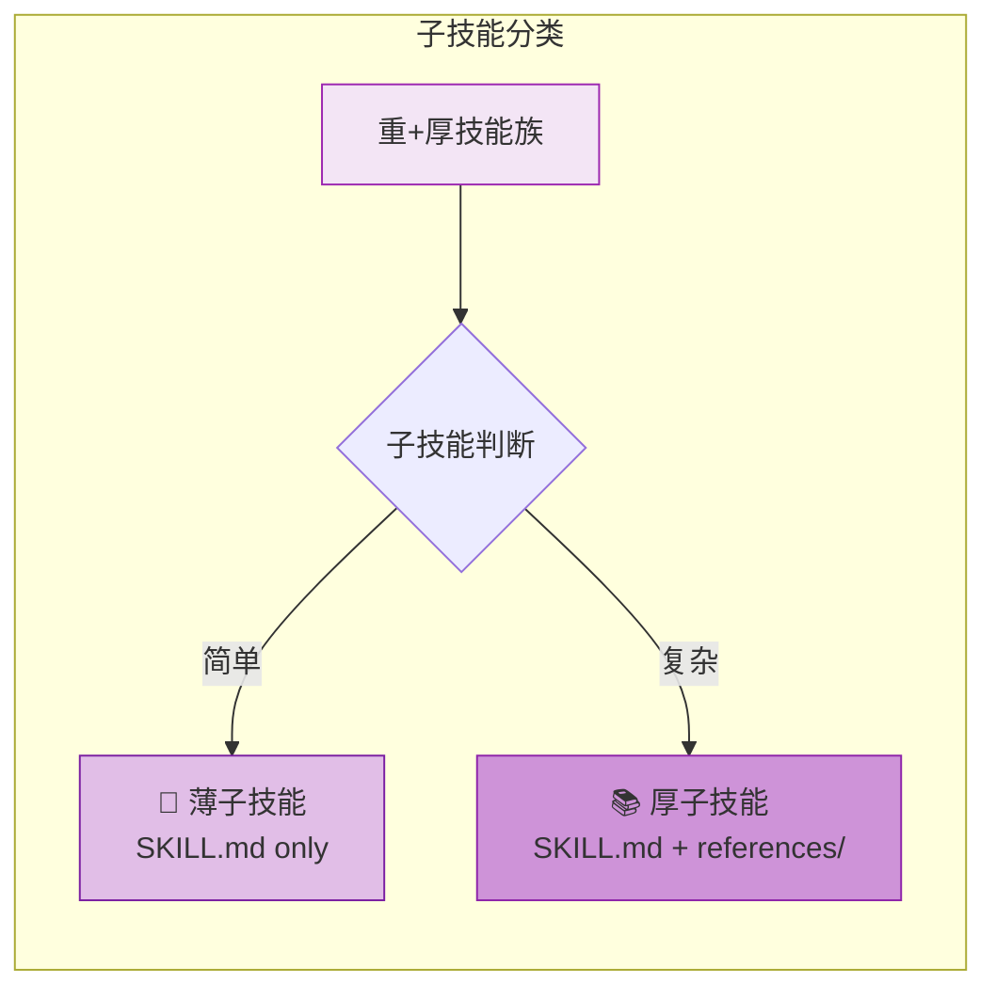
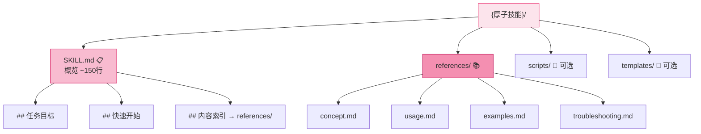
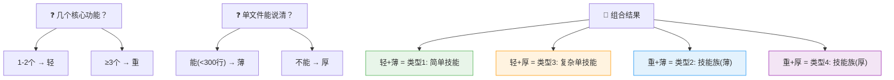

# Skill Factory Planner - 技能规划器

## 四维分类法



### 维度定义与判断标准

| 维度 | 定义 | 判断标准 | 判定问题 |
|------|------|---------|---------|
| **轻** | 功能单一 | 1-2 个核心能力 | "这个技能只做一件事吗？" |
| **重** | 功能复杂 | ≥3 个模块，可独立使用 | "不同用户可能只用其中一部分吗？" |
| **薄** | 内容精简 | <300 行能描述清楚 | "一个文件能说完整吗？" |
| **厚** | 内容丰富 | 需要详细说明、示例、代码等 | "需要大量补充资料吗？" |

---

## 两步决策流程

### 完整决策树

```mermaid
flowchart TD
    Start([输入分析报告]) --> Q1{几个核心功能？}
    
    Q1 -->|"1-2个"| Light[📦 轻：单一功能]
    Q1 -->|"≥3个"| Heavy[🏗️ 重：多模块]
    
    Light --> Q2{单文件能说清？<br/>（<300行）}
    Heavy --> Q3{每个子技能都简单？<br/>（<300行）}
    
    Q2 -->|"✅ 能"| T1[✅ 类型1: 轻+薄<br/>简单技能<br/><b>结构:</b> SKILL.md 单文件]
    Q2 -->|"❌ 不能"| T3[📚 类型3: 轻+厚<br/>复杂单技能<br/><b>结构:</b> SKILL.md + references/]
    
    Q3 -->|"✅ 都简单"| T2[🔧 类型2: 重+薄<br/>技能族-薄<br/><b>结构:</b> skills/{子}/SKILL.md]
    Q3 -->|"❌ 部分复杂"| T4[⭐ 类型4: 重+厚<br/>技能族-厚<br/><b>结构:</b> skills/ + 混合 references/]
    
    T1 --> End1([输出: 拆分计划])
    T2 --> End2([输出: 拆分计划])
    T3 --> End3([输出: 拆分计划])
    T4 --> End4([输出: 拆分计划])
    
    style T1 fill:#e8f5e9,stroke:#4caf50,color:#1b5e20,stroke-width:2px
    style T2 fill:#e3f2fd,stroke:#2196f3,color:#0d47a1,stroke-width:2px
    style T3 fill:#fff3e0,stroke:#ff9800,color:#e65100,stroke-width:2px
    style T4 fill:#f3e5f5,stroke:#9c27b0,color:#4a148c,stroke-width:2px
```

---

## 四种类型的详细定义

### 类型对比总览



### 类型 1：轻+薄（简单技能）

```yaml
特征:
  功能: 单一
  内容: 精简 (<300行)
  
判断依据:
  - 只有 1 个核心能力
  - 不需要拆分
  - 一个文件足够描述

典型场景:
  - 格式转换工具 (json-to-yaml)
  - 文本处理 (text-formatter)
  - 数据校验 (data-validator)
```



### 类型 2：重+薄（技能族-薄）

```yaml
特征:
  功能: 多模块，可独立
  content: 每个模块都精简

判断依据:
  - 有多个独立功能模块
  - 每个子技能逻辑简单
  - 用户可能只调用其中部分

典型场景:
  - CLI 工具集 (file-ops + text-process + system-mgmt)
  - 工作流编排器 (step1 + step2 + step3)
  - 开发工具集 (lint + format + test)
```



### 类型 3：轻+厚（复杂单技能）

```yaml
特征:
  功能: 单一
  内容: 丰富 (>300行)

判断依据:
  - 只有一个核心主题
  - 但需要大量详细说明
  - 内容高度内聚，不适合拆分

典型场景:
  - 数据处理管道 (data-pipeline)
  - 完整教程类 (react-tutorial)
  - 复杂算法实现 (ml-model-trainer)
```



### 类型 4：重+厚（技能族-厚）⭐

```yaml
特征:
  功能: 多模块，可独立
  内容: 部分模块本身很丰富

判断依据:
  - 有多个独立功能模块（重）
  - 其中某些模块内容非常丰富（厚）
  - 外层解耦，内层分层

典型场景:
  - 大型框架学习包 (vue-family, react-family)
  - 全栈开发工具集 (fullstack-toolkit)
  - 企业级解决方案 (erp-suite)
```



---

## 子技能分类表（用于类型4）

当判定为**重+厚**时，需对每个子技能再分类：



| 子技能类型 | 特征 | 结构 | 示例 |
|-----------|------|------|------|
| **薄子技能** | 单文件够用 | `SKILL.md` only | vue-router |
| **厚子技能** | 需要详细文档 | `SKILL.md` + `references/` | vue-core |

### 厚子技能内部结构



---

## 输出格式

```markdown
## 技能拆分计划

### 分类结果
- **类型**: light-thin / heavy-thin / light-thick / heavy-thick
- **技能名称**: {名称}
- **判定理由**: 
  - 轻重: {为什么是轻/重}
  - 薄厚: {为什么是薄/厚}

### 架构设计
{对应类型的目录结构图}

### 模块清单
#### {模块名}
- **轻重属性**: light / heavy
- **薄厚属性**: thin / thick
- **核心职责**: {说明}
- **依赖**: {无/其他模块}

### 执行计划
| 顺序 | 模块 | 类型 | 可并行组 |
|------|------|------|----------|
| 1 | {模块} | sub-skill(thin) | - |
| 2 | {模块} | sub-skill(thick) | - |

### 补充资源需求
| 资源类型 | 需要？ | 说明 |
|---------|--------|------|
| references/ | ✅/❌ | 哪些模块需要 |
| scripts/ | ✅/❌ | 哪些模块需要 |
| templates/ | ✅/❌ | 哪些模块需要 |
| assets/ | ✅/❌ | 哪些模块需要 |
```

---

## 快速判断问答（Q&A）

不确定如何判定？通过以下问题快速定位：

### 轻还是重？

**Q: 这个技能能否拆成多个独立使用的部分？**

- 能 → **重**（用 `skills/` 子目录，每个子技能可独立运行）
- 不能 → **轻**（单个 SKILL.md 即可）

> **补充判断**: "不同用户可能只用其中一部分功能吗？"
> - 是 → 重
> - 否 → 轻

### 薄还是厚？

**Q: 单个 SKILL.md 能否在 300 行内说清楚？**

- 能 → **薄**（无需额外文件）
- 不能 → **厚**（需要 `references/` 存放详细内容）

> **补充判断**: "是否需要大量代码示例、API 文档、实现细节说明？"
> - 是 → 厚
> - 否 → 薄

### 组合结果速查

| 轻重 × 薄厚 | 结果 | 一句话描述 |
|-------------|------|-----------|
| 轻 + 薄 | **类型1** | 一个简单文件搞定 |
| 重 + 薄 | **类型2** | 多个简单文件分工 |
| 轻 + 厚 | **类型3** | 一个概览 + 详细参考 |
| 重 + 厚 | **类型4** | 多个文件，部分有详细参考 |

---

## 决策速查表


