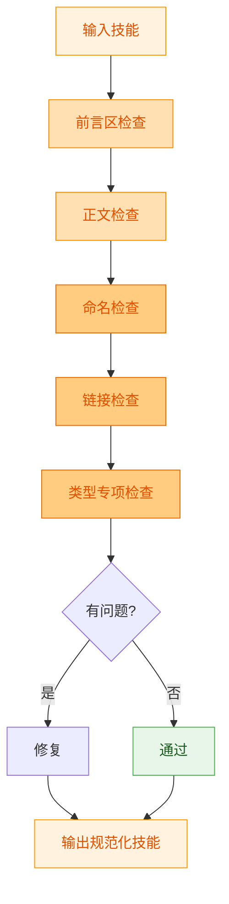

# Skill Factory Standardizer - 技能规范化器

## 职责边界

**负责**: 使技能符合标准规范，质量达标
**不负责**: 内容修改（enricher/simplifier）、视觉美化（beautifier）

---

## 规范化流程



---

## 检查一：前言区（Preamble）

### 必填字段

| 字段 | 格式要求 | 标准 |
|------|---------|------|
| **name** | 小写字母+连字符 | kebab-case，不含 -skill 后缀 |
| **version** | vX.X.X | 语义化版本号 |
| **author** | 非空字符串 | 作者或团队名 |
| **description** | 100-150 字符 | 说明用途和能力 |
| **tags** | 数组，>= 3 个标签 | 相关关键词 |

### 可选字段

| 字段 | 何时需要 | 说明 |
|------|---------|------|
| dependency.parent | 重类型技能 | 指向父技能 |
| dependency.children | 含子技能的技能 | 列出子技能 |
| dependency.requires | 有依赖的技能 | 依赖的其他技能 |

### 常见问题与修复

| 问题 | 修复方式 |
|------|---------|
| name 大写 | 转为小写+连字符 |
| description 过短 (<100) | 补充使用场景+目标用户 |
| description 过长 (>150) | 精炼为核心要点 |
| tags < 3 | 补充相关标签 |
| version 缺失 | 设为 v1.0.0 |

---

## 检查二：正文（Body Content）

### 必备章节

```markdown
## 任务目标
- 本 Skill 用于: <一句话>
- 核心能力: <要点列表>
- 触发条件: <何时使用>

## 操作步骤
1. <步骤1>
2. <步骤2>

## 使用示例
<至少一个完整示例>

## 注意事项
<注意点>
```

### 章节检查清单

- [ ] ## 任务目标 存在
- [ ] ## 操作步骤 存在
- [ ] ## 使用示例 存在且完整
- [ ] ## 注意事项 存在
- [ ] 正文总行数 < 500（或合理范围内）

### 行数标准

| 类型 | 主文件行数上限 |
|------|--------------|
| 轻+薄 | 300 行 |
| 轻+厚 | 200 行（概览） |
| 重+薄 协调器 | 150 行 |
| 重+厚 协调器 | 150 行 |

---

## 检查三：命名规范

### 目录/文件命名

| 类型 | 规则 | 正确示例 | 错误示例 |
|------|------|---------|---------|
| 技能目录 | 小写+连字符 | `data-cleaner` | `DataCleaner` |
| 子技能目录 | `{父}-{功能}` | `factory-planner` | `planner` |
| 文件名 | 小写+连字符 | `api-reference.md` | `API_Reference.md` |
| 禁止 |不以 -skill 结尾 | ✅ `text-formatter` | ❌ `text-formatter-skill` |

### 内容中的名称引用

- 引用时使用目录名的 kebab-case 格式
- 显示名称可以使用 readable format

---

## 检查四：链接检查

### 内部链接（references 类型）

- [ ] 所有 `[text](references/xxx.md)` 指向存在的文件
- [ ] 所有 `[text](skills/xxx/SKILL.md)` 指向存在的子技能
- [ ] 无死链（broken link）
- [ ] 无循环引用（A → B → A）

### 外部链接

- [ ] URL 格式正确（http/https）
- [ ] 链接文本有意义（避免 "点击这里"）

---

## 检查五：类型专项检查

### 轻+薄 专项

- [ ] 仅有一个 SKILL.md 文件
- [ ] 无 skills/ 目录
- [ ] 无 references/ 目录
- [ ] 正文 < 300 行

### 重+薄 专项

- [ ] 有 skills/ 目录
- [ ] 主文件含 children 列表
- [ ] 每个子技能只有 SKILL.md
- [ ] 子技能无 references/

### 轻+厚 专项

- [ ] 有 references/ 目录
- [ ] references 下 >= 2 个 .md 文件
- [ ] 主文件含内容索引表
- [ ] 索引链接全部有效
- [ ] 无 skills/ 目录

### 重+厚 专项

- [ ] 有 skills/ 目录
- [ ] 部分子技能有 references/
- [ ] 分类明确（哪些是薄子、哪些是厚子）
- [ ] 共享资源位置合理

---

## 检查六：WORKFLOW.md 格式（工作流专项）

当输入为 WORKFLOW.md 时，使用以下规范检查：

### 前言区格式

```yaml
---
name: <workflow-name>
description: <描述>
target: <目标>
skills_required: [skill-1, skill-2]
---
```

### 正文必需结构

```markdown
# <工作流名称>

## 目标
<工作流目标>

## 前置条件
- <条件>

## 技能清单
- <skill>: <用途>

## 执行流程
### 步骤 1: <名称>
- **使用技能**: <skill>
- **输入**: <描述>
- **操作**: <说明>
- **输出**: <描述>
- **下一步**: <下一步>

## 异常处理
- <异常>: <处理>

## 输出交付物
- <交付物>
```

### 步骤设计三原则

| 原则 | 说明 | 检查方法 |
|------|------|---------|
| **原子性** | 每个步骤只做一件事 | 步骤标题是否单一 |
| **可验证** | 有明确的完成标准 | 输出是否可判断完成 |
| **独立性** | 通过接口与其他步骤交互 | 是否有清晰的输入/输出 |

### WORKFLOW.md 专项检查清单

- [ ] name 存在且为 kebab-case
- [ ] target 明确（不是空泛的"完成任务"）
- [ ] skills_required 列出所有涉及的技能
- [ ] 前置条件完整
- [ ] 每个步骤包含 5 要素（技能/输入/操作/输出/下一步）
- [ ] 异常处理覆盖主要失败场景
- [ ] 交付物明确可检验

---

## 评分机制

### 评分维度

| 维度 | 权重 | 说明 |
|------|------|------|
| 前言区完整性 | 25% | 必填字段齐全且格式正确 |
| 正文完整性 | 25% | 必备章节齐全 |
| 命名规范性 | 25% | 符合 kebab-case |
| 结构正确性 | 25% | 符合对应类型的目录结构 |

### 评分等级

| 分数 | 等级 | 处理 |
|------|------|------|
| 90-100 | 优秀 | 通过 |
| 70-89 | 良好 | 通过 + 建议 |
| 60-69 | 合格 | 通过 + 必须修复 |
| <60 | 不合格 | 返回修复 |

---

## 输出报告

```markdown
## 规范化检验报告

### 基本信息
- 技能名称: <name>
- 判定类型: <类型>
- 检验时间: <时间>

### 前言区检查
| 字段 | 状态 | 备注 |
|------|------|------|
| name | ✅/❌ | |
| version | ✅/❌ | |
| author | ✅/❌ | |
| description | ✅/❌ | 长度: XX字符 |
| tags | ✅/❌ | 数量: X个 |

### 正文检查
| 章节 | 状态 |
|------|------|
| 任务目标 | ✅/❌ |
| 操作步骤 | ✅/❌ |
| 使用示例 | ✅/❌ |
| 注意事项 | ✅/❌ |

### 类型专项检查
<对应类型的检查结果>

### 评分
| 维度 | 得分 | 加权分 |
|------|------|--------|
| 前言区 | XX | XX |
| 正文 | XX | XX |
| 命名 | XX | XX |
| 结构 | XX | XX |
| **总分** | | **XX** |

**等级**: 🥇/🥈/🥉/❌

### 结论
✅ 通过 / ❌ 需修复: <问题列表>
```

---

## 参考

- [skill-factory](../SKILL.md) - 工厂主文件
- [skill-factory-packager](../skills/skill-factory-packager/SKILL.md) - 验证器（生产阶段的结构验证）
- [skill-lifecycle/skills/skill-standards](../../../skill-lifecycle/skills/skill-standards/SKILL.md) - 完整规范定义
